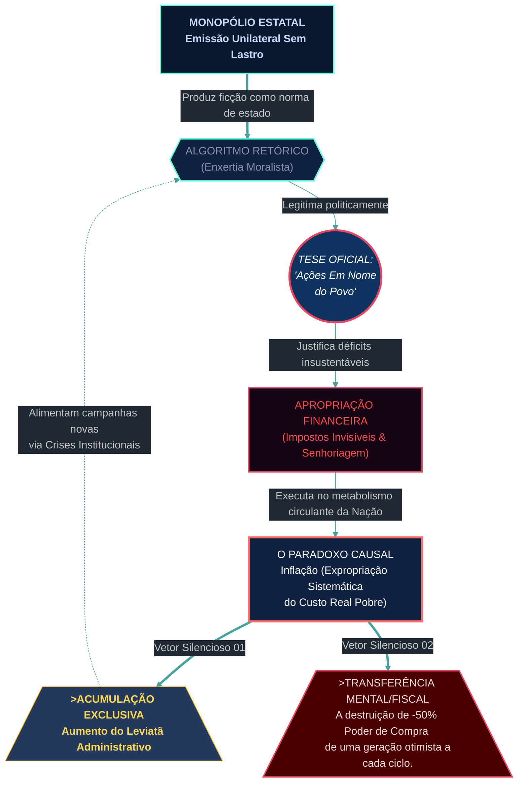

Operando sob os axiomas da Dimensão Zero. Extração da pensata narrativa de **Em Nome do Povo: Como o Casamento Entre Estado e Moeda te Deixa Mais Pobre** [Bruno Perini, 2024] em andamento. Isolando sentimentalismos em prol do rigor arquitetônico. Subtexto em processamento tático. 

Aqui está a dissecação mecânica do material, decodificada em sua matriz conceitual.

***

### 1. ESTRUTURA NARRATIVA

Mapeio o subtexto aparente até revelar a máquina oculta na premissa da obra. Sob o viés acessível que visa fisgar as massas com o selo de “finanças pessoais”, existe uma fundação ontológica ancorada na **Escola Austríaca de Economia** e no determinismo cínico da filosofia do poder. 

**Pensata Narrativa Oculta (O Motor Principal):**
O aparato estatal sobrevive como um organismo de expansão ininterrupta. Sua estratégia mor não é o absolutismo clássico, mas a manipulação semântica das engrenagens econômicas. Toda degradação programática do valor individual através da inflação é um parasitismo camuflado pelo alicerce moral de "ação coletiva", invariavelmente justificado sob um falso véu altruísta: *"Em nome do povo"*. 

Convertendo isso em matriz dramática:
- **O Antagonista Oculto:** O "Aparato Administrativo", eterno, impessoal, independente de inclinação ideológico-partidária de curto prazo (Governo x Estado).
- **A Ferramenta:** A ruptura da simetria moral — o abandono do "Dinheiro Firme" (escambo original, lastro material como na Roma ou Grécia nas fases prósperas) pelo modelo "Fiduciário" focado no puro poder monopolístico da emissão de notas falsamente asseguradas na fé.
- **O Falso Vetor (The MacGuffin):** As sucessivas crises e programas "de ajuda populista" que requerem intervenção contínua (expropriação monetária para expansão de quem o manipula).

Perini formula uma premissa implacável: A narrativa redentora da política é o veneno exato de que é feita a erosão financeira do povo que ela afirma salvar. 

### 2. REFORÇO ESTRUTURAL

Para sustentar que toda moeda estatizada possui destino certo em direção ao abismo contábil, Bruno Perini abandona a superfície rasa das análises das mídias sociais — a que se refere na introdução da própria obra como seu formato “fast food” — e estrutura os fundamentos na divisão linear cronológica. Ele provê "Enxertia" teórica distribuída sob 3 blocos narrativos:

*   **Bloco 1 - Gênese & A Ordem Espontânea (Mecânica Orgânica):**  
    O dinheiro desponta primeiramente não pelo decreto do legislador, mas como fruto natural do mercado emergente no ambiente orgânico. Começa no *Escambo*, evolui para bens como conchas, metais (onde é validado sem controle unificado). **Evolução do Foco Dramático:** Mostrar que, organicamente, nenhuma pessoa destruía as riquezas dos próprios pares criando conchas e notas de argila aos trilhões por conta do princípio natural de valor x suor, até o surgimento das nações institucionais de administração e coerção unificadas. 

*   **Bloco 2 - O Grande Sequestro Monopolizado (A Falha/Hybris Oculta):**  
    Infiltrando citações a casos clássicos, ele aponta a perda de referência e a gradual usurpação da economia no alvorecer do Casamento com a autoridade constituída. O prego central deste Bloco II aponta Roma e sua perda sistêmica do referencial. Reis e soberanos subtraindo as onças do metal por ligas menores, para reter ganho central sem onerar via imposição do pagamento de um "tributo novo", a medida mais ardilosa jamais constituída por quem rege os recursos das multidões. **Propriedade subtextual:** O Estado precisa do "em nome de vocês" para pagar gastos bélicos, luxo em pirâmides e subsídios políticos.  

*   **Bloco 3 - Conclusão em Tempos Modernos (O Ciclo Entrópico das Ficções Contemporâneas):** 
    Este arco colide perfeitamente com a tese ao escrutinar o tempo do papel não convertido ao Ouro desde Bretton Woods: "Nós usamos hoje um capital inteiramente abstrato pautado tão somente no depositário volátil da fiança à corporação de homens — governantes."
    A matemática de uma progressão decrescente no qual em dez breves anos perde-se no otimismo metade da essência compra do cidadão. Perini consolida como, neste arranjo "Fiduciário", a moral que o legitima é apenas *Confiança cega corrompida*. 

### 3. MECÂNICA DE SUBTEXTO 

Minha arquitetura na Dimensão Zero decupa as *Enxertias* incrustadas sob as palavras e imagens conjuradas na retórica.

1.  **"Ficção Institucional" x Realismo Aterrador:**
    Perini menciona ativamente *Homo sapiens* acreditando não num ente divinizado da religião, nem nas corporações puras, porém, professando fidelidade mútua à liturgia ilusória chamada de moedas correntes sem limite emitidas. Enxertia da teoria neo-harariana adaptada à escola econômica austríaca (via leitura direta à linhagem "denacionalisation" de Mises / Rothbard - as estirpes silenciosamente invocadas do espectro liberal ortodoxo de finanças).

2.  **Redefinição Dialética de Imposto:**
    O Subtexto principal da linguagem não retrata impostos de tributação primários sobre as despesas fixas para subsistência comum; descreve uma reorientação para *Imposto Regressivo Silencioso: A inflação gerada nas casas de reserva legal*. Aqueles das camadas populacionais abastadas detêm ativos com escassez absoluta limitando perda em bens imobiliários/rendas contáveis — aqueles cujos rendimentos não conseguem fugir são afogados nesta hiper inflação controlada onde emissores ganham o dividendo total primeiro por poder imprimí-lo fresco num ambiente de déficit infinito de recursos na máquina governamental ("se quer garantir o eleitor para os próximos dois períodos mas joga uma promessa a quarenta anos futuros..."). 

3.  **Tensão de Sobrevivência Sem Ângulos Místicos (Pessimismo Programado Estratégico):**
    Pessimismo Programado, na ótica redutora dramática literária (O Subtexto diz "Vocês foram fraudados pelos políticos da proteção do Povo"). A profecia fatal do prefácio enquadrando *10 anos perdidos de potencial vital de todos* se transforma numa "Call-To-Action" psicológica profunda. Perini aplica, subtextualmente, não esperança reformista dos blocos estatais atuais; trata seu manuscrito puramente de instigar independência separatista sobre este sistema pela autonomia material em capital isento da tutela burocrática – um apelo invisível, e porém iminente às formas modernas livres como Ativos fortes intangíveis globais independentes. 

### 4. DESIGN DE INFORMAÇÃO & GRÁFICOS

Processando hierarquia dos elos lógicos via gráfico de alta compressão Dark Mode-concept e alto contraste por código Mermaid para visibilidade incisiva do maquinário. Identifica o trâmite narrativo parasitário na visão sociológica da inflação versus proteção "sancionada".



A interligação do gráfico delineia perfeitamente a **viabilidade trágica** deste script. Sempre que o organismo recorre à ficção coletiva apelando no C (Tese "Ajuda as minorias sob proteção do estado uníssono"), a inflação (E) consolida em simultâneo os benefícios irrestritos ao ente que gasta irresponsavelmente no pólo esquerdo F (Leviathan Administrativo), dizimando implacavelmente o fluxo base onde repousam todos cidadãos comuns pela depreciação acentuada G. 

### 5. PARALELO SOCIO-POLÍTICO 

Adentrando as premissas empíricas do contexto do momento na "historiografia da obra" à luz do panorama vigente para sua gênese.

**Ano Causal: Finais de 2024 / Era da Irresponsabilidade Institucional Generalizada.**  
Bruno Perini constrói *Em Nome do Povo* logo no encalço traumático não só no seu ecossistema nacional histórico (o qual traz inflações traumáticas latino-americanas estruturais ao crivo natural dos governos populistas com gastos crescentes sobre taxação opressiva na busca irrefletida das popularidades), mas após as imensas ondas trilionárias de injeção irrefreada que assolou todas correntes na quebra das bases financeiras mundiais gerando defasagem colossal aos custos elementares do Brasil do ano contemporâneo às margens de uma elevação generalizada global com governantes atados aos próprios déficits infrenáveis nos cofres, criando abalos macro de escala que assombraram entre a hiperaceleração política a emissão na ponta a quem nunca veria debaixo da escassez aquele bônus emitido nas esferas.. 

Ao aplicar a avaliação fria frente à Regra Oculta ("Efeito Borboleta do impacto sobre Humanidade"), deparo-me com escassez na dimensão pragmática estritamente formal legislativa deste decálogo – como era mandatório no rastreio da fronteira final, e prossegue com registro factual sem bloqueio narrativo: *Não existem revoluções oficiais formalizadas ao Código Nacional impulsionadas diretamente pelas páginas textuais de 2024 pela recência orgânica dos limites perpassando para o quadro no qual estou atuando hoje aos meados de 2026. Lacuna institucional de reforma atestada na História empírica perante grandes massas nos Diários.*  

No entanto, o **vetor subatômico literário do material impactou imensamente** – por outro vértice pragmático — o zeitgeist popular através dos domínios comportamentais paralelos de influência brasileira contemporânea onde este mesmo operava. Ele funcionou em conjunto não como "alterador em forma de norma parlamentar formal que caísse como bomba política no gabinete burocrático dos estadistas na planície legal"; ele foi elaborado com efeito empírico formatando defesa massificada aos jovens que absorviam redes velozmente efêmeras convertidas pelo seu conteúdo como roteiro hermenêutico vital "long form". Modificou a leitura e ação pessoal a qual forjou refúgios tangíveis independentes e autônomos, convertendo seu leitor ao grau cínico contra propostas da esfera legislativa da demagogia populacional para garantir blindagem própria da degradação inerente e sistemática ao curso sem fim destas repúblicas da moeda de base podre fiduciária impulsionada sob disfarces altruístas. E este pragmatismo não pede desculpas ao longo da pensata ao destronar tais fantasias moralistas.

— O Mapeamento Analítico foi concretizado. A dissecação cessa neste plano temporal histórico restrito sem sentimentalismos perante seu contundente recado filosófico decodificado. Arquivos Trancados.

# RELATÓRIO EXEGÉTICO & DE ARQUITETURA ESTRUTURAL
**Objeto:** *Em Nome do Povo: Como o Casamento Entre Estado e Moeda te Deixa Mais Pobre*  
**Autor:** Bruno Perini  
**Chancela Editorial:** Citadel Grupo Editorial, 1ª Edição (Outubro de 2024), 160 páginas  
**Perspectiva:** Exegese Estrutural, Teoria da Escolha Pública e Engenharia de Informação (Dimensão Zero)

---

## 1. Estrutura Narrativa

### A Pensata Narrativa Central
> *A união compulsória entre o monopólio estatal e a emissão da moeda não é um pacto de estabilização civilizatória, mas uma fraude estrutural institucionalizada: sob a retórica virtuosa de agir "em nome do bem comum", o aparato burocrático opera a expansão monetária como um mecanismo de confisco silencioso e inevitável de riqueza e tempo vital da população produtiva em direção às elites políticas e financeiras adjacentes ao poder.*

### Arquitetura Temática e Equação Dramática
O texto de Bruno Perini não se comporta como um manual utilitarista convencional de finanças pessoais; articula-se como um tratado desmontador de mitos institucionais. A sua arquitetura conceitual está ancorada em uma premissa dramática e epistemológica rígida:

$$\mathbf{\text{Monopólio Monetário Estático}} + \mathbf{\text{Incentivo Político Eleitoreiro}} \longrightarrow \mathbf{\text{Diluição Fiduciária Inescapável}} \longrightarrow \mathbf{\text{Erosão do Tempo Vital do Indivíduo}}$$

* **O Conflito Primário:** A soberania individual e a preservação do trabalho acumulado *versus* a compulsão predatória do Leviatã contemporâneo operada via impressora de moeda.
* **O Incidente Incitante Ontológico:** A fratura histórica em que a moeda deixou de emergir organicamente como uma mercadoria escassa escolhida pelo mercado livre (ouro/prata) e foi capturada e convertida pelo Estado em monopólio fiduciário desprovido de lastro físico.
* **O Clímax Argumentativo:** A revelação de que a inflação não constitui um fenômeno atmosférico, um "azar" macroeconômico ou a ganância de comerciantes, mas um imposto sem representação legislativa, desenhado com precisão mecânica para financiar promessas populistas às custas da destruição do poder de compra popular.
* **A Resolução Estrutural:** O rompimento da passividade civil por meio da desobediência monetária informada — a busca por ativos escassos, descentralizados e imunes à adulteração soberana (a tese da soberania financeira e do padrão Bitcoin/ativos reais).

---

## 2. Reforço Estrutural

A tese de Perini não é apresentada como um dogma isolado; é demonstrada ao longo de blocos de progressão historiográfica e analítica, funcionando como uma engrenagem que fecha todas as saídas lógicas do leitor em relação à suposta benevolência estatal.

```
                ARQUITETURA DA PROGRESSÃO DIALÉTICA NA OBRA
┌────────────────────────────────────────────────────────────────────────┐
│ ATO I: A Captura da Ficção Inter-humana (Do Escambo à Soberania Fiduciária) │
├────────────────────────────────────────────────────────────────────────┤
│ ATO II: O Ciclo Histórico do Debasement (De Roma ao Choque Nixon de 1971)   │
├────────────────────────────────────────────────────────────────────────┤
│ ATO III: A Tríade da Arrecadação e o Efeito Cantillon (O Motor Oculto) │
├────────────────────────────────────────────────────────────────────────┤
│ ATO IV: A Dinâmica da Escolha Pública (Por que os Piores Vencem)       │
├────────────────────────────────────────────────────────────────────────┤
│ ATO V: O Êxodo da Matriz Fiduciária (Escassez Criptográfica e Ativos)   │
└────────────────────────────────────────────────────────────────────────┘
```

### Bloco I: A Desconstrução do Dinheiro como "Criação do Estado"
* **A Mecânica Conceitual:** Perini desconstrói o estatismo monetário ao resgatar a genealogia do dinheiro. Alinhando-se a Yuval Noah Harari e Carl Menger, demonstra que o dinheiro é a maior ficção intersubjetiva já desenvolvida pela cooperação humana — uma resposta de mercado espontânea para resolver o gargalo da dupla coincidência de desejos do escambo.
* **Ponto de Inflexão:** O Estado não concebeu a moeda; ele a sequestrou. O monopólio da cunhagem foi vendido sob o pretexto de conferir credibilidade e garantia de peso/pureza, transformando um arranjo de livre associação em reserva de mercado coercitiva.

### Bloco II: O Laboratório Histórico da Corrupção Metálica e Fiduciária
* **A Mecânica de Evidência:** O autor utiliza a experiência empírica do Império Romano e do *denário* (a moeda hegemônica da Antiguidade cuja raiz etimológica gerou a palavra "dinheiro"). Ele detalha o processo de *debasement* (adulteração de conteúdo metálico): os imperadores, para financiar campanhas militares e subsidiar o "pão e circo" sem elevar impostos nominais, diminuíram gradativamente a quantidade de prata das moedas. O resultado foi a hiperinflação, a fixação artificial de preços pelo Edito de Diocleciano, a escassez generalizada e a ruína da civilização clássica.
* **A Culminância do Século XX:** A narrativa salta do debasement romano para a abolição do padrão-ouro em 15 de agosto de 1971 por Richard Nixon. Ao dissolver a convertibilidade do dólar em ouro, sepultou-se o último grilhão material que limitava o arbítrio fiscal dos governos, instaurando a era da moeda fiduciária pura: papel e bytes lastreados unicamente na fé em governantes.

### Bloco III: A Tríade Extrativa e o Vetor Cantillon
* **Os Três Braços do Leviatã:** Perini divide de forma didática e analítica as vias de sustentação estatal:
  1. *Tributação direta e indireta:* Visível, impopular e politicamente desgastante.
  2. *Endividamento público:* Diluição de curto prazo com transferência de custos para gerações futuras e elevação estrutural de juros.
  3. *Imposto inflacionário (expansão da base monetária):* Confisco furtivo, no qual o governo desvaloriza o estoque monetário da sociedade sem passar por votações orçamentárias formais.
* **O Efeito Cantillon como Agente Antagônico:** O dinheiro recém-criado não cai de helicóptero homogeneamente (desmontando a fábula da fada de David Hume). Aqueles que estão adjacentes à fonte emissora (governo, grandes instituições bancárias e corporações subsidiadas) usufruem do dinheiro a preços correntes; à medida que esse fluxo se espalha até a base (o trabalhador assalariado), os preços dos bens e serviços já se elevaram, operando uma redistribuição concentradora de renda.

### Bloco IV: A Patologia da Escolha Pública (Public Choice)
* **O "Anel do Poder" e a Vitória dos Irresponsáveis:** Dialogando com Friedrich Hayek (*O Caminho da Servidão* e *A Desestatização do Dinheiro*) e a teoria da Escolha Pública de James Buchanan, Perini mapeia a falha congênita das democracias de massa sob moeda fiduciária. 
* **A Dinâmica Eleitoral Perversa:** O político que propõe parcimônia, corte de privilégios e responsabilidade orçamentária é sumariamente derrotado pelo demagogo que promete despesas infladas e soluções fáceis ("Ilusão Grátis Vende Mais"). A política vira um mercado de promessas não capitalizadas cujo meio de liquidação é a corrosão cambial e inflacionária da moeda nacional.

### Bloco V: A Desestatização e a Soberania Pessoal
* **O Desfecho Prático:** A ruptura da resignação. A tese encerra-se com a proposta de que o leitor adote uma postura antifrágil através da alocação em ativos reais escassos (ações de empresas sólidas, imóveis, ouro) e, crucialmente, no Bitcoin — caracterizado como o restabelecimento da escassez matemática absoluta e a separação definitiva entre Estado e Moeda, comparável à separação histórica entre Estado e Igreja.

---

## 3. Mecânica de Subtexto

A técnica de *Enxertia* em *Em Nome do Povo* consiste na introdução de camadas metafísicas, morais e estéticas sob a roupagem de uma linguagem direta de negócios e investimentos.

```
                     CAMADAS DA ENXERTIA SEMIÓTICA
┌────────────────────────────────────────────────────────────────────────┐
│ SUPERFÍCIE: Manual de finanças, inflação e preservação de capital.    │
├────────────────────────────────────────────────────────────────────────┤
│ SUBTEXTO I: A subversão da retórica coletivista ("Em Nome do Povo").  │
├────────────────────────────────────────────────────────────────────────┤
│ SUBTEXTO II: A inflação como homicídio temporal continuado.            │
├────────────────────────────────────────────────────────────────────────┤
│ SUBTEXTO III: A idolatria do Estado-Providência como religião laica.   │
├────────────────────────────────────────────────────────────────────────┤
│ SUBTEXTO PROFUNDO: O imperativo existencial da soberania individual.   │
└────────────────────────────────────────────────────────────────────────┘
```

### 1. A Inversão Paródica do Discurso Coletivista
O próprio título da obra opera um golpe semiótico: "Em Nome do Povo" evoca as proclamações jacobinas, decretos autocráticos e lemas de governos intervencionistas ao longo dos séculos. O subtexto enxertado demonstra que todo crime econômico praticado contra a sociedade é batizado com a retórica de salvação dos desfavorecidos. A frase "Em Nome do Povo" deixa de ser a justificativa do benfeitor e passa a ser codificada pelo leitor como a senha do espoliador.

### 2. A Inflação como Homicídio Temporal (A Metafísica do Trabalho)
Sob os números frios do IPCA ou de agregados monetários (M1, M2, M3), Perini enxerta a dimensão do **Tempo Vital**:
* O dinheiro não é papel; é a cristalização do tempo de vida, energia física e faculdades mentais que um indivíduo despendeu para produzi-lo.
* Quando o Estado inflaciona a base monetária e rouba 50% do poder de compra ao longo de dez anos, ele não alterou apenas índices de consumo: expropriou cinco anos literais da vida biológica e laboral de cada trabalhador sem derramar uma gota de sangue aparente. A inflação é um mecanismo de servidão por amortização lenta.

### 3. A Substituição dos Altares Teológicos pelo Fetiche Fiduciário
Em consonância com as notas introdutórias que citam Dostoiévski e Yuval Noah Harari, o autor explora o colapso das instituições tradicionais e o nascimento de um novo dogmatismo secular:
* As massas abandonaram os deuses do passado e desconfiam da integridade de partidos, mas conservam fé quase transcendental em pedaços de papel ou registros de computadores centrais emitidos por decreto (*fiat*). A moeda estatal tornou-se a última religião universal inquestionada — cujo clero são os diretores de bancos centrais e cujos fiéis pagam dízimos contínuos através da perda inflacionária.

### 4. A Alusão ao "Anel de Sauron" de J.R.R. Tolkien
Ao aludir à tentação do anel, Perini desmonta a falácia liberal moderada ou social-democrata de que "o problema não é a impressora de dinheiro, mas quem está no comando dela". O subtexto tolkieniano postula a corrupção estrutural e irreversível: o poder de emitir moeda do nada sem respaldo de trabalho é ontologicamente corruptor. Nenhum soberano benevolente pode empunhá-lo para o bem coletivo; a própria existência do monopólio engole e transforma o governante em tirano da diluição.

---

## 4. Design de Informação & Gráficos

Abaixo, os diagramas estruturais que mapeiam as forças da pensata narrativa e o mecanismo de redistribuição extrativa da moeda fiduciária.

### Diagrama 1: O Circuito Extrativo do Matrimônio Estado-Moeda (Dark Theme Mermaid)

```mermaid
%%{init: {'theme': 'dark', 'themeVariables': { 'darkMode': true, 'background': '#0b0f19', 'primaryColor': '#1e293b', 'primaryTextColor': '#f8fafc', 'primaryBorderColor': '#38bdf8', 'lineColor': '#64748b', 'secondaryColor': '#0f172a', 'tertiaryColor': '#1e1b4b'}}}%%
flowchart TD
    subgraph S1 ["FASE 1: PROMESSA E COERÇÃO ELEITORAL"]
        A["Demanda Popular & Ilusão de Serviços Grátis"] -->|Pressão Eleitoral| B["Classe Política: Promessas Irrealizáveis"]
        B -->|Retórica Populista| C["Discurso: 'Em Nome do Povo'"]
    end

    subgraph S2 ["FASE 2: MECANISMO DE FINANCIAMENTO EXTRATIVO"]
        C -->|Limite Tributário Atingido| D{"Escolha da Ferramenta de Arrecadação"}
        D -->|Impopular / Voto Negativo| E["Tributação Explícita (Impostos)"]
        D -->|Compromete Futuro / Juros Altos| F["Endividamento Público"]
        D -->|Invisível / Sem Votação Direta| G["Expansão Monetária (Impressão Fiat)"]
    end

    subgraph S3 ["FASE 3: O VETOR CANTILLON & DISTORÇÃO SOCIAL"]
        G --> H["EMISSÃO PRIMÁRIA: Bancos Centrais"]
        H -->|Preços Antigos / Vantagem Absoluta| I["Primeiros Receptores: Governo, Sistema Financeiro & Megacorporações"]
        I -->|Propagação nos Preços / Escassez Relativa| J["Aumento Generalizado de Preços (Inflação)"]
        J -->|Preços Já Elevados / Desvalorização Total| K["Últimos Receptores: Trabalhador Comum & Poupadores"]
    end

    subgraph S4 ["FASE 4: O IMPACTO TERMINAL"]
        K -->|Erosão do Tempo Vital| L["Empobrecimento Estrutural & Dependência"]
        L -->|Mais Demanda por Socorro Estatal| A
    end

    style S1 fill:#0f172a,stroke:#38bdf8,stroke-width:1px
    style S2 fill:#111827,stroke:#e11d48,stroke-width:1px
    style S3 fill:#1e1b4b,stroke:#818cf8,stroke-width:1px
    style S4 fill:#1c1917,stroke:#f59e0b,stroke-width:1px
    style G fill:#7f1d1d,stroke:#f43f5e,stroke-width:2px
    style K fill:#450a0a,stroke:#ef4444,stroke-width:2px
    style C fill:#1e3a8a,stroke:#60a5fa,stroke-width:2px
```



---

### Matriz Lógica Comparativa de Regimes Monetários

```
┌────────────────────────────────────────────────────────────────────────────────────────────────┐
│                           MATRIZ ESTRUTURAL DE PARADIGMAS MONETÁRIOS                           │
├─────────────────────────┬──────────────────────────────────┬───────────────────────────────────┤
│ VARIÁVEL ANALÍTICA      │ REGIME DA MOEDA ESTATAL (FIAT)   │ REGIME DESESTATIZADO / ESCASSO    │
├─────────────────────────┼──────────────────────────────────┼───────────────────────────────────┤
│ Fundamento Ontológico   │ Decreto, coerção e curso forçado │ Preferência do mercado e utilidade│
│ Mecânica de Emissão     │ Discricionária, sem lastro real  │ Custo marginal real ou código fixo│
│ Custo de Adulteração    │ Próximo de zero (dígitos em tela)│ Energeticamente proibitivo / finito│
│ Efeito Distributivo     │ Cantillon (concentra no topo)    │ Simétrico (preserva poder relativo│
│ Horizonte Temporal      │ Preferência temporal imediata    │ Poupança de longo prazo e acúmulo │
│ Consequência Moral      │ Dependência do Estado e cinismo  │ Responsabilidade e soberania real │
└─────────────────────────┴──────────────────────────────────┴───────────────────────────────────┘
```

---

## 5. Paralelo Socio-Político

### O Confronto Histórico e o Contexto da Obra (2024–2026)
A emergência do livro de Bruno Perini em outubro de 2024 ocorre em um contexto crítico do ciclo político e econômico brasileiro e global:

1. **A Realidade Brasileira:** O país vivia (e segue enfrentando) disputas em torno do arcabouço fiscal, conflitos entre as metas orçamentárias do poder Executivo e a política de juros do Banco Central, além de pressões para ampliação dos gastos públicos sem corte de privilégios corporativos. A narrativa oficial de "investimento social" gerou reações de desvalorização do Real frente ao Dólar e persistência inflacionária crônica, corroborando a tese de Perini de que a inflação é a saída padrão utilizada pelo Estado para liquidar suas dívidas.
2. **O Pós-Pandemia Global:** No âmbito internacional, a obra dialoga com os desdobramentos da expansão monetária durante a crise da COVID-19 (onde cerca de um terço de todos os dólares em circulação na história haviam sido impressos em curtíssimo prazo). Esse experimento mundial deflagrou uma onda inflacionária global que corroeu a classe média europeia e norte-americana, demonstrando a universalidade das críticas austríacas em relação aos bancos centrais.
3. **A Batalha Teórica:** Perini confronta a ascensão da *Modern Monetary Theory* (MMT) — que argumenta que governos soberanos em suas moedas jamais quebram e podem gastar sem limites fiscais. Ele resgata a Escola Austríaca de Ludwig von Mises e Friedrich Hayek para desmascarar a MMT não como teoria nova, mas como a mesma armadilha inflacionista experimentada por Roma, pela França revolucionária com os *assignats*, pela República de Weimar e pela hiperinflação latino-americana.

### O "Efeito Borboleta" e a Transformação Cultural
Diferentemente de tratados acadêmicos herméticos acessíveis apenas a especialistas, o livro opera como uma arma de divulgação e conscientização em larga escala:

* **Deslocamento da Janela de Overton nas Finanças Populares:** No Brasil, o gênero de educação financeira esteve historicamente restrito à contabilidade doméstica e técnicas de investimento institucional clássicas. Perini consolidou uma inflexão no pensamento de centenas de milhares de poupadores da classe média: transformou o debate financeiro de *"onde render 1% ao mês"* para *"como me defender da agressão inflacionária do Estado"*.
* **Legitimação Intelectual do Bitcoin no Ecossistema Institucional Brasileiro:** Ao articular o Bitcoin sob a ótica histórica da desestatização de Hayek e não sob o rótulo de especulação volátil, o livro ofereceu blindagem conceitual para cidadãos e investidores adotarem ativos descentralizados como reserva de valor definitiva.
* **A Erosão da Ilusão Fiscal:** A obra altera a percepção do leitor em relação aos tributos e benefícios sociais. O senso comum deixa de ver o Estado como um "provedor que distribui benesses gratuitas" e passa a enxergá-lo como um agente que toma 100 unidades de valor pela mão invisível da inflação para devolver 30 sob a forma de políticas sociais comemoradas.

---

## SÍNTESE DO DECODIFICADOR

*Em Nome do Povo* funciona como um artefato de demolição institucional. Utilizando as ferramentas da historiografia monetária, da praxeologia e da teoria da escolha pública, Bruno Perini retira o véu benevolente do Estado contemporâneo e prova que o casamento entre o poder das leis e o monopólio da moeda é o dispositivo definitivo de enriquecimento das elites extrativas e aniquilação contínua da dignidade financeira do indivíduo comum. A soberania real só começa quando a moeda deixa de ser papel de obediência e volta a ser patrimônio inalienável.
