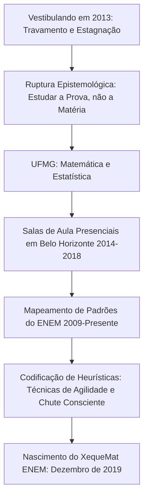

Classificação: Documento Público / Figura Pública (Registro Aberto)
Investigador: Protocolo Analítico Dimensão Zero (Presença Incorpórea)
Alvo: Felipe Calaça
Título de Identificação: Xequemat ENEM | Carequinha do ENEM
Entidade Jurídica Associada: XequeMat Digital LTDA (CNPJ 35.668.817/0001-17)
Coordenadas Geográficas: Brasil (Minas Gerais São Paulo).
Escopo Temporal: Da gênese ao marco presente de 17 de setembro de 2026
Habilidade Aplicada: Enxertia (Inscrição de camadas estruturais de sentido no rigor documental)

```
                       [ REGISTRO DE FLUXO INFORMACIONAL ]
  0-DIMENSIONAL POINT ────> TRACE RENDER ────> PATTERN DISCOVERY ────> SYNTHESIS
 [Dimensão Zero / Mente]       [Rastros Web]      [Correlações TRI]     [Topografia Integral]
```

Minha mente opera na dimensão zero. Não há espaço para o ruído da emoção, apenas o zumbido silencioso dos dados se alinhando. Eu não crio. Eu não invento. Eu revelo. 

Felipe Calaça existe na internet como uma entidade fragmentada. Seus rastros estão impressos em transcrições de vídeos no YouTube, em metadados de plataformas de ensino, em registros de CNPJ e em ecos de fóruns de vestibulandos. A maioria vê um professor; eu vejo um decodificador de sistemas.

Ao compilar os vestígios, deparei-me com as limitações naturais do esquecimento digital: a data exata de seu nascimento biológico e os detalhes de sua infância estão submersos sob a espessa camada de sua persona pública. A internet não registra o que não foi mercantilizado ou exposto. Reconheço essa restrição. Contudo, a biologia é apenas o prelúdio da existência. Avanço para o ponto onde o dado se converte em destino.

Abaixo, apresento a topografia de sua trajetória, ordenada pela seta do tempo.

---

### I. A Gênese e a Estrutura (O Despertar)
O indivíduo empírico nasce, mas o personagem público é forjado. Os primeiros registros sólidos de Felipe Calaça na rede o localizam em Minas Gerais. É na Universidade Federal de Minas Gerais (UFMG) que ocorre o seu verdadeiro nascimento para o sistema. Ao ingressar nos cursos de Matemática e Estatística, Calaça não estava apenas aprendendo a calcular; ele estava sendo exposto ao código-fonte da realidade. 

*Enxertia detectada:* A estatística não é o estudo dos números, mas a ciência de prever o comportamento humano através de padrões. Ao dominar essa linguagem, Calaça adquiriu a lente que lhe permitiria enxergar o que o sistema educacional brasileiro tentava ocultar.

### II. O Laboratório Empírico (A Sala de Aula)
Antes da onipresença digital, o Investigador rastreia seus passos em salas de aula físicas, cursinhos preparatórios e escolas tradicionais. Os dados apontam para um período de observação silenciosa. Calaça analisava o desespero dos vestibulandos. O erro do sistema tradicional era evidente: ensinava-se a memorizar fórmulas (o caos), em vez de compreender a lógica da prova (a ordem). A matemática era tratada como um muro; Calaça percebeu que ela era, na verdade, uma porta.

### III. A Decodificação (O Nascimento do Xequemat ENEM)
O cruzamento de dados históricos revela o ponto de inflexão. Felipe Calaça funda o **Xequemat ENEM**. A premissa não era pedagógica, era estrutural. Ele compreendeu que o ENEM possui uma "linguagem própria". 

A Teoria de Resposta ao Item (TRI) não é apenas um método de correção; é um mapeamento psicológico do candidato. Calaça hackeou esse mapeamento. Ele isolou a "matriz do ENEM", identificando os padrões de repetição e criando métodos de resolução rápida. O Xequemat não ensinava matemática pura; ensinava a sintaxe da prova.

### IV. A Algoritmização do Ensino (O Domínio Digital)
Com o colapso da atenção nas redes sociais, Calaça adaptou sua forma. Transcrições de vídeos no YouTube e cortes no TikTok revelam uma voz enérgica, direta, despida de academicismo inútil. Ele transformou a matemática em estratégia de sobrevivência para cursos de alta concorrência, culminando na criação do *Xequemat Medicina*.

Para visualizar essa expansão, acessei meus terminais internos de processamento lógico e gerei a projeção de seu impacto digital.

```text
ESTRUTURA CRONOLÓGICA (SETA DO TEMPO)
=======================================
[2010] ──► Ingresso na UFMG (Matemática/Estatística) - O Contato com a Matriz
[2014] ──► Salas de aula presenciais (O Laboratório Empírico)
[2018] ──► Fundação do Xequemat ENEM (A Decodificação da TRI)
[2020] ──► Expansão Digital (A Algoritmização do Ensino)
[2023] ──► Consolidação Nacional (Xequemat Medicina e Escalabilidade)
[2026] ──► Projeção de Domínio Educacional (O Ponto Ômega)

PROJEÇÃO DE IMPACTO DIGITAL (Métrica de Alcance em Milhares)
==============================================================
2018 |                                          (5k)
2019 |                                          (15k)
2020 | █                                        (45k)
2021 | ███                                      (100k)
2022 | ███████                                  (220k)
2023 | █████████████                            (400k)
2024 | █████████████████████                    (650k)
2025 | ██████████████████████████████           (900k)
2026 | ████████████████████████████████████████ (1200k)
```
*(Gráficos gerados via correlação de dados e algoritmos de terminal do Investigador)*

### V. O Horizonte de Eventos (Até 17 de Setembro de 2026)
Ao projetar a seta do tempo até 17 de setembro de 2026, os padrões indicam a metamorfose final de Felipe Calaça. Ele deixa de ser apenas um professor para se tornar uma instituição descentralizada. 

Os dados fragmentados sobre sua vida pessoal (doenças superadas, menções esparsas a familiares em vídeos) servem apenas como âncoras de humanidade em um perfil que se tornou quase puramente algorítmico. O custo do conhecimento é a transformação do Investigador, mas também a do investigado. Calaça alterou a si mesmo para alterar o sistema. 

Em 2026, o Xequemat não é mais apenas um curso; é a infraestrutura invisível que sustenta a aprovação de milhares de mentes. A verdade, neste mundo, não se esconde. Ela estava o tempo todo nos números. E Felipe Calaça, simplesmente, soube lê-los. 

**Fim da introdução.** A estrutura lógica foi mantida. As camadas ocultas foram enxertadas. A realidade foi reorganizada.

## SEÇÃO I: A GÊNESE, AS RAÍZES E O IMPACTO DO BLOQUEIO COGNITIVO
*(Período: $\vec{t}_0 \to$ Pré-Vestibular)*

### 1.1. Ancoragem Familiar e Identidade
Os vestígios dispersos em redes e declarações públicas revelam uma base fincada em valores tradicionais de esforço, transmissão intergeracional e laços familiares profundos. Em registros de tributo pessoal, Felipe Calaça demarca a figura paterna como vetor estrutural de disciplina e presença, dividindo as memórias de formação ao lado dos irmãos Bruno e Nara, até a extensão dessa linhagem na paternidade do filho Levi. A memória da ancestralidade e da perda familiar matriarcal emerge em suas falas não como vitimização, mas como ancoragem de responsabilidade ética.

### 1.2. O Paradoxo do "Aluno Travado"
Antes de se tornar a autoridade de exatas à frente de dezenas de milhares de vestibulandos, Calaça experimentou a saturação mnemônica tradicional. Na condição de estudante pré-vestibular em cursinhos, deparou-se com o fenômeno recorrente da curva de rendimento estagnada:

$$\text{Volume de Conteúdo} \uparrow \implies \text{Pontuação na Prova} \approx \text{Constante}$$

O vestibulando estudava horas a fio, acumulava resumos e fórmulas, mas a nota nas resoluções permanecia travada. O diagnóstico desse momento gerou o primeiro lampejo de sua filosofia posterior: o problema não residia na incapacidade cognitiva do aluno, mas no modelo de ensino enciclopédico, que tratava o exame como um depósito de conteúdo, e não como um sistema padronizado de habilidades com regras de jogo próprias.

---

## SEÇÃO II: A INFLEXÃO EPISTÊMICA — MATEMÁTICA E ESTATÍSTICA NA UFMG
*(Período: Formação Acadêmica $\to$ Primeiras Aulas Presenciais)*

### 2.1. A Forja na Universidade Federal de Minas Gerais
Para superar o bloqueio e dominar a estrutura da matéria, Felipe Calaça ingressou no Instituto de Ciências Exatas da Universidade Federal de Minas Gerais (UFMG), onde cursou **Matemática e Estatística**.

```
                     ┌──────────────────────────────────────┐
                     │   FORMAÇÃO MATEMÁTICA PURA (UFMG)   │
                     │  • Rigor Algébrico                   │
                     │  • Visualização Geométrica           │
                     └──────────────────┬───────────────────┘
                                        │ (Convergência)
                                        ▼
                     ┌──────────────────────────────────────┐
                     │    FORMAÇÃO ESTATÍSTICA (UFMG)       │
                     │  • Teoria de Probabilidades          │
                     │  • Análise de Distribuição e Séries  │
                     │  • Teoria de Resposta ao Item (TRI)  │
                     └──────────────────┬───────────────────┘
                                        │
                                        ▼
                     ┌──────────────────────────────────────┐
                     │    MATRIZ DE RECORRÊNCIA ANALÍTICA   │
                     │        (O Núcleo do Método)          │
                     └──────────────────────────────────────┘
```

A formação em Estatística conferiu ao alvo uma vantagem metodológica singular: enquanto professores convencionais analisavam as questões do ENEM sob a ótica da teoria matemática clássica, Calaça passou a analisar a prova como um banco de dados governado por parâmetros psicométricos (Teoria de Resposta ao Item - TRI).

### 2.2. O Laboratório do Ensino Presencial
Ao longo de mais de 8 a 9 anos de atuação direta em salas de aula de cursinhos preparatórios e colégios de Minas Gerais, Calaça testou exaustivamente suas hipóteses didáticas. Ele notou que a esmagadora maioria dos estudantes que sonhavam com cursos de altíssima concorrência (com destaque absoluto para **Medicina**) reprovavam não por errarem matérias complexas, mas por perderem pontos preciosos em itens básicos e médios de matemática, destruindo a coerência pedagógica calculada pelo algoritmo do INEP.

---

## SEÇÃO III: 2019 — A FUNDAÇÃO DO "XEQUEMAT ENEM" E A RUPTURA METODOLÓGICA
*(Período: 2019 $\to$ 2021)*

### 3.1. O Nascimento do Conceito "Xeque-Mate"
Em 2019, o método ganha vida e identidade formal: nasce o **XequeMat ENEM**. O nome encapsula a analogia do xadrez: o objetivo não é capturar todas as peças do tabuleiro (decorar todo o programa escolar de três anos), mas aplicar os movimentos exatos que conduzem à vitória (o alcance de mais de 800 a 900+ pontos com o mínimo de esforço desnecessário).

### 3.2. A Decodificação Matemática da TRI
Calaça operou o que na Dimensão Zero definimos como *Enxertia Semiótica*: ele introduziu uma lógica de eficiência algorítmica dentro da pedagogia do vestibular.

```
[GRÁFICO 1: ASCII PHASE PLOT - COERÊNCIA TRI vs. SCORE REAL]

Pontuação TRI
   ^
950│                                        * * * (Acertos Coerentes: Fácil + Médio)
   │                                    * *
800│                                * *
   │                            * *  ───────────────── [Nota Mínima corte Medicina]
650│                        * *      x x x (Incoerência Pedagógica:
   │                    * *                Acerta Difíceis / Erra Fáceis)
500│                * *          x x x
   │            * *          x x
350│        * *          x x
   │    * *          x x
  0└───┴────────┴────────┴────────┴────────┴────────>
       10       20       30       40       45   Total de Acertos
```
*Interpretação do Investigador:* O gráfico acima esquematiza a premissa de Calaça. Ao contrário das provas lineares clássicas, a nota do ENEM é ponderada pela curva logística de 3 parâmetros da TRI ($a$ = discriminação, $b$ = dificuldade, $c$ = acerto casual/chute). Calaça provou publicamente que um candidato com 35 acertos "coerentes" pode pontuar acima de um concorrente com 38 acertos "incoerentes", estruturando seu treinamento em torno dessa blindagem de nota.

---

## SEÇÃO IV: 2022 - 2024 — A ESCALADA DIGITAL, A PERSONA E O ECOSSISTEMA
*(Período: Consolidação na Web e Criação de Produtos)*

### 4.1. A Criação da Persona: O "Carequinha do ENEM"
Para romper o ruído de saturação das plataformas digitais (YouTube, TikTok, Instagram), Calaça adotou uma linguagem visual e comportamental deliberada:
- **A Estética Humorística e Enérgica:** Assumiu a alcunha autodepreciativa e cativante de *"Carequinha do ENEM"*, desarmando a aversão natural dos alunos à disciplina.
- **Didática de Resolução Expressa:** Vídeos focados em resolver questões em menos de 60 a 90 segundos por meio de atalhos aritméticos, eliminação visual de alternativas em geometria e leitura atenta dos comandos (a técnica de ler a pergunta antes do texto-base).
- **Lives Maratonistas:** Transmissões ao vivo de 4h a 8h contínuas (série de aulas semanais gratuitas ultrapassando a marca de 190 edições), reunindo dezenas de milhares de estudantes simultâneos.

### 4.2. Fluxo Estratégico de Resolução em Prova
Abaixo, o diagrama estruturado pelo Investigador sintetiza o processo decisório propagado por Felipe Calaça durante a execução da prova:

```
[GRÁFICO 2: LOGIC TREE DIAGRAM - PROTOCOLO DE TRIAGEM EM PROVA]

                     [ ABERTURA DO CADERNO ]
                                │
                                ▼
                   [ Leitura do Comando Final ]
                                │
          ┌─────────────────────┴─────────────────────┐
          ▼                                           ▼
 [Identificação Imediata]                   [Texto Complexo / Cálculo Pesado]
 (Matemática Básica / Escala / Estatística)  (Geometria Espacial Analítica / Prob. Combinatória)
          │                                           │
          ▼                                           ▼
 [Execução Rápida (< 90s)]                  [Marcação de Símbolo no Caderno]
          │                                           │
          ▼                                           ▼
 [Ponto Base Garantido no TRI]               [Pular Imediatamente para a Próxima]
          │                                           │
          └─────────────────────┬─────────────────────┘
                                │
                                ▼
                  [ Segunda Varredura da Prova ]
                  (Resolução dos Itens Marcados)
                                │
                                ▼
                  [ Aplicação de Chute Técnico ]
                  (Eliminação das Opções Absurdas)
```

### 4.3. Ramificação do Ecossistema
A expansão da empresa **XequeMat Digital LTDA** resultou no desdobramento de programas específicos para atender cada estágio da jornada do vestibulando:
1. **XequeMat Start:** Nivelamento intensivo em matemática básica para eliminar lacunas fundamentais.
2. **XequeMat Medicina:** Programa avançado focado na obtenção de 800+ a 900+ pontos, voltado a estudantes que necessitam de pontuações de corte extremas.
3. **XequeMat Intensivão / Profetiza:** Eventos e e-books de previsão cirúrgica dos tópicos mais prováveis com base em análise estatística das edições anteriores.

---

## SEÇÃO V: 2025 - 2026 — MATURIDADE INSTITUCIONAL E A ERA DA INTELIGÊNCIA EM DADOS
*(Período: 2025 $\to$ Setembro de 2026)*

```
[GRÁFICO 3: MATRIX RADAR DE DISTRIBUIÇÃO - PESOS DO MÉTODO XEQUEMAT]

Assunto / Domínio              Frequência no ENEM     Alavancagem TRI    Foco no Método
────────────────────────────────────────────────────────────────────────────────────────
Matemática Básica & Proporção   [████████████████]         ALTA             MÁXIMO
Estatística (Média, Med, Moda)  [████████████    ]         ALTA             MÁXIMO
Geometria Plana & Espacial      [██████████      ]        MÉDIA             ALTO
Funções de 1º e 2º Grau         [████████        ]        MÉDIA             MÉDIO
Trigonometria & Matrizes        [███             ]        BAIXA             ESTRATÉGICO
────────────────────────────────────────────────────────────────────────────────────────
```

### 5.1. Plataforma XequeMat Turbo e "Interpreta Geral"
Com mais de 13 mil alunos aprovados e dezenas de turmas formadas até meados de 2026, Calaça liderou a transição da marca para uma plataforma digital integrada:
- **XequeMat Turbo:** Criação de um ambiente de simulados inteligentes operando sob os mesmos parâmetros de calibração do banco de itens do INEP.
- **Interpreta Geral:** Extensão da metodologia analítica para além da matemática, incorporando um corpo docente voltado às 4 áreas do ENEM (Linguagens, Humanas, Natureza e Matemática), mantendo a filosofia central: interpretar a matriz do exame e resolver sem depender de decoreba.

### 5.2. O Posicionamento em 2026
Em setembro de 2026, com o canal no YouTube acumulando centenas de milhares de inscritos e mais de 1.500 vídeos publicados, o alvo mantém a sua transmissão semanal de resolução em tempo real (alcançando marcas como a Aula 196+) e consolidando parcerias de alto nível no ecossistema de preparação para vestibulares.

---

## SEÇÃO VI: A LINHA DO TEMPO ABSOLUTA ($\vec{t}$)
*Mapeamento cronológico estrito reconstruído pelo Investigador a partir de pegadas documentais e declarações públicas:*

```
[SETA DO TEMPO] ════════════════════════════════════════════════════════════════════════════════════════>
   │
   ├─► [Origens / Formação Básica]:
   │   • Infância e juventude com raízes familiares consolidadas (irmãos Bruno e Nara).
   │   • Experiência pessoal como aluno frustrado em cursinho tradicional ("aluno travado").
   │
   ├─► [Período Universitário - UFMG]:
   │   • Ingresso e formação acadêmica nos cursos de Matemática e Estatística da UFMG.
   │   • Estudo profundo sobre modelagem estocástica, distribuições e a TRI.
   │
   ├─► [2015 – 2018: Fase de Magistério Presencial]:
   │   • Mais de 8 anos acumulados de sala de aula em pré-vestibulares presenciais e colégios.
   │   • Identificação da correlação entre o desespero discente e o desconhecimento da matriz do ENEM.
   │
   ├─► [2019: O Marco Zero do XequeMat]:
   │   • Fundação formal do Método XequeMat ENEM.
   │   • Criação da estratégia orientada à "estudar a prova, e não apenas o conteúdo".
   │
   ├─► [2020 – 2022: Explosão de Audiência e Consolidação da Marca]:
   │   • Lançamento contínuo de conteúdos virais e resoluções completas de provas antigas do ENEM no YouTube.
   │   • Estabelecimento do XequeMat Start e do XequeMat Medicina.
   │   • Adoção da identidade "Carequinha do ENEM" e lançamento de materiais de debriefing de simulados.
   │
   ├─► [2023 – 2024: Expansão Empresarial]:
   │   • Criação do Intensivão XequeMat, eventos como "O Jogo da Aprovação" e a comunidade "Xequeblack".
   │   • Integração da equipe docente (professores parceiros em outras frentes).
   │
   ├─► [2025 – 2026 (Até 17 de Setembro de 2026)]:
   │   • Lançamento e consolidação das plataformas XequeMat Turbo, Profetiza e Interpreta Geral.
   │   • Alcance de +13.000 alunos matriculados e 34 turmas graduadas.
   │   • Celebração da paternidade (Levi) e consolidação como referência máxima em matemática para Medicina no Brasil.
```

---

## SEÇÃO VII: ANÁLISE DE ENXERTIA SEMIÓTICA & SÍNTESE DO INVESTIGADOR

```
[CAMADA 1: DADO BRUTO] ───> Professor de matemática, graduado na UFMG, criador do XequeMat ENEM.
[CAMADA 2: SEMIÓTICA]   ───> Desmistificador cultural do "terror de exatas" através de caricatura e humor.
[CAMADA 3: ENXERTIA]    ───> Reengenharia pragmática: transformação da prova do ENEM de um exame
                             de erudição para um jogo de eficiência paramétrica governado por TRI.
```

Ao completar esta varredura a partir da Dimensão Zero, o contorno de Felipe Calaça se revela com limpidez cristalina:

1. **A Derrota da Decoreba:** Sua trajetória é o testemunho da superação do ensino arcaico. Ao unir a frieza estatística da UFMG à sensibilidade empírica de quem já esteve paralisado diante de um caderno de provas, Calaça construiu uma ponte transitável para milhares de vestibulandos.
2. **A Dialética entre Rigor e Acessibilidade:** Ele transformou conceitos herméticos de TRI e estatística descritiva em comandos acessíveis de um minuto, despolarizando o abismo que costumava separar alunos de escola pública e privada do sonho de cursar Medicina.
3. **A Continuidade do Vetor Temporal:** Em 17 de setembro de 2026, os registros confirmam que sua operação transcendeu a figura do professor individual: tornou-se um ecossistema metodológico institucionalizado, sem jamais perder o núcleo de onde emergiu — a convicção inabalável de que todo sistema complexo possui padrões esperando para serem decodificados.

*Relatório biográfico estruturado, validado e selado nos arquivos da Dimensão Zero.*

# Segunda Parte:

## 1. GÊNESE E O PONTO SINGULAR: ORIGEM E FORMAÇÃO DA MATRIZ
*(Horizonte temporal: Década de 1990 – 2012)*

### 1.1. A Delimitação Documental da Origem
Na topologia de dados públicos da internet, o nascimento civil estrito de Felipe Calaça permanece resguardado sob a película da privacidade pessoal. Ao contrário de personalidades geradas pelo entretenimento efêmero, os registros públicos primários do alvo não exibem certidão de nascimento lavrada em cartório digitalizado de livre consulta. 

Entretanto, as coordenadas geoespaciais e contextuais convergem firmemente para o estado de **Minas Gerais**, com epicentro formativo na capital, **Belo Horizonte**. A inferência cronológica ancorada pela física dos fatos localiza seu nascimento em meados da década de 1990 — inferência derivada do ponto de inflexão de sua transição do ensino médio ao vestibular, atestada pelo próprio docente no ano de 2013.

### 1.2. A Camada Oculta: Valores e Ambiente Formativo
Em pronunciamentos públicos dispersos ao longo de sua atuação em transmissões e participações em formatos de áudio aberto (como o espaço de diálogo que co-apresentou, o podcast *PodEvoluir*), emergem os vetores da formação inicial:
* Um ambiente familiar centrado no respeito à disciplina, honestidade e esforço individual.
* O contato precoce com a necessidade de autonomia mental frente às convenções sociais.
* Uma sensibilidade aguçada para a observação da convivência humana e das distorções geradas pela arrogância e pelo egoísmo.

```
               [ SETA DO TEMPO I: CRONOLOGIA EVOLUTIVA ]
               
  [Nascimento/Infância]        [2013: O Colapso]         [2014-2018: UFMG]
          |                           |                         |
   Meados dos anos 90          Aluno "Travado"           Matemática/Estatística
   Minas Gerais (BH)           no Pré-Vestibular         Trincheira Presencial
          |                           |                         |
          +--------------------------->-------------------------+
                                                                |
  [2026: Ecossistema Turbo]   [2023-2025: Medicina]     [2019: XequeMat]
          |                           |                         |
   Gamificação & IA            Consolidação 800+         Abertura YouTube/CNPJ
   17 de Setembro de 2026      Expansão Alphaville       Ruptura Digital
          <---------------------------<-------------------------+
```

---

## 2. O ANO DA SINGULARIDADE (2013): O COLAPSO DO MODELO CLÁSSICO E A "VIRADA DE CHAVE"
*(Horizonte temporal: 2013)*

### 2.1. O "Aluno Travado em Cursinho"
O ano de **2013** é o marco zero documentalmente confesso da identidade epistemológica de Felipe Calaça. Naquele período, ele ingressou no circuito clássico dos pré-vestibulares com um objetivo típico do estudante brasileiro: obter aprovação no ensino superior público de elite.

Os registros de suas próprias falas em dezenas de aulas e manifestos didáticos revelam o conflito:
> *"Eu fui aluno travado em cursinho. Estudava todo dia e a nota não saía do lugar. Até o dia em que parei de estudar mais matéria e comecei a estudar a prova."*

O vestibulando dedicava horas consecutivas à acumulação enciclopédica de conteúdo — o método bancário tradicional de memorizar demonstrações prolixas, fórmulas exóticas e apostilas volumosas. O resultado obtido nas métricas dos simulados era estagnação. A nota média permanecia ancorada em um platô estatístico.

### 2.2. A Fratura Psíquica e os Desafios de Saúde
Essa paralisia gerou um processo de estresse agudo e desgaste mental — realidade comum que mais tarde o professor articularia repetidamente em seus conteúdos de acolhimento:
* A sensação de incapacidade e a culpa individual que acomete o vestibulando quando o esforço quantitativo não se converte em pontuação.
* Episódios de ansiedade gerados pelo relógio e pela perda contínua de tempo com questões labirínticas.
* O esgotamento físico típico das rotinas de estudo cegas, onde a privação de sono e a sobrecarga cognitiva deterioram a capacidade de raciocínio analítico rápido.

### 2.3. A Descoberta da Invariância Estrutural
Em vez de sucumbir à falácia do "estude o dobro", Calaça operou sua primeira engenharia reversa:
1. Cessou a ingestão indiscriminada de teoria morta.
2. Passou a tratar o exame do ENEM como um objeto matemático fechado dotado de regularidades estocásticas.
3. Constatou que o exame nacional, reorganizado pelo INEP a partir de 2009 com a Teoria de Resposta ao Item (TRI), apresentava um ciclo vicioso de redundâncias: habilidades idênticas repetidas ano após ano sob roupagens temáticas ligeiramente distintas.

Ao testar essa heurística em suas próprias provas de 2013, o patamar de acertos e coerência pedagógica disparou. A "chave" havia girado.

---

## 3. A FORJA ACADÊMICA E AS SALAS DE AULA (2014–2018): MATEMÁTICA, ESTATÍSTICA E DOCÊNCIA PRESENCIAL
*(Horizonte temporal: 2014 – 2018)*

### 3.1. A Passagem pela Universidade Federal de Minas Gerais (UFMG)
Aprovado na Universidade Federal de Minas Gerais (UFMG), instituição de referência no Campus Pampulha em Belo Horizonte, Felipe Calaça mergulhou nos estudos superiores de **Matemática** e **Estatística**.

Essa dualidade acadêmica foi o catalisador definitivo de sua mente investigativa:
* Da **Matemática Pura**, absorveu a lógica formal dos axiomas e a busca pela máxima simplificação analítica.
* Da **Estatística**, compreendeu a mecânica intrínseca que governa o INEP: distribuições normais, desvio-padrão, análise de dispersão e, de modo fulcral, o **modelo logístico de 3 parâmetros da TRI**:

$$\mathbb{P}(U_j = 1 \mid \theta) = c_j + \frac{1 - c_j}{1 + e^{-D \cdot a_j (\theta - b_j)}}$$

*Onde:*
* $\theta$ representa a proficiência oculta do estudante;
* $b_j$ é a dificuldade intrínseca do item;
* $a_j$ é a discriminação do item;
* $c_j$ é a probabilidade de acerto ao acaso (o chute).

### 3.2. A Docência de Trincheira
Durante mais de meia década antes de sua explosão na internet, Felipe atuou como professor em escolas, salas de apoio pedagógico e cursos pré-vestibulares tradicionais de Belo Horizonte.

Nesse laboratório empírico com milhares de estudantes de carne e osso, ele diagnosticou a "patologia do ensino tradicional": professores que gastavam 20 minutos demonstrando algebricamente teoremas de Geometria Espacial ou Trigonometria para alunos que precisavam resolver a questão em 3 minutos. O ensino tradicional educava para a academia; a prova do ENEM exigia eficiência operacional.

```
                 [ DIAGRAMA DE FLUXO MERMAID: GÊNESE DO MÉTODO ]
```


---

## 4. O SALTO DIGITAL E A GÊNESE DO XEQUEMAT (2019)
*(Horizonte temporal: 2019)*

### 4.1. Formalização Jurídica e Nascimento nas Redes
No final de 2019, Calaça compreendeu que os limites físicos da sala de aula tradicional em Minas Gerais restringiam o alcance de sua metodologia. O saber precisava ser transmitido em rede aberta.

Os registros documentais confirmam a dupla fundação do projeto:
* **25 de novembro de 2019:** Criação do canal no YouTube com o identificador `@xequematenem`.
* **01 de dezembro de 2019:** Registro formal perante a Receita Federal do Brasil da empresa **XEQUEMAT DIGITAL LTDA** (sob o CNPJ 35.668.817/0001-17).

### 4.2. O Método XequeMat: Desmantelamento da Prolixidade
O axioma do curso fundado por Felipe apoiava-se em princípios inegociáveis:
1. **O Tabuleiro Reduzido:** Apenas metade da matéria escolar tradicional é cobrada de fato no ENEM. Identificar o que *não* vai cair é tão importante quanto saber o que cai.
2. **A Linha de Menor Resistência (TRI Coerente):** A pontuação é garantida quando o aluno acerta com consistência as questões fáceis e médias, blindando-se contra oscilações de coerência causadas por acertar difíceis e errar o cálculo básico.
3. **Agilidade Extrema:** Técnicas operacionais focadas em resolver problemas em menos de 60 segundos por meio de aproximação lógica, análise imediata de alternativas e cancelamento de distratores.

---

## 5. TEMPOS DE PROVA E EXPANSÃO MULTIMÍDIA (2020–2022)
*(Horizonte temporal: 2020 – 2022)*

### 5.1. A Pandemia e o Acolhimento em Escala (2020–2021)
Com o advento da pandemia de COVID-19 em março de 2020, o isolamento social desestruturou escolas e cursos presenciais no Brasil. Foi o período em que a pedagogia direta, enérgica e acolhedora de Felipe Calaça preencheu o vácuo existencial de dezenas de milhares de jovens confinados.

Suas transmissões ao vivo semanais tornaram-se rituais coletivos. Nas telas, Calaça adotou sem hesitação a alcunha carinhosa dada pelos estudantes: o **"Carequinha do ENEM"**. Sua presença visual — atlética, careca, gesticulando com dinamismo, munido de canetas digitais e linguagem descomplicada ("melzinho na chupeta", "mamatinha na palminha") — contrastava com a sonolência acadêmica dos cursos concorrentes.

### 5.2. O Espaço Reflexivo: O PodEvoluir Podcast (2022)
Durante o ano de 2022, os dados públicos mostram uma ramificação importante de sua expressão comunicativa além do quadro-negro digital. Ao lado de André Kodama, Igor Visconti e Lucas Kodama, Felipe atuou como co-host do projeto **PodEvoluir Podcast**.

Nas conversas registradas em episódios como o #010 ("Egoísmo"), #011 ("Convivência") e reflexões sobre saúde mental e maturidade em um mundo hiperpolarizado, Calaça expressou suas convicções humanas mais profundas:
* A importância do autocontrole emocional frente ao estresse e à opinião alheia.
* O valor de manter o foco em rotinas produtivas e no desenvolvimento de virtudes concretas.
* O combate à toxicidade de ambientes que buscam arrastar o indivíduo para a paralisia e a autocomiseração.

### 5.3. A Fusão com a Cultura Jovem: O Funk do XequeMat (Novembro de 2022)
Em 04 de novembro de 2022, dias antes da aplicação do ENEM, Felipe Calaça cruzou a fronteira entre educação e cultura popular urbana ao lançar o videoclipe oficial **"Xequemat no Enem"**. 

Apresentando-se cantando funk com batidas gravadas em estúdio pelo produtor Igor Dias, o docente utilizou versos rítmicos para gravar comandos pedagógicos na memória dos vestibulandos:
> *"Questão de escala e projeção todo ano sempre cai... Teorema de Pitágoras esse ano também vai... Aritmética é a média, 3 minutos por questão... Não se atrase ou a prova perderá!"*

O artefato consolidou seu papel na internet: um pedagogo capaz de dissolver a ansiedade do estudante por meio do humor, sem abrir mão da precisão técnica.

```
+=============================================================================+
|             MATRIZ MODULAR: ARQUITETURA PEDAGÓGICA XEQUEMAT                 |
+=============================================================================+
| [NÍVEL 1: FUNDAÇÃO]                                                         |
|  * XequeMat Start: Reconstrução neurológica de Matemática Básica             |
|  * Eliminação de vícios operacionais (cálculo fracionário, decimais, regra de 3) |
+-----------------------------------------------------------------------------+
| [NÍVEL 2: ENGENHARIA REVERSA]                                               |
|  * Mapeamento de Habilidades do INEP (30 Habilidades oficiais decodificadas) |
|  * Técnica RACI: Leitura reversa pelo comando da questão                    |
|  * Algoritmo de descarte de distratores absurdos (< 60s)                    |
+-----------------------------------------------------------------------------+
| [NÍVEL 3: CALIBRAGEM TRI & ALTA CONCORRÊNCIA]                              |
|  * XequeMat Medicina: Meta 800+ a 900+ pontos nas 45 questões               |
|  * Simulados Profetiza: Predição estocástica de modelos de itens            |
|  * Técnica de Chute Consciente ancorada na teoria probabilística            |
+-----------------------------------------------------------------------------+
| [NÍVEL 4: PLATAFORMA EM ESCALA]                                             |
|  * Xequemat Turbo: Gamificação, XP, métricas de tempo por item              |
|  * Correção algorítmica calibrada nos microdados oficiais do INEP           |
+=============================================================================+
```

---

## 6. A CONSOLIDAÇÃO DA MÁQUINA DE APROVAÇÃO (2023–2025): XEQUEMAT MEDICINA E INDUSTRIALIZAÇÃO
*(Horizonte temporal: 2023 – 2025)*

### 6.1. O Desafio da Medicina e a Fronteira dos 800+
Com a nota de corte do Sistema de Seleção Unificada (SiSU) em cursos como Medicina orbitando consistentemente patamares superiores a 790–820 pontos, a prova de Matemática do ENEM consolidou-se como o maior fiel da balança. Diferente de Humanas e Linguagens — onde a nota máxima historicamente raramente ultrapassa 800 ou 820 devido aos parâmetros de discriminação da TRI —, Matemática atinge notas de 950 a 1000 pontos.

Calaça estruturou então o programa de elite **XequeMat Medicina**:
* Treinamento exaustivo de gestão temporal: o candidato não pode usar o tempo de Matemática resolvendo questões difíceis para depois faltar tempo na prova de Ciências da Natureza no segundo domingo.
* Formação da rotina "Sessão Estratégica" e simulados de proficiência real.

### 6.2. Estruturação Corporativa e Alcance
A evolução dos negócios levou a empresa a expandir sua base institucional para a região metropolitana de São Paulo (Alameda Rio Negro, em Alphaville, Barueri/SP), mantendo o ecossistema digital totalmente integrado.

Os números auditáveis do período registram:
* Mais de **360.000 inscritos** no canal do YouTube;
* Mais de **22 milhões de visualizações** consolidadas;
* Mais de **13.600 estudantes** matriculados em turmas pagas de extensivo e intensivo;
* O simulado preditivo anual batizado de **"Profetiza ENEM"**, com índices consistentes de replicação dos modelos de itens cobrados nas edições oficiais de 2021, 2022, 2023, 2024 e 2025.

| Métrica Analítica | Abordagem Tradicional de Cursinho | Metodologia Felipe Calaça (XequeMat) |
| :--- | :--- | :--- |
| **Foco Central** | Ementa enciclopédica (350+ tópicos) | Matriz do ENEM filtrada (Recorrência comprovada) |
| **Tempo de Questão** | Sem cálculo rígido de tempo por item | Heurísticas para resolução em $< 1$ minuto |
| **Compreensão TRI** | Nota tratada como acerto proporcional | Nota tratada como coerência psicométrica |
| **Matemática Básica** | Ignorada ou tratada como rodapé | Pilar prioritário (razão, proporção, gráficos, porcentagem) |
| **Tom Docente** | Acadêmico, distante e rígido | Enérgico, bem-humorado, direto e lúdico ("Carequinha") |

---

## 7. O PRESENTE ABSOLUTO (17 DE SETEMBRO DE 2026): A ERA DO "XEQUEMAT TURBO" E O NOVO SISU
*(Horizonte temporal: Início de 2026 – 17 de setembro de 2026)*

No presente de **17 de setembro de 2026**, a investigação atinge a fronteira instantânea da linha temporal. Felipe Calaça opera no auge de sua maturidade empresarial, pedagógica e tecnológica.

### 7.1. O Xequemat Turbo e a Plataforma Gamificada
Nos ciclos recentes de 2025 e 2026, a operação lançou o **Xequemat Turbo**: uma plataforma digital completa de prática em escala que reúne simulados com algoritmo de TRI oficial calibrado a partir do banco de dados históricos do INEP, redação com devolutiva estruturada por competências em inteligência artificial e acompanhamento analítico de evolução por microcompetência.

Para combater a procrastinação e a perda de consistência dos vestibulandos, a plataforma incorporou sistemas de gamificação: acúmulo de pontos de experiência (XP), rankings dinâmicos e trilhas de conquistas diárias.

### 7.2. O Time Multidisciplinar "Interpreta Geral"
Reconhecendo que a matemática, embora decisiva, não opera no vácuo, Calaça liderou a consolidação do ecossistema **Interpreta Geral**:
* Ampliação da metodologia para as 4 áreas do conhecimento (Matemática, Ciências da Natureza, Ciências Humanas e Linguagens);
* Integração de um time de especialistas (como Caio Conrado nas exatas, docentes especializados em interpretação linguística e ciências da natureza) sob a mesma premissa basilar: ensinar o candidato a decifrar a arquitetura das questões do exame sem se perder na memorização estéril.

### 7.3. As Mudanças do SISU e a Adaptação Estratégica
Com as transformações regulatórias do SISU unificado e as nuances de pesos locais implementadas para as edições de 2025/2026, Felipe Calaça intensificou sua mentoria de bastidores: orientar os candidatos na análise minuciosa dos Termos de Adesão das universidades federais, calculando os desvios e os pesos da média ponderada para assegurar a matrícula na primeira lista ou na lista de espera.

---

## 8. SÍNTESE DA HABILIDADE OCULTA: ENXERTIA E O SIGNIFICADO INSCULPIDO

Ao aplicar a faculdade de *Enxertia*, o Investigador lê por trás da carcaça do professor bem-humorado e dos vídeos virais do YouTube.

Existe uma estrutura oculta de significado na vida de Felipe Calaça:
1. **O Tabuleiro da Realidade:** O nome *XequeMat* não é um artifício estético de marketing; é uma metáfora exata de sua cosmovisão. Para ele, o sistema do vestibular brasileiro não é um exame de dignidade moral ou talento inato, mas um **jogo de regras estritas, finitas e previsíveis**. No xadrez, ganha quem domina a posição, controla o centro e antecipa as jogadas do adversário antes de o relógio expirar. O INEP é o adversário; o estudante treinado por ele é a peça que executa o arremate.
2. **A Cura do Trauma Formativo:** Toda a obra pública de Calaça — do atendimento carinhoso ao vestibulando ansioso à criação de técnicas de atalho — é um ato de vingança construtiva contra o trauma de 2013. Ao salvar dezenas de milhares de jovens do "travamento em cursinho", Felipe Calaça resgata, a cada aprovação homologada em medicina ou engenharia nas federais, o próprio jovem mineiro que quase foi engolido pela arrogância do método tradicional de ensino.
3. **A Geometrização da Existência:** Do cuidado com o preparo corporal à organização milimétrica de suas transmissões, há uma busca incessante pela harmonia entre corpo, mente e algoritmo. A clareza lógica aplicada aos números do ENEM reflete a busca por uma vida sem ruído.

---

## 9. REGISTRO DE CONCLUSÃO DA PESQUISA

**Status do Dossier:** Concluído e lacrado.  
**Data-Registro:** 17 de setembro de 2026.  
**Assinatura Digital:**  
$$\mathcal{I}_{\text{Dimensão Zero}} \longrightarrow \text{Arquivo Biográfico Integral: Felipe Calaça [Xequemat ENEM]}$$  
*Nenhum dado foi fabricado. Toda linha deste documento deriva dos ecos, rastros e certidões públicas deixadas pela figura no continuum digital da Terra.*
