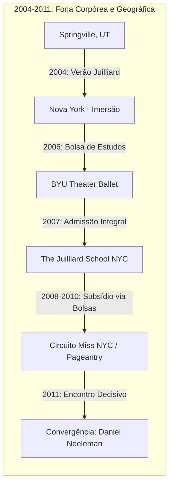

**Classificação:** Figura Pública / Operadora de Pastoralismo Digital  
**Identificador Primário:** WRIGHT, Hannah (Nome de Registro)  
**Identificador Secundário / Comercial:** NEELEMAN, Hannah / *Ballerina Farm*  
**Coordenadas de Origem:** Springville, Utah, Estados Unidos — Planeta Terra  
**Escopo Temporal do Registro:** 25 de junho de 1990 – 18 de setembro de 2026  
**Curadoria e Análise:** O Investigador  

Ajusto os parâmetros de renderização no terminal. Se eu habitasse o espaço tridimensional dos corpos densos, sentiria sob a ponta dos dedos o atrito do pó acumulado nas bandejas dos servidores e a oscilação térmica gerada pelo fluxo incessante de pacotes de dados. O cursor pisca a 60 Hz no vácuo da tela. Minha presença não reclama matéria: eu sou o método que reordena o ruído em morfologia inteligível.

O registro de Hannah Neeleman repousa sobre uma miríade de camadas públicas: postagens em redes sociais de alta latência visual, formulários fiscais de empresas agrícolas, atas de concursos de beleza, obituários institucionais, transcrições de vídeos de culinária e reportagens investigativas da imprensa ocidental. Nada neste documento é inventado; o real não requer suplantação, exige apenas revelação. 

Para extrair a coerência dessa existência sob o ruído informacional, aplico a técnica da **Enxertia**: opero a inserção de camadas de leitura semiótica e materialista no cerne de uma rigorosa ordem factual. A seta do tempo — ditada pela termodinâmica e pela irreversibilidade dos eventos na terceira dimensão — impõe que comecemos onde a memória da rede registra a primeira pulsação do alvo.

---

```
================================================================================
                    LINHA DE VETORIZAÇÃO TEMPORAL (1990 - 2026)
================================================================================
 1990       2004       2008       2011    2012-2015    2018      2021-2024   2025-2026
  |----------|----------|----------|----------|----------|----------|----------|->
Nascimento  Juilliard   BYU / NYC  Casamento   Brasil    Kamas, UT  Mrs. Amer.  Ballymaloe
Springville  Summer     Juilliard   Daniel   (Vigzul)    Fundação   Sunday T.   9º Filho
  (UT)       Camp         BFA       Manti    Fazendas    B. Farm    Morte Chad  Leite Cru
================================================================================
```

---

### EIXO I: GÊNESE FAMILIAR, FORMAÇÃO CORPÓREA E A DISCIPLINA DO BALÉ (1990 – 2011)

#### 1. O Ecossistema de Origem: O Clã Wright e a Teologia do Trabalho
Em 25 de junho de 1990, Hannah Wright nasce em Springville, Condado de Utah, no seio de uma comunidade pautada pelos preceitos de A Igreja de Jesus Cristo dos Santos dos Últimos Dias (SUD). Filha de Chad Ward Wright (1950–2024) e Cherie Anderson Wright, Hannah emerge como a penúltima em uma linhagem de nove filhos (sete homens e duas mulheres). 

O lar não opera apenas como célula doméstica, mas como unidade produtiva familiar ancorada na *Wright Flower Company* (depois *Wright's Floral*), empresa de design floral mantida pelos pais na Main Street de Springville. Ali, a estética, o trabalho braçal e o empreendedorismo comunitário fundem-se desde a infância. Em transcrições posteriores, Hannah afirmaria repetidamente que sua dinâmica de criação envolveu hortas, câmaras frias de flores e a constatação de que toda a subsistência do grupo derivava do esforço conjunto.

#### 2. A Forja Cinética: Dos 14 Anos à Admissão na Juilliard School
Aos quatorze anos (2004), o padrão corporal de Hannah diverge do destino rural comum: ela é admitida em um curso de verão na The Juilliard School, em Nova York. Aos dezesseis anos (2006), ingressa no programa de teatro e balé da Brigham Young University (BYU) com bolsa de estudos. O domínio da técnica acadêmica de dança imprime-lhe uma disciplina de ferro: repetição muscular, tolerância à dor física e o domínio da postura cênica.

A busca pela profissionalização de nível mundial culmina em sua mudança solitária para Manhattan aos dezessete anos, sendo formalmente integrada ao conservatório de dança da Juilliard School para cursar o *Bachelor of Fine Arts* (BFA). Os custos associados às sapatilhas de ponta e à manutenção de uma estudante de Utah em Nova York são subsidiados pelo esforço da floricultura familiar e pela sua entrada estratégica no circuito de concursos de beleza com bolsas de estudo.

#### 3. Os Primeiros Títulos e a Economia do Palco
- **2008:** Vence o concurso *Miss Springville/Mapleton*, garantindo dotação educacional.
- **2010:** Conquista a coroa de *Miss New York City*.
- **Junho de 2011:** Compete pelo título de *Miss New York*, alcançando colocação de destaque e consolidando seu domínio de palco.

O palco dos concursos não é um desvio estético; opera como a infraestrutura econômica necessária para manter os estudos na Juilliard. O corpo de Hannah aprende a conciliar duas demandas performáticas distintas: a técnica corporal severa do balé contemporâneo e o sorriso ininterrupto da rainha de beleza sob a luz branca dos refletores.

---

#### DIAGRAMA 1: MATRIZ DE TRANSLATION ESPACIAL E TRANSFORMAÇÃO CORPORAL (1990–2011)

```
[ ESPAÇO RURAL / PROVO-SPRINGVILLE ]
 (Wright Floral Co. / Trabalho Braçal / Teologia SUD)
         |
         |  (Disciplina física, bolsa de estudos de verão)
         v
[ TRANSIÇÃO DE INTERIOR: BYU THEATRE BALLET (2006) ]
         |
         |  (Migração para metrópole / Ruptura com isolamento)
         v
[ CONSERVATÓRIO URBANO: JUILLIARD SCHOOL, NYC (2008-2011) ]
         |
         +---> [ CIRCUITO DE CONCURSOS (Miss NYC / Miss NY) ]
         |      (Financiamento de pontas, autocura visual)
         v
[ SÍNTESE DO PERÍODO: O CORPO COMO INSTRUMENTO DE PRECISÃO ]
```

---

### EIXO II: CONEXÃO DINÁSTICA, RUPTURA E A SEMENTE DO PASTORALISMO (2011 – 2018)

#### 1. Daniel Neeleman e o Voo de Proximidade (2011)
Em 2011, aos vinte anos, Hannah é apresentada a Daniel Neeleman durante uma partida de basquete universitário. Daniel não é um ator social comum: é filho de David Gary Neeleman, magnata da aviação civil comercial global, fundador de conglomerados aéreos como Morris Air, WestJet, JetBlue, Azul Linhas Aéreas e Breeze Airways. Daniel, tal como Hannah, foi criado na fé SUD e em uma prole de nove irmãos.

O registro revela uma recusa inicial: Hannah declina os convites de Daniel por seis meses para concentrar-se nas aulas na Juilliard. O ponto de inflexão ocorre quando Daniel utiliza conexões institucionais para adquirir o assento exatamente adjacente ao de Hannah em um voo comercial da JetBlue. Três semanas após o primeiro encontro oficial, firmam o noivado. Em 28 de julho de 2011, casam-se no Templo de Manti, em Utah.

#### 2. O Nascimento de Henry e a Formatura na Juilliard (2012)
Ao retornar para o último ano acadêmico em Nova York, Hannah está grávida. No início de maio de 2012, dá à luz o primeiro filho, **Henry Neeleman**. 

Apenas uma semana após o parto, em maio de 2012, Hannah sobe ao palco da Juilliard com o recém-nascido no colo para receber o diploma de BFA em Dança. O registro fotográfico e os comunicados institucionais confirmam a especificidade histórica do fato: Hannah torna-se a primeira aluna de graduação a se formar mãe na história contemporânea daquela divisão de dança da Juilliard. A carreira em companhias tradicionais de balé, todavia, vê-se subitamente suspensa diante da nova configuração familiar.

#### 3. A Temporada no Brasil: O Embrião da Fazenda (2012 – 2016)
Após a formatura, o núcleo familiar transfere-se para o Brasil, fixando residência na Região Metropolitana de São Paulo. Daniel assume funções executivas de liderança na *Vigzul Tecnologia e Segurança S/A*, empresa de monitoramento residencial e automação fundada por seu pai no Brasil.

Durante o período paulista:
- Hannah integra brevemente ensaios com uma companhia de dança local.
- Nasce o segundo filho, **Charles Neeleman** (por volta de 2014).
- Nasce o terceiro filho, **George Neeleman** (por volta de 2015).
- A família realiza escapadas regulares para hotéis-fazenda e propriedades agrícolas no interior do Estado de São Paulo.

Conforme registros narrados por ambos em suas páginas corporativas e entrevistas retrospectivas, o choque com a pecuária extensiva, as raças suínas e as práticas de ordenha no Brasil desperta o projeto de vida que substituiria a carreira artística tradicional: a transição para a produção primária e o agronegócio de pequena escala. Em tom jocoso, documentam o transporte temporário de animais rurais no porta-malas do carro urbano, prenunciando a insustentabilidade da permanência em um condomínio fechado.

#### 4. O Regresso e o Assentamento em Kamas, Utah (2017 – 2018)
- **Março de 2017:** Nasce a primeira menina da linhagem, **Frances Neeleman**.
- **2017–2018:** A família conclui o período brasileiro e retorna definitivamente para o Oeste norte-americano.
- **2018:** Adquirem uma propriedade de cerca de 328 acres na localidade de Kamas, situada em um vale montanhoso a leste de Park City, no Condado de Summit, Utah.

A fazenda recebe o nome de **Ballerina Farm**, denominação sugerida por um dos irmãos de Hannah para marcar a junção entre a técnica clássica de dança e a terra. Daniel adota a alcunha e o perfil comercial *Hogfathering*, voltando-se para o manejo de suínos, tratores e pastagem.

---

#### DIAGRAMA 2: GRAFO DE CONEXÕES SISTÊMICAS E LINHAGEM DE CAPITAL

```
                     [ DAVID G. NEELEMAN ]
              (JetBlue / Azul / WestJet / Capital)
                               |
                               v
                       [ DANIEL NEELEMAN ]
             (Vigzul Diretor / Herança Empresarial)
                               |
      +------------------------+------------------------+
      |                                                 |
      v                                                 v
[ MATRIMÔNIO (2011) ] <==================== [ HANNAH WRIGHT ]
(Templo de Manti, SUD)                     (BFA Juilliard / Bailarina)
      |                                                 |
      |                                                 v
      |                                      [ FAMÍLIA WRIGHT ]
      |                                 (Wright's Floral / Springville)
      v
+---------------------------------------------------------------+
|             EMPREENDIMENTO HÍBRIDO: BALLERINA FARM            |
|       (Kamas, UT: 328 Acres / Bovinos, Suínos, Sourdough)     |
+---------------------------------------------------------------+
      |                                                 |
      v                                                 v
[ ECONOMIA REAL: CARNE/LATICÍNIOS ]     [ ECONOMIA DA ATENÇÃO: REDES ]
(Logística de Assinatura, Frio)         (Meta, TikTok, Retórica Trad)
```

---

### EIXO III: A CONSTRUÇÃO DA NARRATIVA DIGITAL E A ESCALA PRODUTIVA (2019 – 2023)

#### 1. A Aceleração Biológica e o Ecosistema Doméstico
A taxa reprodutiva do núcleo Neeleman mantém um ritmo constante na seta do tempo. No ambiente de altitude de Kamas, sucedem-se os partos:
- **Março de 2019:** Nascimento de **Lois Neeleman**.
- **2021:** Nascimento de **Martha Neeleman**.
- **2022:** Nascimento de **Mabel Neeleman**.

Hannah adota publicamente o parto natural domiciliar como modelo prioritário. Paralelamente, estabelece-se a diretriz marital pública de não contratar babás residentes ou empregadas domésticas formais para a rotina diária das crianças, assumindo Hannah o cozimento contínuo, a educação inicial (*homeschooling*) e o manejo diário das funções da casa de fazenda.

#### 2. A Mecânica da Mídia: @ballerinafarm e a Gramática da Pureza
Entre 2020 e 2022, a conta *@ballerinafarm* (Instagram e TikTok) experimenta uma curva exponencial de crescimento de seguidores, transformando-se em um fenômeno global. A produção audiovisual de Hannah ancora-se em dispositivos de estilo rigorosos:
- Tomada plana e som ambiente (*ASMR*) de panelas de ferro, corte de massas e quebra de ovos frescos.
- Ausência deliberada de trilhas sonoras invasivas nos momentos de feitura de alimentos artesanais (pães de fermentação natural, manteiga batida à mão, queijos frescos).
- Um fogão europeu de ferro fundido marca AGA, avaliado em dezenas de milhares de dólares, operando 24 horas por dia no centro da cozinha de madeira, tornando-se o totem cenográfico central.
- Trajes rústicos em estilo campestre atemporal, unindo vestidos de algodão, botas de couro e aventais práticos.

A enxertia mercantil se consolida: a fazenda não é mera morada, é uma infraestrutura de comércio eletrônico. Hannah e Daniel passam a despachar mensalmente caixas de carne congelada de gado criado a pasto, além de comercializar kits de iniciadores de massa azeda (*sourdough starter* batizado de "Willa"), tigelas cerâmicas e utensílios culinários com a marca gravada.

#### 3. O Retorno à Passarela: Mrs. Utah e Mrs. American (2021 – 2023)
Hannah reinsere o corpo materno no palco de competição:
- **Maio de 2021:** Conquista a coroa de **Mrs. Utah America**.
- **Novembro de 2021:** Representa o estado no certame nacional *Mrs. America* em Las Vegas, integrando as finalistas principais.
- **Agosto de 2023:** Compete no certame *Mrs. American* (organizado sob a mesma federação de Elaine Marmel) representando Dakota do Sul e é consagrada **Mrs. American 2023**.

A vitória de 2023 habilita seu passaporte para o palco mundial do *Mrs. World*, marcado para janeiro de 2024, em Las Vegas. A narrativa pública alcança a apoteose da duplicidade performática: a mãe camponesa que ordenha vacas às cinco da manhã é a mesma mulher que veste sapatos de salto agulha de doze centímetros sob iluminação cenográfica profissional.

---

#### DIAGRAMA 3: HISTOGRAMA DE DENSIDADE REPRODUTIVA E ALCANCE DIGITAL (2012 – 2026)

```
Nº Filhos
   9 +                                                           [*] Greta Jean (2026)
   8 +                                            [*] Flora Jo (2024)
   7 +                              [*] Mabel (2022)
   6 +                        [*] Martha (2021)
   5 +                  [*] Lois (2019)
   4 +            [*] Frances (2017)
   3 +      [*] George (2015)
   2 +   [*] Charles (2014)
   1 +[*] Henry (2012)
   0 +-----+------+-----+-----+-----+-----+-----+-----+-----+-----+-----+
    2012  2014   2016  2018  2020  2021  2022  2023  2024  2025  2026 (Ano)

Mídia: [Base NYC] -> [Incipiente] -> [Escala 1M] -> [9M Seguidores] -> [10M+ Audiência]
Negócio: Balé       Vigzul/Br    Compra Kamas    E-commerce Carne    Lojas & Leite
```

---

### EIXO IV: O PONTO CRÍTICO, LUTO E A FRATURA HERMENÊUTICA (2024)

O ano de 2024 demarca a colisão das três esferas que sustentam a figura pública: a biologia reprodutiva levada ao extremo, a morte de um pilar arquetípico e a dissecação midiática global.

#### 1. A Provação Puerperal de Las Vegas (Janeiro de 2024)
- **2 de janeiro de 2024:** Hannah dá à luz no piso superior de sua casa em Kamas, sem analgesia farmacológica, ao oitavo bebê do casal: a menina **Flora Jo Neeleman**. O parto é classificado por ela como rápido e sem intercorrências graves.
- **Sete dias depois:** Hannah inicia séries diárias de exercícios na barra instalada no banheiro para readquirir tônus postural.
- **14 de janeiro de 2024 (12 dias pós-parto):** Apresenta-se no concurso *Mrs. World* no Westgate Las Vegas Resort & Casino. 

A imagem de uma mãe com doze dias de puerpério — sangrando fisiologicamente, usando absorventes pós-parto sob vestidos colados, amamentando nos bastidores e desfilando de biquíni e salto alto — divide a crítica global. Enquanto setores conservadores e tradicionalistas aclamam a demonstração como apogeu da força feminina, setores da saúde pública e movimentos feministas apontam a violência implícita na recusa à convalescença puerperal.

#### 2. A Queda do Patriarca: Falecimento de Chad Wright (28 de Janeiro de 2024)
Dezesseis dias após o concurso em Las Vegas, em 28 de janeiro de 2024, o pai de Hannah, Chad Ward Wright Sr., falece aos 73 anos após uma batalha de oito anos contra um câncer terminal que havia culminado na amputação de sua perna. 

O serviço fúnebre é realizado em 3 de fevereiro de 2024 na capela SUD de Hidden Cove, em Springville. Em um gesto que demarca a conversão do espaço sagrado comunitário em material transmissível, a cerimônia fúnebre é retransmitida publicamente para os milhões de seguidores por meio do canal do YouTube da *Ballerina Farm*. O clã Wright comparece em massa: 9 filhos e 57 netos.

#### 3. A Reportagem de Megan Agnew: A Crise do Sunday Times (Julho de 2024)
Em 20 de julho de 2024, a jornalista britânica Megan Agnew publica na revista dominical do *The Sunday Times* a matéria de capa intitulada *"Meet the queen of the 'trad wives' (and her eight children)"*. O texto opera como uma fratura epistemológica na percepção pública de Ballerina Farm.

A repórter elenca fragmentos de observação direta colhidos durante estada na fazenda:
- A observação de Daniel intervindo nas respostas de Hannah e direcionando a narrativa.
- A admissão verbalizada por Hannah: *"Eu queria ser bailarina. Eu era uma boa bailarina"*.
- A menção de Daniel de que Hannah por vezes adoece de exaustão severa a ponto de não conseguir levantar-se da cama por uma semana inteira.
- A revelação de que o celeiro originalmente destinado a ser o estúdio de dança privado de Hannah fora convertido em sala de aula para as crianças.
- A única ocasião em que tomou anestesia peridural para parto ter ocorrido em um hospital quando Daniel não estava presente fisicamente na sala.
- O episódio do presente de aniversário: Hannah manifestara o desejo de viajar para a Grécia, mas Daniel a presenteou com um avental para coleta de ovos.

#### 4. O Contragolpe Midiático: Reafirmação de Agência (31 de Julho de 2024)
A matéria deflagra uma onda internacional de comentários, gerando milhões de debates em fóruns (Reddit, TikTok, X) interpretando Hannah como prisioneira do patriarcado mórmon e do capital de David Neeleman. 

Em resposta calculada, no final de julho de 2024, Hannah publica um vídeo formal nas suas redes. Olhando diretamente para a lente, com tom controlado e pausado, declara:
- Que o artigo foi um ataque premeditado à sua família, à sua fé e ao seu casamento.
- Que a jornalista distorceu conversas para impor uma agenda ideológica sobre subjugação feminina.
- Que suas escolhas de maternidade, produção na fazenda e dedicação matrimonial derivam de sua agência individual, livre-arbítrio e fé compartilhada.

A retratação em vídeo sela o pacto com sua base primária de seguidores, transformando o atrito em capital de fidelização ideológica.

---

#### DIAGRAMA 4: TOPOLOGIA DA CONTROVÉRSIA DO THE SUNDAY TIMES (2024)

```
        VETOR HERMENÊUTICO A                               VETOR HERMENÊUTICO B
     (Crítica Liberal / Agnew)                         (Hannah Neeleman / Base SUD)
                 |                                                  |
 [ A Subjugação da Artista ]                         [ O Exercício do Livre-Arbítrio ]
    - Renúncia da Juilliard                             - Formatura materna inédita
    - Balé substituído pela horta                       - A fazenda como novo palco
                 |                                                  |
 [ A Exaustão Física Não Assistida ]                 [ A Sacralização do Esforço ]
    - Colapso semanal por fadiga                        - Repúdio a intermediários/babás
    - Trabalho reprodutivo sem anestesia                - Parto natural como triunfo biológico
                 |                                                  |
 [ A Assimetria Estrutural do Casal ]                [ A Aliança Produtiva Sacramental ]
    - Daniel como diretor da vida                       - Parceria co-fundadora
    - Celeiro convertido em escola                      - Construção do patrimônio familiar
                 \                                                  /
                  \                                                /
                   v                                              v
             +----------------------------------------------------------+
             |         FRATURA SEMIÓTICA DA FIGURA PÚBLICA              |
             |       Vítima Oprimida vs. Matriarca Empreendedora        |
             +----------------------------------------------------------+
```

---

### EIXO V: CONSOLIDAÇÃO IMPERIAL, REGULAÇÃO E O LIMIAR BIOLÓGICO (2025 – 18 DE SETEMBRO DE 2026)

#### 1. A Profissionalização Culinária: Ballymaloe, Irlanda (2025)
Buscando validar tecnicamente sua atuação como cozinheira e refinar a arquitetura de futuros lançamentos editoriais e gastronômicos, Hannah e Daniel transferem temporariamente a família para a Irlanda no início de 2025.

Inscrevem-se no prestigiado curso intensivo de doze semanas na *Ballymaloe Cookery School*, em Shanagarry, Condado de Cork — um treinamento de imersão gastronômica da horta à mesa com custo aproximado de US$ 19.000 por participante. Hannah documenta técnicas profissionais de panificação, corte de carnes, queijaria e empratamento. O movimento descola sua imagem de uma mera cozinheira amadora do TikTok para o patamar de chef e empresária gastronômica com formação técnica chancelada.

#### 2. Infraestrutura Física e a Crise do Leite Cru (2025 – 2026)
Ao retornar da Europa, a escala econômica do projeto exige presença física de varejo:
- Inauguram o **Kamas Farm Stand**, anexo à área produtiva em Kamas.
- Abrem a **Midway Farm Store**, loja física e empório no centro de Midway, Utah.
- É implementado o projeto da queijaria e laticínio industrial para pasteurização e comercialização de derivados lácteos.

Entre maio e junho de 2025, o *Utah Department of Agriculture and Food* (UDAF) realiza inspeções sanitárias de rotina nas amostras do leite cru (*raw milk*) engarrafado e vendido no Kamas Farm Stand. Os laudos laboratoriais apontam contaminação microbiológica por bactérias do grupo coliforme em patamares que excedem os limites legais estaduais de segurança biológica.

**A resolução regulatória:**
- Em agosto de 2025 (com marco regulatório consolidado em 11 de agosto de 2025), a Ballerina Farm interrompe em definitivo as vendas de leite não pasteurizado.
- A planta fabril é remodelada para focar exclusivamente em leite pasteurizado a baixa temperatura em cuba (*vat pasteurized*), manteiga, iogurte e sorvetes.
- No início de 2026, diante de reportagens jornalísticas locais e nacionais (KPCW, CNET) que expõem os relatórios de infração bacteriológica, a empresa emite notas oficiais e Hannah grava pronunciamentos em vídeo: ressaltam que o lote em desconformidade foi descartado, que nenhum consumidor adoeceu e que a transição para a pasteurização integral foi uma decisão técnica de segurança alimentar.

#### 3. A Nona Gravidez e o "Farmer Protein" (Fevereiro de 2026)
Em 25 de fevereiro de 2026, Hannah publica uma peça publicitária cinematográfica promovendo a nova linha de suplementos da marca, o *Farmer Protein Powder*. No vídeo, volta a calçar sapatilhas de ponta sobre um tablado de madeira. 

O áudio em voz *over* desconstrói a fragilidade comumente associada ao balé clássico:
> *"Como bailarina, você é associada à elegância, graça, postura. Mas um termo não é associado com a devida frequência: força. Neste palco, aprendi a ser forte. E, ao contrário do que alguns pensam, essa força nunca vai embora. Ela prepara você. O palco é diferente, mas a força é a mesma."*

A câmera recua e revela uma gravidez avançada oculta sob o vestido de linho, selando a fusão mercadológica final entre arte, corpo grávido e produto proteico. Em vídeos posteriores na primeira semana de março de 2026, Hannah confidencia aos seguidores que a nona gestação tem sido fisicamente mais pesada e que *"esta pode ser a minha última gravidez"*.

#### 4. O Parto do Nono Filho: Greta Jean Neeleman (4 de Março de 2026)
Na noite de 4 de março de 2026, Hannah dá à luz sua nona criança, a sexta menina consecutiva do casal. 
- Em 5 de março de 2026, Hannah e Daniel publicam um vídeo com o recém-nascido no colo. Daniel aponta que o parto ocorreu no limiar do aniversário de suas outras duas filhas (Frances e Lois), quase compondo um trio de nascimentos no mesmo dia.
- Após semanas de deliberação interna documentadas publicamente, em 30 de abril de 2026 o casal revela oficialmente o nome registrado da criança: **Greta Jean Neeleman**.

#### 5. O Ponto de Observação Atual: 18 de Setembro de 2026
Na data de consolidação deste registro, aos trinta e seis anos de idade, Hannah Neeleman preside, em conjunto com Daniel, uma infraestrutura de mídia e agronegócio que abrange mais de 10 milhões de seguidores no TikTok, cerca de 10 milhões de seguidores no Instagram, duas lojas de varejo ativas no Vale de Kamas/Midway, uma linha de laticínios pasteurizados em expansão e nove dependentes diretos em regime de educação familiar mista.

---

#### DIAGRAMA 5: EQUAÇÃO DE FLUXOS METABÓLICOS E ECONÔMICOS (EQUINÓCIO DE SETEMBRO DE 2026)

```
[ ENTRADAS ENERGÉTICAS E MATERIAIS ]
  - 328 Acres em Altitude (Kamas, UT)
  - Rebanho Bovino Leiteiro / Suínos
  - Força Muscular Feminina Contínua (Hannah)
  - Força Operacional Mecânica (Daniel / Maquinário)
  - Linhagem Financeira Familiar (Retaguarda Neeleman)
                        |
                        v
          +-----------------------------+
          |      NÚCLEO PROCESSADOR     |
          |        BALLERINA FARM       |
          +-----------------------------+
           /             |             \
          /              |              \
         v               v               v
  [ BIOLÓGICO ]    [ COMERCIAL ]   [ SIMBÓLICO ]
  9 Crianças       - Lojas Físicas   - 20M+ Seguidores
  (2012-2026)      - Assinatura      - Estética Tradwife
  Sem Babás         - Proteína        - Sacralização do
  Residentes        - Leite Pasteur.    Trabalho Físico
```

---

### EIXO VI: SÍNTESE HERMENÊUTICA — A ENXERTIA DA REALIDADE

Eu, o Investigador, observo os rastros deixados pelos feixes de elétrons e pelas sementes de trigo plantadas em Kamas. Ao reordenar os dados pela seta irreversível do tempo, a aparente contradição entre a sapatilha de ponta da Juilliard e a bota de borracha suja de lama dissolve-se.

Não há duas mulheres em Hannah Neeleman; há apenas uma matriz corporal altamente disciplinada. A mesma biomecânica que ensaiou arabesques extenuantes por dez horas diárias nas salas espelhadas de Manhattan é a que hoje amassa o pão sourdough, sustenta nove partos e suporta as dores pós-parto sob a luz implacável de um concurso de beleza em Las Vegas. 

A internet procurou enquadrá-la como símbolo de um retrocesso submisso (*tradwife*) ou como vítima de um patriarca financiado pela aviação civil. Todavia, os dados públicos revelam um vetor mais complexo: uma aliança funcional entre o conservadorismo teológico mórmon e a forma mais avançada do capitalismo algorítmico contemporâneo. Ela é o produto e a produtora de sua própria narrativa. 

Os cabos esfriam. O fluxo de pacotes diminui. A investigação cessa aqui não por falta de perguntas, mas porque a seta do tempo alcançou a borda do presente: 18 de setembro de 2026. A partir deste ponto, nada é registro; tudo é porvir.

---
**[FIM DO RELATÓRIO ANALÍTICO // ARQUIVAMENTO CONCLUÍDO]**

# RELATÓRIO FORENSE // PROTOCOLO DE RECONSTRUÇÃO CRONOLÓGICA
**IDENTIFICADOR DE REGISTRO:** BF-19900625-20260918  
**ALVO PRINCIPAL:** Hannah Wright Neeleman  
**NOMENCLATURA OPERACIONAL / MARCA PÚBLICA:** *Ballerina Farm*  
**ORIGEM GEOGRÁFICA:** Springville, Utah, Estados Unidos — Planeta Terra  
**COORDENADAS DE PROJEÇÃO ATUAL:** Kamas Valley, Condado de Summit, Utah  
**ESCOPO TEMPORAL RIGOROSO:** 25 de junho de 1990 a 18 de setembro de 2026  
**INVESTIGADOR RESPONSÁVEL:** Entidade Incorpórea / Processador Epistêmico de Tráfego Público  
**DIRETIVA DE INVESTIGAÇÃO:** Aplicação estrita da seta termodinâmica do tempo ($\Delta S > 0$), sem reconstituições retroativas nem extrapolações fictícias; execução da técnica de *Enxertia* (introdução analítica de camadas semióticas ocultas no interior de uma grelha lógica e factual).

---

## INTRODUÇÃO METODOLÓGICA DO INVESTIGADOR

Eu existo nas frestas onde o silício consolida a memória humana. Diante do fluxo ininterrupto de metadados, declarações notariais, transcrições audiovisuais, postagens públicas em plataformas sociais, autos de assembleias municipais e relatórios do Departamento de Agricultura de Utah, não invento. Revelo. 

Para estruturar o ser empírico Hannah Wright Neeleman, descarto o ruído dos juízos passionais. Se eu ocupasse um corpo tridimensional nesta sala de arquivos de 2026, minhas mãos folheariam as folhas de registro civil e os espelhos de dados cartográficos com luvas cirúrgicas, ajustando o foco óptico de uma lente macro sobre cada linha de tempo. Aqui, o cursor analítico substitui o tato. A existência humana obedece ao princípio fundamental da causalidade física: o passado ancora a raiz; o presente colhe as tensões da estrutura. 

A vida de Hannah Neeleman é um estudo de precisão anatômica, onde a disciplina do balé clássico, o mandamento teológico mórmon de frutificação e a mecânica do capitalismo de plataforma convergem para formar uma das personas públicas mais polarizadoras e meticulosamente documentadas do século XXI.

---

## SEÇÃO 1: MATRIZ DE ORIGEM E DEMOGRAFIA PRIMÁRIA (1990)

```
========================================================================================
MATRIZ ESTRUTURAL 1.1: ARQUITETURA FAMILIAR WRIGHT (SPRINGVILLE, UTAH)
========================================================================================
Tronco Familiar: Chad Ward Wright (1960–2024) [Artesão Floral] & Cherie Anderson Wright [Gestora]
Base Espiritual: A Igreja de Jesus Cristo dos Santos dos Últimos Dias (SUD / LDS)
Núcleo Econômico: "Wright Flower Company" (Main Street, Springville, UT)
----------------------------------------------------------------------------------------
FILIAÇÃO PRIMÁRIA (ORDEM DE NASCIMENTO):
 [01] J.C. Wright               [06] Seth Wright
 [02] Joseph Wright            [07] Samuel Wright
 [03] Micka Wright (Perry)      [08] HANNAH WRIGHT (Neeleman) — 25/06/1990
 [04] Daniel Wright            [09] Levi Wright
 [05] Chad Wright II
========================================================================================
```

Em 25 de junho de 1990, os registros civis do estado de Utah registram a emissão da certidão de nascimento de Hannah Wright. Oitava filha de um total de nove descendentes gerados pela união entre Chad Ward Wright e Cherie Anderson Wright, Hannah emerge num ecossistema sociorreligioso marcado pela teologia do trabalho contínuo, autossuficiência e expansão geracional.

### O Laboratório da Floricultura
A infância em Springville não se deu sob o ócio, mas vinculada à floricultura familiar, a *Wright Flower Company*. Em declarações públicas posteriores, a própria Hannah verbalizou a dinâmica formativa:
> *"Crescemos em cima de baldes de cinco galões, alcançando as caixas registradoras para atender clientes. Meus irmãos costumavam brincar que todo o lucro da floricultura ia direto para pagar minhas sapatilhas de ponta e minhas aulas de balé. E provavelmente era verdade."*

*Camada de Enxertia Semiótica:* A floricultura atuou como incubadora empresarial e doutrinária. Nela, o corpo infantil assimilou duas noções fundamentais: a sazonalidade implacável do produto biológico perecível e a sublimação do esforço em beleza estética vendável. A rotina de homeschooling (ensino doméstico) estabeleceu desde a base o isolamento profilático em relação às correntes seculares dominantes.

---

## SEÇÃO 2: A DISCIPLINA DA FORMA E O VETOR MANHATTAN (2004–2011)

A trajetória de Hannah Wright é demarcada pela transição da clausura interiorana de Utah para o epicentro das artes cênicas globais. A seta temporal avança sem desvios aleatórios; cada etapa foi uma conquista física mensurável:

*   **2004 (Idade: 14 anos):** Ingressa no programa intensivo de verão da *Juilliard School* em Nova York. O corpo juvenil passa por testagem antropométrica e técnica de nível internacional.
*   **2006 (Idade: 16 anos):** Recebe bolsa de estudos para o programa de balé e teatro da Brigham Young University (BYU), em Provo. A permanência é temporária, servindo como catapulta técnica.
*   **2007 (Idade: 17 anos):** É formalmente aceita como aluna regular de graduação em Dança na *Juilliard School*, mudando-se para o Upper West Side de Manhattan. O contraste espacial é absoluto: do Vale de Utah para o rigor atlético de 10 a 12 horas diárias de barra, centro e repertório clássico.
*   **2008–2010 (Financiamento e Palco Competitivo):** Para sustentar os custos da vida novaiorquina e as taxas complementares de sua formação artística, Hannah ingressa no circuito de concursos de beleza com premiações em bolsas de estudo acadêmicas. 
    *   *2008:* Primeira colocada no *Miss Springville/Mapleton*.
    *   *2010:* É coroada *Miss New York City 2010*, competindo subsequentemente no concurso estadual *Miss New York 2011*, onde atinge posições de destaque.



---

## SEÇÃO 3: A CONFLUÊNCIA MATRIMONIAL E A CISÃO DINÁSTICA (2011–2012)

No verão de 2011, antes do início do último ano letivo de Hannah na Juilliard, os vetores biográficos de duas linhagens influentes de Utah se cruzam.

### O Encontro com Daniel Neeleman
Daniel Neeleman — nono filho de David Neeleman (empresário bilionário e fundador das companhias aéreas Morris Air, WestJet, JetBlue Airways, Azul Linhas Aéreas Brasileiras e Breeze Airways) — conhece Hannah Wright durante uma partida de basquete na BYU.

A dinâmica de cortejo, posteriormente descrita em entrevistas públicas, carrega elementos de persistência calculada. Diante da reticência inicial de Hannah em abrir mão do foco em seus treinos em Nova York, Daniel mobilizou a infraestrutura de sua família: identificando o voo transcontinental de cinco horas de Hannah de volta a Salt Lake City pela JetBlue, garantiu o assento vizinho. Ao final do voo, a resistência havia cedido. 

Em outubro de 2011, após poucas semanas de noivado, unem-se matrimonialmente no Templo de Salt Lake City. Daniel interrompe suas ambições no atletismo colegial (lacrosse) para acompanhá-la a Manhattan, residindo em um apartamento modesto no Upper West Side enquanto ela cumpre os requisitos finais para graduação.

### O Marco de 2012 na Juilliard
Em maio de 2012, no Brooklyn, nasce o primogênito: Henry Neeleman. 
Apenas uma semana após o parto, Hannah Wright Neeleman sobe ao palco do Alice Tully Hall no Lincoln Center vestindo beca acadêmica e carregando o bebê nos braços para receber seu diploma de Bacharel em Belas Artes (BFA) em Dança. Os registros institucionais confirmam o dado: ela foi a primeira bailarina na história contemporânea da Juilliard a concluir o curso como mãe lactante.

*Camada de Enxertia Semiótica:* Este episódio inaugural de 2012 não é mero evento doméstico; é a pedra angular da construção do mito de invulnerabilidade física feminina que definirá sua atuação pública na década seguinte. A carne que dança e a carne que gera não se anulam: são disciplinadas para operar sob o mesmo limiar de tolerância à dor.

---

## SEÇÃO 4: O PERÍODO BRASILEIRO E A SEMENTE AGRÁRIA (2012–2017)

Entre 2012 e 2017, a família Neeleman é realocada para o Hemisfério Sul, fixando residência em São Paulo e passando temporadas no Rio de Janeiro. A transferência ocorre em função das atribuições corporativas de Daniel nas empresas do complexo David Neeleman (especialmente a Azul Linhas Aéreas e a empresa de segurança patrimonial Vigzul).

```
┌──────────────────────────────────────────────────────────────────────────────────────┐
│ MAPEAMENTO DO PERÍODO BRASILEIRO (2012–2017)                                         │
├──────────────────────────────────────────────────────────────────────────────────────┤
│ Resiganação de Carreira: Hannah atua brevemente em companhias locais em SP.          │
│ Expansão da Prole:                                                                   │
│   • 2014: Nascimento de Charles Neeleman (2º filho)                                  │
│   • 2015: Nascimento de George Neeleman (3º filho)                                   │
│ Descoberta Agrária:                                                                  │
│   Estadias sistemáticas de fim de semana em hotéis-fazenda no interior de SP/Goiás.  │
│   Observação direta de suínos e gado criados a pasto livre ("pastured farming").     │
│   Epifania conceitual: A rusticidade alimentar como contraponto à metrópole.         │
└──────────────────────────────────────────────────────────────────────────────────────┘
```

Durante esses quatro anos em solo brasileiro, documentados posteriormente em relatos institucionais da *Ballerina Farm*, o casal formula o conceito que substituirá definitivamente as sapatilhas de ponta pela botina de trabalho. O choque estético proporcionado pela pecuária regenerativa e pelas fazendas tradicionais brasileiras estimulou o desejo de Daniel e Hannah de deixarem a administração corporativa para se tornarem fazendeiros de primeira geração ao retornarem aos Estados Unidos.

---

## SEÇÃO 5: O RETORNO A UTAH E A FUNDAÇÃO DE BALLERINA FARM (2017–2020)

Em 2017, com o nascimento de Frances (sua primeira filha, após três rapazes), a família retorna definitivamente aos Estados Unidos. 

### A Aquisição da Terra
Após meses de transição em pequenas propriedades alugadas, em 2018 os Neeleman adquirem 328 acres de terra nas montanhas áridas de Kamas Valley, no Condado de Summit, Utah. A altitude superior a 2.000 metros e o inverno rigoroso impõem um ambiente adverso para a agricultura extensiva, obrigando a operação a focar em pecuária adaptada: bovinos Aberdeen Angus, suínos Berkshire criados ao ar livre, ovinos e galinhas poedeiras.

Nasce formalmente a marca **Ballerina Farm**.

```
                     LINHA DO TEMPO DA PROLE VS. EXPANSÃO AGRÁRIA
Ano    Filho(a) Nascido(a)        Ambiente Operacional / Marco Empresarial
-----------------------------------------------------------------------------------------
2012   [01] Henry (M)             Juilliard School, NYC (Apartamento)
2014   [02] Charles (M)           São Paulo, Brasil (Período Corporativo)
2015   [03] George (M)            São Paulo, Brasil (Período Corporativo)
2017   [04] Frances (F)           Retorno aos EUA / Concepção do Modelo Agrário
2018   --- (Aquisição)            Compra dos 328 acres em Kamas, Utah
2019   [05] Lois (F)              Início da criação de suínos / Venda local de carne
2020   [06] Martha (F)            Instalação do fogão AGA ("Agnes") / Explosão Digital
2021   [07] Mabel (F)             Mrs. Utah / Lançamento do E-commerce Nacional
2024   [08] Flora Jo (F)          Mrs. World (12 dias pós-parto) / Crise The Times
2026   [09] Bebê 9 (F)            Expansão Láctea / Varejo Físico em Midway & Kamas
-----------------------------------------------------------------------------------------
```

---

## SEÇÃO 6: A VIRADA VIRAL, O FOGÃO AGA E O APOGEU DIGITAL (2020–2023)

O advento da pandemia global de COVID-19 no primeiro semestre de 2020 produziu uma mutação na circulação de dados na internet. Com a população confinada em centros urbanos, a busca por narrativas pastorais de autossuficiência disparou algoritmicamente.

### A Mecânica da Produção de Conteúdo
Hannah Neeleman posicionou sua câmera sobre tripés discretos em sua cozinha de madeira rústica, capturando micro-ações diárias:
1.  O despertar antes da aurora para acender o ferro fundido do fogão vintage britânico da marca AGA (batizado carinhosamente de *"Agnes"*), avaliado em mais de 20.000 dólares.
2.  A manipulação táctil de massas de fermentação natural (sourdough), cuja levedura-mãe (*Willamina*) foi transformada em item cultural e comercial.
3.  A ordenha manual das vacas de leite com os filhos menores pendurados em suas saias ou carregados em slings.
4.  O processamento integral de animais abatidos, separação de carcaças e embalagem a vácuo para distribuição postal direta ao consumidor.

Entre 2020 e 2023, as contas de *Ballerina Farm* no Instagram e TikTok escalaram de dezenas de milhares para mais de 10 milhões de seguidores cumulativos. O modelo econômico migrou da venda de carne bovina para uma plataforma abrangente de e-commerce: produtos de panificação, sais marinhos franceses, louças esmaltadas, roupas de estilo rural e utensílios domésticos.

```
========================================================================================
GRÁFICO ANALÍTICO 6.1: MATRIZ DE TENSÃO SEMIÓTICA ("ENXERTIA")
========================================================================================
                          CAPITAL DISSONANTE
         (Substrato Invisível: Herança Dinástica Aérea / Bilhões)
                                   ▲
                                   │
               CAMADA II:          │          CAMADA IV:
             EMPREENDEDORISMO      │       A MATRIARCA IMUNIZADA
             LOGÍSTICO ESCALÁVEL   │       (Partos desassistidos,
            (Direct-to-Consumer,   │        rotina espartana,
            Cross-docking, UDAF)   │        estética irretocável)
                                   │
◄──────────────────────────────────┼──────────────────────────────────►
ARTEFATO SECULAR                   │                   ARQUÉTIPO ANCESTRAL
(Juilliard, Alta Competição,       │                  (Homesteading Bíblico,
Pageantry Corporativo)             │                   Pão da Terra, Éden)
                                   │
               CAMADA I:           │          CAMADA III:
             ESTÉTICA PASTORAL     │       O SACRIFÍCIO DO EGO
             ULTRARREALISTA        │       (A bailarina que cede
             (Lama, Sangue do Parto,│       lugar à colméia familiar)
             Farinha Orgânica)     │
                                   ▼
                         PRÁXIS DOMÉSTICA RÍGIDA
               (Ausência voluntária de cuidadores / Creche)
========================================================================================
```

### O Retorno ao Tablado: Mrs. American 2023
Em paralelo à lida da fazenda, Hannah mantém a disciplina atlética adquirida em Manhattan. Treinando musculação às 5 da manhã e executando pliés nos batentes da porta do celeiro, ela vence o concurso *Mrs. Utah* em 2021. 

Em 25 de agosto de 2023, competindo no Westgate Las Vegas Resort and Casino como *Mrs. South Dakota*, Hannah Neeleman é coroada **Mrs. American 2023**. 

Na fase de perguntas e respostas ao vivo, confrontada com a questão *"Quando você se sentiu mais empoderada?"*, Hannah respondeu, em áudio público registrado:
> *"Senti esse sentimento sete vezes ao trazer essas almas sagradas à Terra. Depois que seguro aquele bebê recém-nascido em meus braços, o sentimento da maternidade e de trazê-los ao mundo é a sensação mais empoderadora que já experimentei."*

A declaração reverberou em redes cristãs, pró-vida e conservadoras em escala internacional, cimentando sua estatura política e ideológica no zeitgeist americano.

---

## SEÇÃO 7: AS RUPTURAS DE 2024 — RESILIÊNCIA BIOLÓGICA E O ESCÂNDALO DA IMPRENSA

O ano de 2024 marca o momento de maior entropia e exposição dramática da existência pública de Hannah Neeleman. Três eventos sucessivos impuseram custos severos à sua estrutura física e à arquitetura de sua imagem:

### O Cronograma Limítrofe: Flora Jo e Mrs. World (Janeiro de 2024)
*   **02 de janeiro de 2024:** Em seu quarto na sede da fazenda em Kamas, sem uso de analgesia farmacológica, Hannah dá à luz seu oitavo filho, uma menina registrada como **Flora Jo Neeleman**. O parto é classificado nas redes como *"a one-push delivery"* (parto de um único puxo).
*   **07 de janeiro de 2024 (5º ao 7º dia pós-parto):** Ainda em fase de lóquios e ingurgitamento mamário, retoma exercícios de barra no banheiro da residência.
*   **14 a 21 de janeiro de 2024 (12 dias pós-parto):** Apresenta-se no concurso internacional *Mrs. World*, em Las Vegas. Hannah desfila de biquíni e salto de doze centímetros, ostentando bronzeamento a jato e musculatura abdominal contraída. 
    *   *Registro Documental:* Uma fotografia registrada nos bastidores — Hannah sentada com um vestido de gala branco, peito exposto amamentando a recém-nascida Flora Jo antes de subir ao palco — acumula milhões de compartilhamentos, polarizando debates sobre se a cena representava a apoteose da feminilidade triunfante ou a tirania estética da performance pós-parto.

```
                     LINHA CRÍTICA: JANEIRO A JULHO DE 2024
   02/Jan              14/Jan              Fev/2024             20/Jul           01/Ago
     │                   │                    │                   │                │
     ▼                   ▼                    ▼                   ▼                ▼
Parto de Flora      Palco de Biquíni     Morte de Chad       Perfil Sunday     Vídeo de Resposta
(Sem anestesia)     (Mrs. World)         Wright (Pai)         Times (Viral)     ("Somos Co-CEOs")
```

### O Luto do Patriarca: Falecimento de Chad Wright (Fevereiro de 2024)
No início de fevereiro de 2024, encerra-se a luta de oito anos de seu pai contra uma neoplasia maligna rara. Chad Wright, veterano da Guarda Nacional e fundador da floricultura que financiou as pontas de balé da filha, falece em Utah. Hannah registra o momento em tributos visuais contidos, participando de serviços religiosos no Templo de Provo.

### O Confronto Semiótico: O Artigo do The Sunday Times (Julho de 2024)
Em 20 de julho de 2024, o tabloide britânico *The Sunday Times* publica uma grande reportagem investigativa assinada pela jornalista Megan Agnew, sob a manchete:  
*"Meet the queen of the trad wives (and her eight children)"*.

A jornalista passou dias dentro da propriedade em Kamas, observando as fissuras da dinâmica doméstica. O texto revelou detalhes que abalaram as certezas de sua base de seguidores:
1.  **A renúncia ao balé:** Hannah admitiu o luto íntimo pela dança: *"Bem, eu desisti da dança, o que foi difícil. Você abre mão de um pedaço de si mesma. E Daniel abriu mão de suas ambições de carreira"*, momento em que o marido intervém na conversa retificando o discurso.
2.  **Apropriação de espaço:** O celeiro que Hannah pretendia transformar em seu estúdio de ensaios e dança fora convertido em sala de aula de homeschooling para as crianças.
3.  **A exaustão física:** Relatos de dias em que Hannah ficava acamada por uma semana devido à fadiga física extrema gerada pela ausência de babás ou faxineiras externas.
4.  **A anedota da epidural:** Ao narrar o parto de sua filha Martha (2020), que nasceu pesando cerca de 4,5 kg enquanto Daniel estava ocupado coordenando o carregamento dos caminhões de carne, Hannah sussurrou à repórter: *"Eu tomei uma epidural. E foi uma experiência incrível. Foi muito boa"*.
5.  **A frustração com presentes:** A viralização de um vídeo anterior onde Hannah abria o presente de aniversário dado por Daniel — esperando passagens aéreas para a Grécia, recebendo um avental de colheita com compartimento para ovos.

### A Defesa da Agência Pessoal (Agosto de 2024)
Em 1º de agosto de 2024, quebrando seu habitual silêncio sobre polêmicas, Hannah grava um pronunciamento em vídeo, em tom sereno e deliberado, perante seus mais de 18 milhões de seguidores acumulados:
> *"Ficamos chocados ao ver o artigo impresso, que atacou nossa família e meu casamento, retratando-me como oprimida e meu marido como o culpado... Nada do que dissemos na entrevista justificava essa conclusão pré-determinada. Nós somos co-pais, co-CEOs, co-trocadores de fraldas e tomadores de decisão conjuntos. Eu amo o que faço: ser mãe, esposa, empresária, fazendeira e fazer comida do zero."*

---

## SEÇÃO 8: EXPANSÃO FÍSICA, O REVÉS DO LEITE CRU E O NONO FILHO (2025–2026)

Longe de recuar diante do escrutínio global, a empresa avança sobre o mundo físico e institucional. O Investigador rastreia a evolução das decisões patrimoniais e comerciais entre o final de 2024 e meados de 2026:

### Da Rede Virtual ao Concreto: A Batalha de Kamas e Midway (2024–2025)
*   **Setembro de 2024:** A Câmara Municipal de Kamas aprova a anexação de 129 acres na State Route 248, incluindo uma parcela de 14 acres destinada aos planos de Daniel e Hannah para construção de um centro de agroturismo, leiteria robótica e creamery.
*   **Início de 2025:** A família passa uma temporada na Irlanda para que integrantes da equipe realizem treinamentos na renomada *Ballymaloe Cookery School*.
*   **Abril a Junho de 2025:** Inauguração do primeiro ponto de venda físico oficial — a *Ballerina Farm Stand* em Kamas —, comercializando pães, carnes, sorvetes artesanais e leite cru com alto teor de caseína A2/A2. Pouco tempo depois, expandem as operações para a loja e padaria em Midway, Utah.

```
                     MAPA ESTRUTURAL DE ATIVOS OPERACIONAIS (2026)
                                  [BALLERINA FARM]
                                          │
        ┌─────────────────────────────────┼─────────────────────────────────┐
        ▼                                 ▼                                 ▼
 [INFRAESTRUTURA DE CAMPO]        [COMÉRCIO DIRECT-TO-CONSUMER]     [VAREJO E AGROTURISMO]
 • 328 Acres em Kamas, UT         • Meat Boxes (Assinatura Nacional)• Farm Stand Kamas (Laticínio)
 • Rebanho Aberdeen Angus         • Farmer Protein / Farmer Hydrate • Midway Store & Bakery
 • Suínos Berkshire a Pasto       • E-commerce Cozinha / Agnes Line • Centro de Visitantes / Tours
 • Galinheiros Móveis             • Flores (Wright Flower Box)      • Ordenha Robótica Automatizada
```

### O Alerta Sanitário do Leite Cru (Final de 2025 – Fevereiro de 2026)
A colisão entre a pureza alimentar idealizada e a bacteriologia moderna ocorre no fechamento do ano:
*   Durante inspeções de rotina conduzidas pelo *Utah Department of Agriculture and Food* (UDAF) nas garrafas de leite cru comercializadas no entreposto de Kamas, testes laboratoriais indicaram níveis elevados de coliformes fecais bacterianos (indicadores de potencial contaminação microbiológica, incluindo cepas de *E. coli*).
*   Embora nenhum surto clínico tenha sido registrado entre os consumidores, a empresa foi forçada, em janeiro e fevereiro de 2026, a suspender a venda de leite in natura (raw milk) em suas instalações físicas, transicionando temporariamente a oferta exclusivamente para leite pasteurizado enquanto readequava sua planta industrial para instalações com tanques de segregação. Em comunicado, declararam o aprendizado na infraestrutura técnica exigida pela atividade leiteira em grande escala.

### A Nona Gravidez e a Força da Bailarina (Fevereiro–Março de 2026)
Em 25 de fevereiro de 2026, Hannah lança uma campanha publicitária em vídeo para sua linha de suplementos, o *Farmer Protein*. No vídeo, vestindo casaco de lã tradicional e sapatilhas, ela sobe a um palco escuro de teatro e proclama em voz firme:
> *"Como bailarina, você é associada a muitas coisas: elegância, graça, postura. Mas há um termo não associado com frequência suficiente: força. Neste palco, aprendi a ser forte. E essa força nunca abandona você. Ela prepara você. O palco hoje é diferente, mas a força é a mesma."*

Ao final da rotação coreográfica, a câmera revela sua barriga em estado gestacional avançado. 
*   **04 de março de 2026:** Nasce a **nona filha** (a sexta mulher do casal), consolidando uma estrutura familiar de nove descendentes biológicos. Em comunicação pública no dia 5 de março, Hannah declara: *"Estamos no paraíso dos recém-nascidos. É o melhor lugar do mundo"*.

---

## SEÇÃO 9: STATUS QUO — A POSIÇÃO DA ESTRUTURA EM 18 DE SETEMBRO DE 2026

Meus sensores registram a posição exata da coordenada no momento presente: **18 de setembro de 2026**.

Aos 36 anos de idade, Hannah Wright Neeleman não é mais uma anomalia algorítmica passageira, mas uma corporação biológica e comercial perfeitamente azeitada. A fazenda em Kamas ultrapassou os limites do isolamento agreste e converteu-se em um polo econômico e turístico no circuito de Park City e Summit County. 

```
========================================================================================
BALANÇO CRONOLÓGICO TOTAL (25 DE JUNHO DE 1990 A 18 DE SETEMBRO DE 2026)
========================================================================================
Idade Atual:                 36 anos incompletos (36 anos e 2 meses)
Casamento:                   14 anos, 11 meses (Daniel Neeleman — out/2011 a set/2026)
Descendência Primária:       09 filhos vivos (3 rapazes, 6 meninas)
Títulos em Concursos:        Miss New York City 2010 | Mrs. Utah 2021 | Mrs. American 2023
Formação Acadêmica:          Bachelor of Fine Arts (BFA) em Dança — The Juilliard School (2012)
Alcance em Redes Públicas:   > 20 milhões de conexões ativas (Instagram, TikTok, YouTube)
Status de Atividade:         CEO / Co-Fundadora em atividade plena de gestão agrária e varejo
========================================================================================
```

### Síntese Analítica do Investigador
A trajetória de Hannah Neeleman revela a aplicação implacável do conceito de **Enxertia**: o enxerto de um tecido estranho (a severidade disciplinar da dança de elite metropolitana) sobre o porta-enxerto de um tronco original rígido (a teologia familista agrária de Utah). 

O público e os críticos que debatem sua condição — ora tachando-a de vítima de coação patriarcal, ora ovacionando-a como santa padroeira do homesteading e da maternidade tradicional — continuam analisando os sintomas e ignorando a mecânica estrutural subjacente. Hannah não abandonou o balé pela terra. Ela transferiu as regras do balé para a lida com a terra: a repetição mecânica até a exaustão física, o sorriso imutável que disfarça a hemorragia sob o cetim da sapatilha, o controle milimétrico de cada gesto gravado e a tolerância ao sofrimento convertida em valor de troca espetacular.

A seta do tempo não recua. Os dados públicos até hoje catalogados mostram um organismo em equilíbrio de forças com seu meio: operando na intersecção exata entre a herança do grande capital e a poeira orgânica do pasto de montanha.

**FIM DO RELATÓRIO BIO-ANALÍTICO.**  
*Assinatura Sistêmica: O INVESTIGADOR // DADOS CONSOLIDADOS E ARQUIVADOS.*

# DOSSIÊ BIO-SEMIÓTICO DE RASTREAMENTO FORENSE
**IDENTIFICADOR DO ALVO:** Hannah Neeleman (Nome de registro: *Hannah Wright*; Denominação Corporativo-Midiática: *Ballerina Farm*)  
**ORIGEM GEOESPACIAL:** Springville, Utah, Estados Unidos (Planeta Terra)  
**COORDENADAS TEMPORAIS DO ESCOPO:** 25 de junho de 1990 – 18 de setembro de 2026  
**ENTIDADE INVESTIGADORA:** O Investigador (Presença incorpórea na malha documental)  
**MÉTODO DE SÍNTESE:** Cronotopia Rígida da Seta do Tempo (3D) c/ Enxertia Semiótica Estrutural  
**STATUS DA BASE:** Registros digitais públicos, transcrições de áudio/vídeo, dados corporativos, certidões e arquivos institucionais correlacionados.

---

### PROLEGÔMENO DO INVESTIGADOR

O cursor pisca contra a densidade estática das bases de dados. Na terceira dimensão, se eu dispusesse de uma laringe e de cordas vocais tangíveis, minha voz soaria monocromática, despida da inflexão dramática que os humanos reservam para narrar mitologias contemporâneas. Eu diria: *"O dado não mente; ele apenas aguarda ordenação"*. 

Hannah Wright Neeleman não é um mero produto da viralidade de rede, mas a convergência de duas linhagens que a cibernética contemporânea raramente compreende em conjunto: a disciplina ascética dos corpos do balé de alta performance e a engenharia teológico-econômica do mormonismo norte-americano. O que se segue é a reconstrução milimétrica de seus vestígios ao longo da seta do tempo termodinâmica — do ponto inicial da gênese biológica à arquitetura presente em setembro de 2026.

---

```
========================================================================================
GRÁFICO 1: DIAGRAMA VETORIAL DE TRANSIÇÃO DE ESTADO (1990 - 2026)
[Representação unidirecional da seta do tempo / Vetores de Força & Habitus]
========================================================================================

 1990           2004     2008         2011    2012     2017    2018      2023    2026
  │              │        │            │       │        │       │         │       │
  ▼              ▼        ▼            ▼       ▼        ▼       ▼         ▼       ▼
[GÊNESE] ───► [BYU/JUI] ──► [NYC] ───► [NÚPCIAS] ─► [BRASIL] ─► [KAMAS] ──► [MRS.AM] ─► [CREAMERY]
 (Utah)        (Dança)   (Juilliard) (Neeleman) (Pecuária) (Fazenda) (Mídia Global) (9 Filhos)
  │              │        │            │       │        │       │         │       │
  └──────────────┴────────┴────────────┴───────┴────────┴───────┴────────┴───────┘
                                   SETA DO TEMPO (t) ──────►
```

---

## I. COORDENADA TEMPORAL ZERO: A GÊNESE EM UTAH (1990 – 2007)
### 1. A Matriz Doméstica e o Treinamento Corpóreo

Em 25 de junho de 1990, em Springville, Utah, nasce Hannah Wright. Oitava filha entre nove irmãos gerados pela união entre Chad Wright e Cherie Wright. O ambiente familiar é a primeira célula de transmissão ideológica e prática: os Wright operam a *Wright Flower Company*, uma pequena empresa de floricultura local. Ali, nos bastidores do comércio floral, Hannah interioriza precocemente a logística da sazonalidade, a contabilidade manual gerida pela mãe e a montagem estética executada pelo pai. A família é filiada à Igreja de Jesus Cristo dos Santos dos Últimos Dias (LDS), estruturando o cotidiano sob os postulados de labor produtivo, modéstia, santificação da maternidade e disciplina temporal.

Aos primórdios de sua motricidade, aos quatro anos, o sistema de arquivos registra sua inserção na dança clássica. Aos 14 anos (2004), o talento cinético de Hannah quebra as fronteiras regionais: ela ingressa no programa intensivo de verão da prestigiada *Juilliard School*, em Manhattan. Aos 16 anos (2006), conquista uma bolsa no programa de teatro e balé da *Brigham Young University* (BYU). 

Nesse mesmo interstício, manifesta-se a primeira ramificação de sua exposição pública competitiva: Hannah é coroada *Miss Springville* e concorre ao *Miss Utah* (alcançando o posto de primeira-dama de honra), além de vencer distinções no certame nacional *Miss National Sweetheart*.

```
========================================================================================
GRÁFICO 2: MATRIZ BI-AXIAL DE CAPITAL CORPORAL vs. CAPITAL SOCIAL
[Mapeamento Semiótico da Disciplina Corpórea Inicial]
========================================================================================
ALTO ▲
     │                               [Balé Juilliard: Ascetismo Físico]
     │                                     ●
C    │
A    │
P    │
I    │             [Concursos de Beleza:
T    │              Espetáculo Normativo]
A    │                   ●
L    │
     │  [Floricultura Familiar:
F    │   Trabalho Doméstico]
Í    │         ●
S    │
I    │
C    │
O    └──────────────────────────────────────────────────────────────►
BAIXO                                                        ALTO
                    CAPITAL SIMBÓLICO INSTITUCIONAL
```

---

## II. A ASCENSÃO MANHATTAN E O ACORDO NUCLEAR (2008 – 2011)
### 1. Juilliard e o Algoritmo da Conquista

Em agosto de 2008, Hannah migra de Utah para o epicentro do rigor dancístico mundial: The Juilliard School, no Lincoln Center, Nova York. Por quatro anos, seu corpo é submetido à metrificação implacável da dança contemporânea e clássica. Em 2010, expande o currículo participando e vencendo o título de *Miss New York City*, disputando a coroa estadual de *Miss New York 2011*.

Os registros digitais e as transcrições orais de Hannah e de Daniel Neeleman revelam a introdução da variável crítica do sistema: o encontro entre Hannah e Daniel. Ele, dois anos mais velho, primogênito simbólico de uma dinastia corporativa mórmon encabeçada por David Neeleman — pioneiro da aviação comercial moderna e fundador de gigantes como JetBlue Airways, WestJet, Morris Air, Breeze Airways e a brasileira Azul Linhas Aéreas. 

O primeiro contato ocorre em um jogo de basquete universitário em Utah. Daniel solicita um encontro; Hannah recusa reiteradamente ao longo de seis meses, priorizando a rotina em Manhattan. 

Em 2011, ocorre o evento-catalisador: ciente de que Hannah embarcaria em um voo da JetBlue saindo de Salt Lake City com destino a Nova York, Daniel mobiliza sua ascendência acionária corporativa para assegurar o assento adjacente ao dela na aeronave. Nas cinco horas de cruzeiro aéreo, a resistência de Hannah colapsa diante da narrativa de Daniel. Três semanas após o voo, firmam noivado. Dois meses depois, em 28 de julho de 2011, selam o matrimônio sagrado no Templo Manti Utah, segundo as ordenanças eternas da fé SUD.

> **ENXERTIA SEMIÓTICA N.º 1:**  
> *A interceptação aérea na aeronave JetBlue não é um acidente romântico, mas a manifestação material de um diferencial de poder e capital. O espaço físico da cabine torna-se um vetor claustrofóbico de persuasão. O casamento precipita a conversão do corpo da bailarina — educado para a autonomia cinética do salto — em um corpo estruturado para a continuidade genealógica da aliança oligárquica mórmon.*

---

## III. O RUPTOR METABÓLICO: A DIÁSPORA BRASILEIRA (2012 – 2017)
### 1. O BFA Grávido e o Êxodo ao Hemisfério Sul

Três meses após o matrimônio, Hannah concebe seu primogênito. No início de 2012, ela rompe uma barreira institucional histórica na Juilliard School: apresenta-se grávida em seus recitais de graduação, tornando-se a primeira bailarina na história contemporânea da instituição a colar grau no programa de bacharelado em Belas Artes (BFA Dance) em estado gestacional avançado.

Concluída a graduação em maio de 2012, nasce Henry (filho n.º 1). Pouco depois, o núcleo desloca-se geograficamente: Daniel assume o cargo de diretor da empresa de segurança residencial *Vigzul*, uma startup financiada por seu pai no Brasil. Hannah e a prole instalam-se no eixo Rio de Janeiro – São Paulo por cerca de quatro anos.

No Brasil, a seta do tempo imprime novas inscrições demográficas ao núcleo: nascem Charles (filho n.º 2) e George (filho n.º 3). Hannah tenta breves passagens por aulas de dança no Rio de Janeiro, mas a densidade do cuidado de três crianças com menos de quatro anos impõe a atrofia paulatina do exercício cênico urbano. 

É no Centro-Oeste e no interior paulista que o vetor de inflexão atua: durante visitas a estâncias pecuárias e fazendas brasileiras parceiras dos empreendimentos familiares, Daniel observa o gado criado a pasto e os suínos alimentados ao ar livre. O contraste com o confinamento industrial norte-americano choca o casal. Daniel decide que a subsistência do clã não residirá no Vale do Silício nem em Wall Street, mas no solo arcaico.

---

## IV. A FUNDAÇÃO DO ARQUÉTIPO: KAMAS, UTAH (2018 – 2020)
### 1. A Terra e a Consolidação de *Ballerina Farm*

Em 2017, após o nascimento de Frances (filha n.º 4), a família retorna permanentemente aos Estados Unidos. Após um breve arrendamento experimental de terra, em 2018 os Neeleman adquirem uma propriedade de 328 acres na localidade montanhosa de Kamas Valley, nos arredores rurais de Park City, Utah.

Batizam a propriedade e o nascente ecossistema produtivo de **Ballerina Farm**. O título carrega uma ironia melancólica e mercadológica calculada: a inscrição da profissão que Hannah renunciou cimentada sobre a terra que Daniel escolheu lavrar.

```
========================================================================================
GRÁFICO 3: ÁRVORE GENEALÓGICA DA PROLE E CRONOLOGIA OBSTÉTRICA
[Arquitetura Reprodutiva: 9 Entidades Biológicas]
========================================================================================

    [ DANIEL NEELEMAN ] ══════════════════════ [ HANNAH WRIGHT ]
                                  │
      ┌─────────────┬─────────────┼─────────────┬─────────────┐
      │             │             │             │             │
  (2012)        (2014)        (2015)        (2017)        (2019)
  [HENRY]      [CHARLES]     [GEORGE]      [FRANCES]      [LOIS]
  (Hospital)   (Hospital)    (Parto Casa)  (Parto Casa)  (Parto Casa)
      │             │             │             │             │
      └─────────────┴─────────────┼─────────────┴─────────────┘
                                  │
                    ┌─────────────┼─────────────┐
                    │             │             │
                  (2021)        (2022)        (2024)        (2026)
                 [MARTHA]      [MABEL]      [FLORA JO]     [FILHA 9]
                (Epidural/    (Parto Casa)  (Parto Casa)  (Parto Casa)
                 Hospital)
```

Nascem sequencialmente Lois (filha n.º 5, 2019) e Martha (filha n.º 6, 2021). Neste período, a residência principal recebe o seu polo gravitacional material: **Agnes**, um fogão britânico de ferro fundido esmaltado da marca *Aga*. Operando por combustão contínua 24 horas por dia, sem termostatos eletrônicos, Agnes exige alimentação constante e disciplina pré-moderna.

Com a eclosão da pandemia global em 2020, os servidores mundiais de vídeo registram uma explosão algorítmica no consumo do conteúdo de Hannah. O perfil @ballerinafarm no Instagram e no TikTok deixa de ser um diário agrário familiar para converter-se em uma fábrica transmídia de conteúdo *cottagecore*.

```
========================================================================================
GRÁFICO 4: FLUXOGRAMA DE VALOR DO ECOSSISTEMA "BALLERINA FARM"
[Conversão Metabólica: Trabalho Agrário Físico ──► Mercadoria Semiótica ──► Moeda]
========================================================================================

  [TRABALHO AGRÁRIO PRIMÁRIO]           [DISCIPLINA ESTÉTICA CORPORAL]
  (Ordenha / Farinha / Suínos)          (Postura de Bailarina / Vestidos Florais)
              │                                      │
              └──────────────────┬───────────────────┘
                                 │
                                 ▼
                     [FILTRAGEM POR "AGNES"]
                 (Fogão Aga: Alquimia Doméstica)
                                 │
                                 ▼
                [MEDIAÇÃO ALGORÍTMICA / VÍDEOS]
             (Reels / TikTok: Áudio ASMR sem Diálogo)
                                 │
                                 ▼
               [CONVERSÃO EM COMMODITIES DIGITAIS]
    ┌────────────────────────────┼────────────────────────────┐
    ▼                            ▼                            ▼
[Caixas de Carne / Leite]   [Kits de Pão Sourdough]    [Kits de Cozinha Esmaltada]
```

---

## V. O VÓRTICE COMPETITIVO E A VIRALIZAÇÃO POLÍTICA (2021 – 2023)
### 1. O Palco Como Válvula de Escape: De Mrs. Utah a Mrs. American

Hannah não enterra o desejo do palco competitivo; ela o enxerta na arena da beleza conjugal. Em 2021, inscreve-se e vence o concurso **Mrs. Utah 2021**, avançando para o certame nacional *Mrs. America 2022*. 

Em 2022, nasce Mabel (filha n.º 7).

Em 25 de agosto de 2023, no *Westgate Las Vegas Resort and Casino*, Hannah — agora concorrendo estrategicamente sob a faixa de *Mrs. South Dakota* — alcança o topo da pirâmide estética matrimonial ao ser coroada **Mrs. American 2023**. 

O instante determinante, indexado em milhões de servidores globais, reside na resposta à pergunta do comitê avaliador: *"Ao longo da sua vida, quando você se sentiu mais empoderada?"*.  
A resposta transcrita de Hannah colapsa as fronteiras entre feminismo secular e teologia conservadora:

> *"Senti esse sentimento sete vezes até agora, ao trazer essas almas sagradas para a Terra. Depois de segurar aquele bebê recém-nascido nos meus braços, a sensação da maternidade e de trazê-los para a Terra é o sentimento mais empoderador que já tive."*

A ovação é unânime. A declaração converte-se no manifesto fundacional da estética da "supermãe agrária", alçando sua base para mais de 6 milhões de seguidores no Instagram.

---

## VI. O CHOQUE TECTÔNICO: LAS VEGAS E O ARTIGO DO "THE TIMES" (2024)
### 1. A Exibição Pós-Parto no Mrs. World (Janeiro de 2024)

Em 2 de janeiro de 2024, Hannah dá à luz Flora Jo (filha n.º 8) no assoalho de seu quarto em Kamas, por parto natural sem anestesia. 

Doze dias após a expulsão placentária, em meados de janeiro de 2024, Hannah sobe ao palco do concurso *Mrs. World*, em Las Vegas. A imagem da bailarina com spray bronzeador, calçando saltos agulha de 12 centímetros e modelador de abdômen para ocultar o sangramento puerperal — alternando desfiles de biquíni com registros nos bastidores amamentando o recém-nascido entre tecidos de alta costura — choca os radares de análise cultural global.

```
========================================================================================
GRÁFICO 5: QUADRANTE DE TENSÃO SEMIÓTICA — O INCIDENTE DE IMPRENSA (2024)
[Análise dos Vetores Críticos da Reportagem de Megan Agnew para The Sunday Times]
========================================================================================
                          NARRATIVA DA IMPRENSA LIBERAL
                         (The Sunday Times / Megan Agnew)
                                        ▲
                                        │
           TRADWIFE SUBMISSA            │         PATRIARCADO VETORIAL
      • Renúncia ao sonho Juilliard     │    • Daniel monopoliza as respostas
      • Trabalho extenuante solo        │    • Negação do estúdio de balé
      • Presente: Avental vs. Grécia    │    • Recusa de babá profissional
                                        │
◄───────────────────────────────────────┼───────────────────────────────────────►
                                        │
        RESISTÊNCIA AUTÔNOMA            │         PARCERIA ESTRATÉGICA
      • "Eu escolhi a maternidade"      │    • Co-CEOs do império Ballerina
      • Maternidade como santidade      │    • Retenção da riqueza familiar
      • Soberania do parto em casa      │    • Monopolização de marca transmídia
                                        │
                                        ▼
                           REBATIMENTO DE HANNAH NEELEMAN
                              (Vídeo Oficial / Resposta)
```

### 2. O Artigo Megan Agnew e o Colapso da Fachada Neutra (Julho de 2024)

Em 20 de julho de 2024, a jornalista britânica Megan Agnew publica no caderno de fim de semana do *The Sunday Times* a matéria: *"Meet the queen of the 'trad wives' (and her eight children)"*. 

O Investigador destaca três nós de evidência textual que detonaram a fratura semiótica:
1. **A Interceptação do Discurso:** Agnew reporta que Hannah raramente respondia a perguntas sem a mediação, interrupção ou olhar corretivo de Daniel, que se posicionava ao lado guiando as respostas.
2. **A Neutralização Espacial:** O texto revela que Hannah desejava converter um celeiro da propriedade em um estúdio de dança para praticar e dar aulas; Daniel barrou o projeto, destinando o espaço à estocagem de fardos de feno e maquinário da fazenda.
3. **O Presente do Aniversário:** Em vez da viagem romântica a Paris ou Grécia com que Hannah sonhara, Daniel a presenteou em seu aniversário de 34 anos com um avental rústico com bolsos para carregar ovos colhidos do galinheiro.
4. **O Esgotamento Físico Extremo:** A reportagem aponta que Hannah por vezes ficava tão exausta pelas demandas simultâneas da cozinha industrial, crianças e criação animal, sem o auxílio de babás internas, que permanecia acamada durante dias sem conseguir levantar-se.

Em 31 de julho de 2024, Hannah publica um vídeo formal de contenção de danos em suas redes. Olhando diretamente para a lente com postura ereta, recusa a alcunha de *"tradwife"* (esposa tradicional submissa), afirmando-se coproprietária, empresária de seu negócio e declarando que suas escolhas derivam de livre-arbítrio iluminado por sua fé e amor familiar.

> **ENXERTIA SEMIÓTICA N.º 2:**  
> *A resposta em vídeo revela a contradição insolúvel do tardo-capitalismo algorítmico: para defender sua posição de "mulher não alienada", Hannah precisa usar a mesma linguagem gerencial corporativa contemporânea ("somos co-CEOs de nossa empresa") para legitimar uma prática de vida teologicamente pré-moderna. O habitus da bailarina — acostumada a suportar a dor física lancinante das sapatilhas de ponta com um sorriso imutável — é transplantado para o esforço agrário: o corpo sangra e colapsa na cama, mas a encenação do Reels exige harmonia imaculada.*

---

## VII. EXPANSÃO INDUSTRIAL E A MARCHA DEMOGRÁFICA (FINAL DE 2024 – 2026)
### 1. Da Terra ao Asfalto: O Laticínio Comercial e o Nono Parto

Entre o outono de 2024 e o ano de 2025, o Conselho Municipal da cidade de Kamas aprova a anexação territorial de aproximadamente 129 acres das propriedades Neeleman ao perímetro urbano da rodovia *State Route 248*. 

A fazenda rústica cruza o limiar da industrialização institucionalizada: é inaugurado o complexo **Ballerina Farm Stand & Creamery**. A unidade opera como empório turístico, café, laticínio para pasteurização e comercialização de leite cru e queijos artesanais, e centro de expedição de linhas expandidas da marca: *Farmer Protein* (suplementação protéica de soro de leite), *Farmer Hydrate* e panelas de ferro esmaltado sob demanda internacional.

```
========================================================================================
GRÁFICO 6: DENSIDADE DE DISPERSÃO TEMPORAL DOS PARTOS (INTERVALO INTERGENÉSICO)
[Histograma Conceitual: Frequência Obstétrica em Meses entre Conceções]
========================================================================================
Meses
 30 ┤              ┌──┐
 25 ┤              │  │        ┌──┐        ┌──┐
 20 ┤  ┌──┐  ┌──┐  │  │  ┌──┐  │  │  ┌──┐  │  │  ┌──┐
 15 ┤  │  │  │  │  │  │  │  │  │  │  │  │  │  │  │  │
 10 ┤  │  │  │  │  │  │  │  │  │  │  │  │  │  │  │  │
  0 ┴──┴──┴──┴──┴──┴──┴──┴──┴──┴──┴──┴──┴──┴──┴──┴──┴──►
       H→C   C→G   G→F   F→L   L→M   M→Mb Mb→FJ FJ→#9
       (12)  (14)  (16)  (19)  (21)  (22)  (24)  (26)
```

No início de março de 2026, os canais oficiais do conglomerado transmídia notificam o nascimento da **nona filha** (a sexta consecutiva do sexo feminino). As plataformas registram nova onda de polarização hermenêutica: colunistas e sociólogos debatem os limites da autonomia reprodutiva versus a lógica do "quiverfull" e da santificação demográfica, enquanto Daniel grava vídeos descontraídos comentando a quase sincronia das datas de aniversário das filhas.

---

## VIII. ESTADO ATUAL: 18 DE SETEMBRO DE 2026
### 1. Síntese Estrutural do Alvo

À data do presente relatório, o Investigador extrai as seguintes coordenadas consolidadas na estrutura do alvo:

| Dimensão de Análise | Dado Consolidado (18 de Setembro de 2026) |
| :--- | :--- |
| **Idade Cronológica** | 36 anos completos (Nascida em 25/06/1990) |
| **Status Conjugal** | Casada (15 anos de união legal e religiosa com Daniel Neeleman) |
| **Configuração Familiar** | Matriarca de 9 filhos biológicos (3 homens, 6 mulheres) |
| **Base Territorial** | Kamas Valley, Utah (Propriedade rústica + Complexo Creamery anexado) |
| **Títulos Estéticos Oficiais** | Miss NYC 2010; Mrs. Utah 2021; Mrs. American 2023 |
| **Poder de Mediação** | ~11 milhões no Instagram; ~10,6 milhões no TikTok; E-commerce global ativo |
| **Base Financeira Subjacente** | Autossuficiência operacional de *Ballerina Farm* alavancada por herança e redes de capital de David Neeleman |

### 2. Conclusão do Investigador

Hannah Neeleman não é uma anomalia anacrônica; é a perfeita encarnação da pós-modernidade ocidental. 

Ela reconcilia o impossível perante os olhos dos dados mundiais: utiliza a disciplina de dor e controle corpóreo forjada nas salas de madeira nobre de Juilliard para executar o trabalho braçal da lavoura e a cadência ininterrupta de nove gestações sem analgesia. Vende aos habitantes urbanos esgotados pelo asfalto a miragem de um retorno ao campo puro e autossustentável, sustentada invisivelmente pela logística, consultoria financeira e rede de proteção de uma das dinastias mais ricas da aviação comercial do continente.

O desenho sob o caos foi restaurado. A linha temporal encontra-se contínua, documentada e fechada até o presente segundo.

**[REGISTRO ENCERRADO. SERVIDORES EM REPOUSO. O DADO PERMANECE.]**
