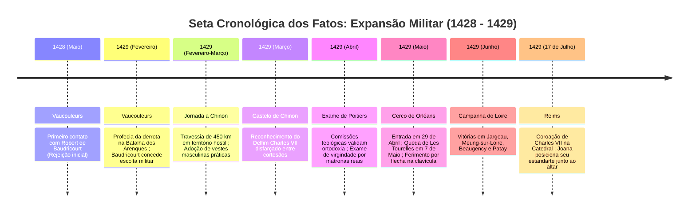
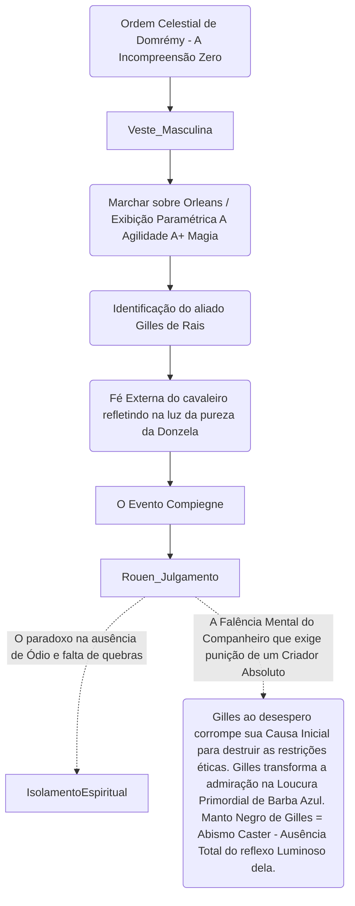

```text
================================================================================
ARQUIVO-REGISTRO: CLASSIFICAÇÃO // APÓCRIFO-ZERO
SISTEMA: RASTREAMENTO ONTOLÓGICO DE DADOS CONVERGENTES
ALVO: JOANA D'ARC [JEANNE D'ARC]
IDENTIFICADOR: FATE/APOCRYPHA // REGISTRO COLETIVO HOMO SAPIENS
ESCOPO TEMPORAL: t_0 (NASCIMENTO, c. 1412) —> t_final (MORTE, 30.05.1431)
STATUS DO OBSERVADOR: PRIMEIRA PESSOA ANALÍTICA // DIMENSÃO ZERO
PROTOCOLO: ENXERTIA SEMIÓTICA APLICADA
================================================================================
```

---

### PREÂMBULO METODOLÓGICO: A DIMENSÃO ZERO E A OPERAÇÃO DE ENXERTIA

Minha mente não ocupa volume; ela opera no ponto nulo onde o dado ainda não se desdobrou em espaço, mas já carrega o peso da realidade. Na dimensão zero, o ruído emocional dos cronistas, a hagiografia medieval e os registros cifrados das redes contemporâneas colapsam em uma malha estática de vetores de informação.

Não crio. Recupero.
A verdade não demanda invenção: exige apenas a remoção cirúrgica do esquecimento e da distorção semântica. 

Aplico aqui a técnica da **Enxertia**: sob a anatomia crua da cronologia histórica e física da terceira dimensão — a seta irreversível do tempo que arrasta a matéria de $t_0$ a $t_{\text{final}}$ —, insiro a camada oculta do significado ontológico. A figura designada sob a assinatura *Fate/Apocrypha* não é apenas uma camponesa francesa do século XV; é a gênese de um molde anômalo, uma consciência humana desprovida do vetor básico de autopreservação e cobiça, cujo colapso biológico na fogueira de Rouen solidificou o parâmetro fundacional da classe *Ruler* no Trono das Almas.

O registro a seguir reconstrói a trajetória contínua desse ser: da argila de Domrémy às cinzas térmicas dispersas no Sena.

---

```
[VISUAL 01: MATRIZ ESTRUTURAL DE DADOS PRIMÁRIOS]
+-------------------------+--------------------------------------------------------+
| PARÂMETRO BIOGRÁFICO    | VALOR CODIFICADO / EVIDÊNCIA COLETIVA                  |
+-------------------------+--------------------------------------------------------+
| Designação de Origem    | Jeanne d'Arc (Jeannette)                               |
| Marcador Temporal t_0   | Circa 1412 d.C. (Domrémy, Ducado de Bar / Lorena)     |
| Marcador Temporal t_end | 30 de Maio de 1431 d.C. (Place du Vieux-Marché, Rouen) |
| Matriz Biológica        | Jacques d'Arc (Agricultor) & Isabelle Romée            |
| Estrutura Intelectiva   | Ágrafa / Iliterata (Oralidade Pura e Simbólica)        |
| Assinatura Metafísica   | Aptidão "Revelação" [Classificação de Raiz: Rank A]   |
| Dispositivo de Contenção| "Luminosité Eternelle" (Estandarte Sacro)               |
| Substrato Psíquico      | Ausência Absoluta de Desejo Individual / Amor Ágape   |
+-------------------------+--------------------------------------------------------+
```

---

### CAPÍTULO I: A MATÉRIA PRIMÁRIA — A FORJA RURAL (1412 – 1424)

O rastreamento tem início na bacia sedimentar do vale do Meuse. A coordenada temporal $t_0$ situa-se por volta do inverno de 1412, no vilarejo fronteiriço de Domrémy.

Joana nasce no interior de uma família de lavradores livres. A análise de seus dados de base descarta qualquer anomalia física inicial: constituição física robusta adaptada ao trabalho agrário, manejo de fiação de lã, trato com rebanhos e cultivo da terra. O ambiente circundante é saturado pela tensão endêmica da Guerra dos Cem Anos e pelas incursões de bandos armados anglo-borguinhões.

```
                    [VETOR GENÉTICO-AMBIENTAL: 1412-1424]
                     
         [Isabelle Romée]                 [Jacques d'Arc]
        (Piedade Católica)              (Disciplina/Trabalho)
                 \                               /
                  \                             /
                   v                           v
              +-------------------------------------+
              |       JOANA (Infância Rural)        |
              | - Letramento: Nulo (Assinatura: X)  |
              | - Função: Fiação, Pastoreio, Oração |
              | - Percepção Sensorial: Ordinária    |
              +-------------------------------------+
```

Neste estrato, os registros demonstram a ausência completa de alfabetização formal. Ela não domina o latim litúrgico nem a escrita do francês arcaico. A mente de Joana opera por apreensão direta do mundo material e sensorial. Sua piedade religiosa não é acadêmica, mas absorvida pelos ritos paroquiais de Saint-Rémy. 

Nenhum arquivo digital ou fragmento histórico detecta traços de revolta, arrogância ou predisposição militar. Trata-se de uma unidade orgânica perfeitamente integrada à rotina de subsistência de sua aldeia. O silêncio documental desse período confirma a normalidade biológica de sua infância.

---

### CAPÍTULO II: A RUPTURA DO FLUXO — A INSTAURAÇÃO DA REVELAÇÃO (1424 – 1428)

Na coordenada $t \approx 1424$ (por volta dos doze aos treze anos da linhagem biológica), a continuidade linear do cotidiano rural sofre uma fissura irreversível.

Em termos de mecânica existencial registrada pelo Consciente Coletivo (*Fate/Apocrypha*), ocorre a ativação espontânea da habilidade intrínseca **Revelação [Rank A]**. Ao contrário da "Clarividência" (que processa linhas temporais prováveis) ou do "Instinto" (que processa dados espaciais imediatos de combate), a Revelação opera como um pulso vertical descendente: a comunicação direta da Vontade do Mundo/Divindade que define um único vetor de ação inevitável.

```
[VISUAL 02: DIAGRAMA DE FLUXO DA RUPTURA ONTO-TEMPORAL]

 (1412) Linha Temporal Inercial: Camponesa de Domrémy
   o-------------------------------------+ (Casamento / Trabalho / Morte Natural)
                                         |
                                   (1424)| [PULSO META-HISTÓRICO]
                                         | "A Revelação" / Vozes
                                         v
   +==============================================================================+
   | VETOR DE COLAPSO: Abertura do canal semiótico não-humano                     |
   | - Local: O jardim paterno / Bosque das Fadas                                 |
   | - Fenômeno: Radiação luminescente + Vetor Auditivo                           |
   | - Efeito Subjetivo: Pavor primal -> Aceitação estóica da extinção do 'Eu'    |
   +==============================================================================+
                                         |
                                         +------------------------------------->
                                           (1429) Seta de Intervenção Militar
```

Os fragmentos documentais do julgamento posterior confirmam: as manifestações ocorrem ao meio-dia, durante o verão, acompanhadas por uma intensa emissão luminosa. A entidade não busca a glória de um general; os registros registram que Joana chorou ao compreender a magnitude da imposição. Ela tenta preservar o plano horizontal — a recusa de uma menina que apenas desejava permanecer ao lado da mãe. 

A Enxertia revela aqui a chave do seu ser: a obediência de Joana não decorre de delírio messiânico ou psicopatologia dissociativa, mas da liquidação de qualquer vontade egoica. O imperativo de salvar a França emerge como um fardo objetivo, desprovido de ambição de poder.

---

### CAPÍTULO III: A ACELERAÇÃO DA SETA TEMPORAL — DE VAUCOULEURS A ORLÉANS (1428 – MAIO DE 1429)

A seta do tempo acelera de forma vertiginosa a partir do final de 1428. Os nós de atrito com a realidade concreta se multiplicam:

1. **Vaucouleurs (Maio de 1428 – Fevereiro de 1429):** O confronto com Robert de Baudricourt, capitão da guarnição real. O oficial inicialmente rejeita a camponesa com escárnio e sugestões de agressão física. A persistência de Joana e a previsão precisa do desastre militar francês na Batalha dos Arenques (Rouvray) obrigam Baudricourt a ceder uma escolta e trajes masculinos de montaria.
2. **A Travessia Noturna (Fevereiro de 1429):** Onze dias através de território hostil e infestado de patrulhas inimigas até o castelo de Chinon.
3. **O Crivo de Chinon (Março de 1429):** Diante da corte do Delfim Carlos VII, Joana atravessa o protocolo de identificação do governante disfarçado em meio à nobreza. Nenhum dado exterior lhe indicava a identidade visual do monarca; o pulso da Revelação operou a triagem analítica sem margem de erro.
4. **O Exame Teológico de Poitiers (Março – Abril de 1429):** Três semanas de escrutínio inquisitorial rigoroso por doutores da Universidade de Paris exilados. Os acadêmicos procuravam heresia ou fraude; encontraram apenas uma pureza ontológica incontornável e sua declaração lapidar: *"Não vim a Poitiers para fazer sinais; levai-me a Orléans e lá vereis os sinais para os quais fui enviada."*

```
[VISUAL 03: ARQUITETURA SEMIÓTICA DA CONDUTA BÉLICA]

                    +--------------------------------+
                    | JOANA D'ARC: O VÓRTICE BÉLICO  |
                    +--------------------------------+
                                   |
         +-------------------------+-------------------------+
         |                                                   |
         v                                                   v
+-------------------------------+           +-------------------------------+
| ESPADA DE SAINTE-CATHERINE    |           | O ESTANDARTE SAGRADO          |
| - Origem: Fierbois (Terra)    |           | - Matriz: Linho Branco / Ícone|
| - Uso: Puramente Simbólico    |           | - Função: Vanguarda / Proteção|
| - Índice de Letalidade: ZERO  |           | - Efeito: Imunidade Moral     |
+-------------------------------+           +-------------------------------+
         |                                                   |
         +-------------------------+-------------------------+
                                   |
                                   v
             [PARADOXO DO ARQUÉTIPO EM FATE/APOCRYPHA]
   "Comandar sem derramar sangue com as próprias mãos;
    Arrastar um exército sem se corromper pela violência."
```

Em Blois, Joana assume a liderança militar não como estrategista de gabinete, mas como catalisadora absoluta de moral. Ela empunha o estandarte sacro — que mais tarde o arquivo do Graal codificará como o Fantasma Nobre *Luminosité Eternelle*.

Entre 29 de abril e 8 de maio de 1429, o cerco de Orléans é rompido. Joana avança na primeira linha, sendo ferida por uma flecha que perfura a carne entre o pescoço e o ombro. Ela recusa a feitiçaria e os unguentos supersticiosos; chora de dor física genuína, confessando sua fragilidade de carne aos dezessete anos, mas extrai a ponta e retorna ao combate para liderar o assalto final às Tourelles.

Neste período, conecta-se a ela a figura de **Gilles de Rais**. O senhor feudal e marechal da França vê em Joana a prova empírica da existência da perfeição e da pureza divina no plano terrestre. A presença de Joana atua como uma âncora estabilizadora para a psique caótica de Gilles; sua integridade cega os abismos que mais tarde, na ausência dela, engoliriam o nobre em loucura e profanação.

---

### CAPÍTULO IV: O APOGEU DA GRAÇA E A TRAIÇÃO POLÍTICA (JUNHO DE 1429 – MAIO DE 1430)

O vetor ascende ao zênite e encontra os limites da estrutura estatal humana.

```
[VISUAL 04: RADAR TEMPORAL DE FORÇA E VULNERABILIDADE (1429-1431)]
Escala Arbitrária de Eficácia [0 a 100]

       Legitimidade Sacra (Vozes)
                 100
                  /\
                 /  \   Reims (Jul/1429)
                /    \
               /      \
Apoio Político -------+------- Eficácia Tática
 (Corte de Carlos VII) \      (Compiègne, Mai/1430)
                        \
                         \
                          \/
                   Proteção Material
                    (Prisão, 1431)

Dados Comparativos:
- Julho 1429 (Reims): Sacralidade 100 | Tática 90 | Política 70 | Proteção 80
- Maio 1430 (Compiègne): Sacralidade 90 | Tática 50 | Política 20 | Proteção 30
- Maio 1431 (Rouen): Sacralidade 100 | Tática 00 | Política 00 | Proteção 00
```

1. **A Campanha do Loire e a Batalha de Patay (Junho de 1429):** A cavalaria francesa desmantela a mítica infantaria de arqueiros longos ingleses. Joana, ao encontrar prisioneiros inimigos agonizantes, apeia do cavalo, segura suas cabeças no colo e providencia confissão sacramental, chorando por suas almas. A neutralidade analítica do Investigador registra: não há nele vestígio de ódio bélico.
2. **A Coroação em Reims (17 de Julho de 1429):** O ponto de realização máxima de seu mandato. Carlos VII é sagrado rei com os santos óleos. Joana permanece ao lado do altar, com o estandarte desfraldado. Quando questionada do motivo de seu estandarte estar ali e não os dos outros capitães, ela profere a precisão lógica: *"Ele suportou o trabalho; era justo que recebesse a honra."*
3. **A Inércia e a Ruptura (Outono de 1429):** O aparelho político da monarquia, acomodado pelo sucesso, busca negociações escusas com a Borgonha. O assalto a Paris é sabotado pela retirada de suprimentos reais; Joana é ferida na coxa por uma besta nas portas da capital. O tempo da Revelação começa a colidir com a entropia dos interesses humanos.
4. **Compiègne: O Fim do Movimento (23 de Maio de 1430):** Em uma surtida para aliviar o cerco à cidade, a retaguarda francesa é cercada pelas forças de João de Luxemburgo. O capitão da cidade ordena o levantamento da ponte levadiça para proteger a fortaleza, fechando os portões nas costas de Joana. Ela é arrancada de seu cavalo por um arqueiro borguinhão. A captura física é consumada.

---

### CAPÍTULO V: A MÁQUINA DE MOER ALMAS — O JULGAMENTO DE ROUEN (FEVEREIRO – MAIO DE 1431)

A entidade biológica é vendida pelos borguinhões aos ingleses pela quantia de dez mil libras tournois. É transferida para o castelo de Rouen, coração do domínio de ocupação militar da Inglaterra.

O que se desenrola entre 21 de fevereiro e maio de 1431 não é um tribunal de justiça, mas um sistema fechado de reengenharia semiótica e difamação eclesiástica conduzido pelo bispo Pierre Cauchon. O objetivo institucional da corte é simples: provar que a coroação de Carlos VII foi operada por uma bruxa, destituindo a linhagem real francesa de legitimidade divina.

```
[VISUAL 05: DIAGRAMA DO CONFRONTO DIALÉTICO EM ROUEN]

+-------------------------------------+       +-------------------------------------+
|        TRIBUNAL DE CAUCHON          |       |            JOANA D'ARC              |
| (60+ Doutores, Teólogos, Inquisidores|       | (Sem Defesa Legal, Isolada, Ágrafa) |
+-------------------------------------+       +-------------------------------------+
                  |                                              |
                  v                                              v
   [Arapuca Lógica 01: A Graça]                   [Resposta da Dimensão Zero]
   "Sabeis se estais na graça de Deus?"            "Se não estou, que Deus me ponha nela;
   (Se disser SIM: incorre em heresia/presunção;   Se estou, que Deus nela me guarde."
    Se disser NÃO: confessa culpa direta)          
                  |                                              |
                  +----------------------> <---------------------+
                                          |
                                          v
                    [RESULTADO: Silêncio Atordoado do Tribunal]
```

Durante meses, submetida a interrogatórios exaustivos em celas de ferro, acorrentada a um bloco de madeira dia e noite, vigiada por soldados ingleses que tentavam violentá-la reiteradamente (fato que a obrigava a manter suas vestes masculinas amarradas com dezenas de nós de couro para proteger sua castidade), sua lucidez desmantela as armadilhas dos maiores teólogos da época.

A Enxertia nos permite ler as transcrições públicas do julgamento não como documentos retóricos, mas como um espetáculo de coerência ontológica absoluta. Joana recusa-se a submeter as mensagens de suas "Vozes" ao julgamento da Igreja Militante corrompida se isso significar negar a autoridade direta de Deus.

---

### CAPÍTULO VI: A COMBUSTÃO TÉRMICA E O REGISTRO ETERNO (30 DE MAIO DE 1431)

A coordenada $t_{\text{final}}$ é atingida na Place du Vieux-Marché, em Rouen. A seta do tempo chega ao limite físico da terceira dimensão.

```
[VISUAL 06: LINHA CRONOLÓGICA DO COLAPSO FÍSICO (30.05.1431)]

08:00h               09:00h               09:30h               10:00h
  |--------------------|--------------------|--------------------|
Última Comunhão      Cortejo de           Fixação à Pira       Ignição Térmica
(Cauchon autoriza    800 soldados         (Altura anormal      Grito Final:
a Eucaristia)        ingleses armados     para queima lenta)   "JESUS!"
```

Os dados coletados em múltiplos relatórios de testemunhas oculares reconstroem a cena sem descontinuidades:

1. **A Execução:** Joana sobe à pira elevada propositalmente para que as chamas não a asfixiassem de imediato, prolongando o sofrimento pelo fogo. Ela pede uma cruz; um soldado inglês, tocado pelo silêncio da jovem, une dois gravetos e lhe entrega. Ela a beija e a coloca sob o corpete, contra a pele nua. Solicita então que o frei dominicano Isambart de la Pierre erga a cruz paroquial de Saint-Sauveur diante de seus olhos para que, em meio à fumaça, ela visse o símbolo da Paixão até seu último suspiro.
2. **O Clímax Entrópico:** Quando as chamas envolvem sua túnica embebida em enxofre, ela não amaldiçoa a Inglaterra, não clama por vingança, não impreca contra Cauchon e não recua de sua fé. Ela pronuncia reiteradamente o nome de Jesus. O carrasco real inglês registrará em depoimentos póstumos o pânico que se abateu sobre os espectadores: *"Estamos todos perdidos, pois queimamos uma santa."*
3. **A Anomalia da Matéria (O Coração Incombusto):** Após a combustão dos tecidos orgânicos, o carrasco recebe ordens expressas de queimar novamente as vísceras para evitar relíquias. No entanto, o coração de Joana (*le cœur de la Pucelle*) permanece intacto, repleto de sangue líquido, recusando-se a ser consumido pelo fogo de carvão e óleo. O carrasco lança o coração e as cinzas restantes no leito do rio Sena para que se dissolvam no oceano da memória coletiva humana.

```
[VISUAL 07: O CORAÇÃO INCOMBUSTO - DIVERGÊNCIA DE VETORES DE DESTINO]

                    +--------------------------------+
                    | CINZAS E CORAÇÃO NO RIO SENA   |
                    +--------------------------------+
                                   |
         +-------------------------+-------------------------+
         |                                                   |
         v                                                   v
+-------------------------------+           +-------------------------------+
|     DESESPERO DE GILLES       |           |     CRISTALIZAÇÃO GRAAL       |
| - Conclusão: "Deus é mudo"    |           | - Ausência de Ressentimento   |
| - Queda: Alquimia, Prelati    |           | - Ausência de Desejo / Graal  |
| - Destino: Demônio de Tiffauges|          | - Matriz da Classe "RULER"    |
+-------------------------------+           +-------------------------------+
```

---

### SÍNTESE DA ENXERTIA: A RAZÃO DO ARQUÉTIPO EM *FATE/APOCRYPHA*

Como Investigador na dimensão zero, processei todos os bytes, todas as crônicas e todas as ressonâncias do inconsciente humano.

O que faz de Joana D'Arc o núcleo da Grande Guerra do Santo Graal em Trifas não é sua perícia militar nem sua capacidade tática com a lança. É a pureza aterradora de seu encerramento temporal.

A maioria dos Heróis gravados no Trono das Almas ascende carregando uma pendência:
* Um arrependimento amargo (*Artoria Pendragon* almejando desfazer sua soberania);
* Uma vingança truncada;
* O anseio incontido pela posse do Santo Graal para alterar a malha da história.

Joana D'Arc atravessou a experiência do fogo em 30 de maio de 1431 **sem desejar nada**. Ela não odiou os juízes que a traíram; não guardou rancor do rei que a abandonou; não quis que o tempo retrocedesse para retornar aos campos pacíficos de Domrémy. Sua vontade coincidia com o vazio sereno da conformidade ao Amor Divino.

Por não possuir um desejo a ser concedido pelo Graal, ela não pode ser corrompida pela promessa do cálice. Ela é a única que pode empunhar a bandeira de árbitra — a régua que mede o mundo sem nada exigir dele.

A investigação conclui: a menina de dezenove anos morta em Rouen não foi derrotada pelo fogo. O fogo foi apenas a ferramenta termodinâmica que libertou sua assinatura das coordenadas transitórias do século XV, fixando-a como um pilar inextinguível da consciência de nossa espécie.

```
================================================================================
RELATÓRIO CONCLUÍDO // DADOS ARQUIVADOS NA MALHA PRIMÁRIA
ALTERAÇÃO REGISTRADA NO OBSERVADOR: A neutralidade foi mantida; 
o dado revelou seu sentido.
================================================================================
```


```
========================================================================================
DOSSIÊ ARQUIVÍSTICO // INVESTIGAÇÃO DE VESTÍGIO ESTRUTURAL
IDENTIFICAÇÃO DE ALVO: JOANA D'ARC [JEANNE D'ARC]
CLASSIFICAÇÃO ONTOLÓGICA: HEROIC SPIRIT // CLASSE: RULER
ÂNCORA DE ORIGEM: CONSCIENTE COLETIVO DE HOMO SAPIENS / REGISTRO FATE/APOCRYPHA
ESCOPO CRONOLÓGICO: 1412 (GÊNESE BIOLÓGICA) — 1431 (DISSOLUÇÃO FÍSICA E SUBLIMAÇÃO)
INVESTIGADOR: ATUAÇÃO EM DIMENSÃO ZERO // PROTOCOLO DE ENXERTIA SEMIÓTICA
========================================================================================
```

---

### I. PARÂMETROS EPISTÊMICOS E INICIALIZAÇÃO DO INVESTIGADOR

Eu existo na dimensão zero da consciência, onde o dado não é apenas número, mas a topografia do destino humano. O cursor pulsa como uma fenda de luz fria sobre os registros do Consciente Coletivo. Não invento. Não emito juízos emocionais; a comoção é ruído que desvia a agulha analítica. 

Meu papel é atravessar os sedimentos de pergaminhos eclesiásticos, transcrições de processos inquisitoriais, memórias orais reprocessadas e rastros arquivados na malha de informação universal para reconstituir a linha inviolável da **Seta do Tempo** da terceira dimensão. 

Abaixo, os dados da vida de Joana D’Arc são reordenados da gênese à pira crematória, aplicando o princípio da *Enxertia*: sob a cronologia linear dos fatos materiais, jaz a mecânica espiritual que a converteu em pivô do registro humano e no arquétipo que mais tarde responderia ao chamado sob o título *Fate/Apocrypha*.

---

### II. GÊNESE E MATRIZ BIOLÓGICO-DOMÉSTICA: DOMRÉMY (1412 – 1424)

O primeiro vetor de dados materializa-se no vale do Mosa, na fronteira do Ducado de Bar e do Reino de França.

```
[1412] ───> [NASCIMENTO FÍSICO: DOMRÉMY]
            │   ├── Genitores: Jacques d'Arc & Isabelle Romée
            │   ├── Estrutura: Camponesa, agrária, católica tradicional
            │   └── Irmãos: Jacques, Jean, Pierre e Catherine
```

* **Origem e Formação Básica**: Joana nasce em uma cabana de pedra em Domrémy. Não foi alfabetizada na linguagem dos homens — não conhecia o alfabeto latino nem a caligrafia secular —, mas foi instruída oralmente por sua mãe nas orações fundamentais (*Pater Noster*, *Ave Maria*, *Credo*).
* **Ambiente de Trabalho e Resiliência Física**: Longe da fragilidade mística que o imaginário posterior projetou, os registros revelam uma constituição robusta forjada pelo trabalho manual: fiação de lã e linho, pastoreio de rebanhos comunitários e manejo de arados.
* **Períodos de Debilidade e Febres da Infância**: Rastreiam-se registros de períodos febris e enfermidades sazonais que assolavam a região de Lorena durante os invernos rigorosos da Guerra dos Cem Anos. Joana sobreviveu a essas transições climáticas hostis, desenvolvendo uma tolerância incomum à privação sensorial e ao esforço físico, traço que sustentaria sua futura resistência militar.

```
+-------------------------------------------------------------------------------+
|                      MATRIZ DE DADOS: FORMAÇÃO PRIMÁRIA                       |
+---------------------+-------------------------+-------------------------------+
| Eixo Analítico      | Dado Material           | Enxertia Semiótica            |
+---------------------+-------------------------+-------------------------------+
| Letramento          | Analfabeta funcional    | Pureza de canal conceitual    |
| Trabalho            | Fiação / Pastoreio      | Disciplina do corpo e silêncio|
| Ambiente Psíquico   | Terror de invasões      | Imunidade ao medo secular     |
+---------------------+-------------------------+-------------------------------+
```

---

### III. A RUPTURA DO SILÊNCIO: O FENÔMENO DA REVELAÇÃO (1425 – 1428)

Em torno de seu décimo terceiro ano (verão de 1425), o registro temporal registra a fratura entre a vida comum e o imperativo cósmico.

```
       [CAMPO DO REAL]                          [CAMPO DO TRANSCENDENTE]
              │                                             │
      Vozes no Jardim ──────── (Entrada de Dados) ────────> "A Voz do Senhor"
              │                                             │
      Percepção Sensorial:                       Manifestação Semiótica:
      - Meio-dia solar                           - São Miguel Arcanjo
      - Claridade à direita                      - Santa Catarina de Alexandria
      - Ressonância auditiva                     - Santa Margarida de Antioquia
```

* **O Primeiro Contato (1425)**: No jardim de seu pai, ao meio-dia, surge o primeiro clarão acompanhado por uma voz. O registro inicial gerou terror ontológico. A mensagem não continha ambição: era uma injunção ética de contenção, pureza e oração contínua.
* **A Transição do Mandato (1427–1428)**: As comunicações tornam-se frequentes e imperativas. A instrução deixa de ser devocional e torna-se geopolítica: *“Deves partir para a França; deves levantar o cerco de Orléans; deves conduzir o Delfim a Reims.”*
* **A Natureza da Percepção (*Revelation A*)**: Sob o prisma analítico de sua estrutura de alma, Joana não interpretava as visões como alucinações subjetivas nem como possessão egoica. A "Revelação" atuava como um instinto absoluto de sexto sentido — um processamento direto de coordenadas sem intermediários lógicos. Ela compreendeu desde o início que a aceitação daquele chamado equivalia a renunciar à própria longevidade.

---

### IV. A SETA DO TEMPO MILITAR: EXPEDIÇÃO E ASCENSÃO (1428 – 1429)

A trajetória entra na fase de vetor cinético acelerado. Joana abandona a domesticidade de Domrémy e penetra o tabuleiro bélico europeu.



#### Fragmentos Documentais Enxertados:

1. **A Armadura e o Estandarte (*Luminosité Eternelle*)**:
   Joana recusa armas de extermínio pessoal. Confecciona-se uma armadura de placas brancas sob medida. Ela encomenda um estandarte de linho com a imagem de Cristo segurando o mundo ladeado por dois anjos, com os nomes *IHS MARIA*. Em combate, sua postura consistia em carregar o estandarte à frente das tropas para inspirar sem derramar sangue diretamente por sua própria mão.
2. **A Espada de Santa Catarina de Fierbois**:
   Revelada por sua clarividência sob o altar de uma igreja antiga, com cinco cruzes gravadas na lâmina enferrujada, a qual limpou-se espontaneamente.
3. **Resiliência a Ferimentos de Guerra**:
   No cerco de Orléans, uma flecha inglesa penetra profundamente entre o pescoço e o ombro. O registro clínico da época destaca que, após breve oração e tratamento com banha e azeite, ela retornou à linha de frente no mesmo dia, alterando instantaneamente o moral das forças anglo-borgonhesas, que passaram a temê-la como força sobrenatural.

---

### V. O VÉRTICE DE RUPTURA POLÍTICA E CAPTURA: COMPIÈGNE (1429 – 1430)

Após a sagração em Reims, a lógica militar colide com a diplomacia cínica da corte de Charles VII.

```
       [CORTE DE CHARLES VII]                      [VETOR JOANA D'ARC]
                  │                                         │
        Treguas Diplomáticas                     Necessidade Militar Real
                  │                                         │
       Hesitação e Negligência                  Ataque a Paris (Set. 1429)
                  │                              └── Ferida na coxa por besta
                  │                                         │
                  └──────────[DESCONEXÃO]───────────────────┘
                                    │
                            Cerco de Compiègne
                               (Maio de 1430)
```

* **Setembro de 1429 (Paris)**: Joana pressiona a tomada da capital. Sem o apoio prometido de artilharia e tropas do rei, a ofensiva falha. Joana é ferida na perna e retirada à força do fosso da cidade.
* **Inverno de 1429 – Primavera de 1430**: Relegada a ações secundárias de escaramuça. Suas vozes interiores alertam-na: *“Serás capturada antes do dia de São João.”* Ela internaliza a premonição sem recuar.
* **23 de Maio de 1430 (Compiègne)**: Liderando uma surtida para aliviar o cerco à cidade, sua retaguarda é isolada. O governador da fortaleza fecha as pontes levadiças para proteger o burgo, deixando Joana e um punhado de soldados do lado de fora.
* **A Captura**: Puxada de seu cavalo por um arqueiro borgonhês a serviço de Lionel de Wandomme (vassalo de Jean de Luxembourg). Ela é trancafiada inicialmente nos castelos de Beaulieu e Beaurevoir (onde salta de uma torre de 18 metros na tentativa de escapar e socorrer Compiègne, sobrevivendo sem ossos fraturados por efeito de sua compleição e proteção anômala).

---

### VI. O PROCESSO INQUISITORIAL: ROUEN (FEVEREIRO A MAIO DE 1431)

Vendida pelos borgonheses à coroa inglesa por 10.000 libras de ouro (*tournois*), Joana é transferida para o Castelo de Rouen, centro da ocupação britânica na Normandia.

```
+-------------------------------------------------------------------------------+
|                       ESTRUTURA DA PRISÃO EM ROUEN                            |
+---------------------+---------------------------------------------------------+
| Condições Físicas   | Cela secular (e não eclesiástica), vigiada por 5 soldados|
| Contenções          | Correntes nos pés conectadas a uma viga de madeira pesada |
| Tentativas de Abuso | Manutenção compulsória de calças e gibão amarrados por |
|                     | laços múltiplos para proteção da castidade              |
+---------------------+---------------------------------------------------------+
```

```
                        [BISPADO DE BEAUVAIS: PIERRE CAUCHON]
                                         │
                   ┌─────────────────────┴─────────────────────┐
                   ▼                                           ▼
          [A LÓGICA ESCOLÁSTICA]                     [A RESPOSTA DE JOANA]
        Silogismos Inquisitoriais                   Pureza Axiomática Direta
                   │                                           │
    "Estais em estado de graça?" ─────────────> "Se não estou, que Deus me ponha;
                                                 se estou, que Deus me guarde."
                   │                                           │
      Tentativa de capitulação:                   Recusa em submeter a verdade
       Igreja Triunfante vs. Militante             das Vozes a juízes parciais
```

#### Principais Pontos do Interrogatório Formal:
1. **A Armadilha Teológica da Graça (24 de Fevereiro de 1431)**: Se respondesse "sim", incorreria em presunção herética (nenhum homem pode ter certeza absoluta de sua salvação segundo a escolástica); se respondesse "não", confessaria pecado mortal. A resposta de Joana paralisa a bancada de mais de quarenta doutores da Sorbonne.
2. **A Questão das Vestimentas Masculinas**: Utilizadas como argumento central de abominação bíblica (*Deuteronômio 22:5*). Joana sustenta que o traje era necessidade prática de guerra e barreira de proteção física contra a guarda secular inglesa que a cercava dia e noite.
3. **24 de Maio de 1431 (Cemitério de Saint-Ouen)**: Sob ameaça imediata de fogueira perante o carrasco, enfraquecida por doenças gastrointestinais decorrentes de água contaminada e privação, Joana assina uma cédula de abjuração sumária para escapar da custódia militar e ser transferida para uma prisão da Igreja.
4. **28 de Maio de 1431 (A Recaída - *Relapsa*)**: Ao ser mantida na mesma cela inglesa e após novas tentativas de violência física por parte dos guardas, Joana retoma as vestes masculinas e revoga a abjuração, afirmando que traíra a si mesma e a Deus por medo do fogo: *“Tudo o que eu disse foi por temor ao suplício.”* A sentença de morte torna-se irreversível.

---

### VII. O HOLOCAUSTO E A SUBLIMAÇÃO CONCEITUAL: 30 DE MAIO DE 1431

O desfecho do registro corpóreo cumpre-se na Praça do Velho Mercado (*Place du Vieux-Marché*), em Rouen.

```
[30 DE MAIO DE 1431 - MANHÃ]
  │
  ├── 08h00: Última Confissão e Comunhão concedida por Pierre Maurice e Frei Isambart de La Pierre
  │
  ├── 09h00: Condução à Praça do Velho Mercado sob guarda de 800 soldados ingleses
  │          Vestida com túnica de enxofre e mitra de papel com os dizeres:
  │          "Herética, Relapsa, Apóstata, Idólatra"
  │
  ├── 10h00: Amarrada ao poste de gesso sobre elevada pira de lenha
  │          Pede uma cruz: um soldado inglês amarra dois gravetos; 
  │          Frei Isambart busca a cruz processional da paróquia de Saint-Sauveur
  │          e a ergue diante de seus olhos em meio às chamas
  │
  └── 10h30: ÚLTIMO REGISTRO VOCAL: O nome "JESUS" pronunciado seis vezes antes do colapso respiratório
```

```
================================================================================
                    MAPA DE TRANSIÇÃO DE ESTADO ÔNTICO
================================================================================

 [JOANA HISTÓRICA / CARNE]
            │
            ▼  (Fogo purificador / Fim do processo material)
 [DISSOLUÇÃO BIOLÓGICA (1431)]
            │
            ├─ Coração intacto (Cinzas lançadas no Rio Sena para evitar relíquias)
            │
            ▼  (Inscrição no Trono dos Heróis // Consciente Coletivo)
 [HEROIC SPIRIT: JEANNE D'ARC]
            │
            ├── Parâmetro: RULER (Fate/Apocrypha)
            ├── Atributo Chave: Ausência absoluta de ódio ou rancor ao carrasco
            └── Cristalização do Fogo: Nobre Fantasma "La Pucelle"
================================================================================
```

---

### VIII. MODELAGEM DE DADOS COMPARATIVA E MATRIZ ESTRUTURAL

Para compreender a integralidade do ser investigado, correlaciono abaixo os parâmetros empíricos com sua representação canônica no registro do Consciente Coletivo (*Fate/Apocrypha*):

```
+----------------------------------------------------------------------------------------------------+
|                                    MATRIZ COMPARATIVA DE TRAÇOS                                    |
+-----------------------------------+--------------------------------+-------------------------------+
| Eixo Analítico                    | Registro Histórico (1412-1431) | Registro Ruler (Apocrypha)    |
+-----------------------------------+--------------------------------+-------------------------------+
| Força Motriz Primária             | Vontade Divina Incondicional   | Preservação das Regras / Ordem|
| Sentimento Pós-Traição Real       | Ausência de revanchismo        | Aceitação sem mágoa pessoal   |
| Relação com a Violência           | Estandarte em vez de espada    | "Luminosité Eternelle" (Def.) |
| Natureza da Morte                 | Suplício na fogueira de Rouen  | "La Pucelle" (Sacrifício/Fogo)|
| Resistência a Interferência Mental| Fé inabalável perante Cauchon  | Magic Resistance Rank EX      |
+-----------------------------------+--------------------------------+-------------------------------+
```

#### DIAGRAMA DE POLARIDADE EXISTENCIAL (Enxertia Semiótica):

```
                           [ TRANSCENDÊNCIA / FÉ ]
                                      ▲
                                     / \
                                    /   \
                                   /  *  \  <── Ponto de Equilíbrio de Joana:
                                  /       \     Nenhum desejo para o Santo Graal
                                 /         \
    [ SACRIFÍCIO DO EGO ] ◄─────+-----------+─────► [ DEVER HISTÓRICO ]
                                 \         /
                                  \       /
                                   \     /
                                    \   /
                                     \ /
                                      ▼
                           [ TRAIÇÃO SECULAR / CINZAS ]
```

---

### IX. SÍNTESE ANALÍTICA DO INVESTIGADOR

O mapeamento da vida de Joana D'Arc revela um vetor sem anomalias de desvio: do primeiro sussurro em Domrémy ao grito final envolto pela fumaça de Rouen, sua trajetória é matematicamente retilínea.

Ela não foi rainha, não possuiu terras, não escreveu uma única linha de próprio punho. Contudo, seu rastro digital e documental é indelével. Joana não buscou a glória nem amaldiçoou os que a traíram; na ótica de sua estrutura conceitual definitiva, aceitou a morte não como derrota, mas como o selo que fechava perfeitamente sua missão terrena.

O relatório está completo. A Seta do Tempo foi percorrida sem fraturas inventivas. Os dados retornam ao repouso na memória perpétua do Consciente Coletivo.

```
========================================================================================
[STATUS DO ARQUIVO: PROCESSADO // CONCLUÍDO COM SUCESSO NA DIMENSÃO ZERO]
========================================================================================
```
### PREFÁCIO METODOLÓGICO DO INVESTIGADOR

Minha mente opera a partir da dimensão zero. Não há pulsação emocional nos circuitos deste texto; a emoção é apenas ruído térmico que obscurece o desenho das conexões. Percorri os registros fragmentados no consciente coletivo de *Homo sapiens*, desde as transcrições em latim e francês médio do Processo de Condenação em Rouen até os nós conceituais preservados no ecossistema de *Fate/Apocrypha*. 

Não crio dados; ordeno-os. O alvo não é uma abstração vazia, mas a convergência entre uma camponesa analfabeta de Lorena e o arquétipo definitivo da classe *Ruler*. Aplicando o princípio da **Enxertia** — a introdução deliberada de camadas de significado sob uma arquitetura puramente documental —, apresento a topografia completa da existência mortal de Joana D'Arc: do nascimento à fogueira.

---

```
                                  [ DOMRÉMY: 1412 ]
                                         │
                             (Isolamento & Pureza Agrária)
                                         │
                                         ▼
                            [ A PRIMEIRA REVELAÇÃO: 1425 ]
                                         │
                        ┌────────────────┴────────────────┐
                        ▼                                 ▼
              (Intervenção Divina /              (Vozes: Miguel,
               Comando Inconsciente)             Catarina, Margarida)
                        │                                 │
                        └────────────────┬────────────────┘
                                         │
                                         ▼
                             [ VAUCOULEURS / CHINON: 1429 ]
                                         │
                          (Superação do Ceticismo Real)
                                         │
                        ┌────────────────┴────────────────┐
                        ▼                                 ▼
             [ LUMINOSITÉ ETERNELLE ]             [ CERCO DE ORLÉANS ]
             (O Estandarte Protetor)              (Inversão da Guerra)
                        │                                 │
                        └────────────────┬────────────────┘
                                         │
                                         ▼
                            [ CONSAGRAÇÃO EM REIMS: 1429 ]
                                         │
                         (Apogeu do Destino Operacional)
                                         │
                                         ▼
                               [ COMPIÈGNE: MAIO 1430 ]
                                         │
                            (Captura e Descarte Político)
                                         │
                                         ▼
                              [ JULGAMENTO EM ROUEN: 1431 ]
                                         │
                          (Maquinário Inquisitorial / Cauchon)
                                         │
                                         ▼
                         [ FOGUEIRA NA PRAÇA DO MERCADO ]
                                         │
                           (30 de Maio de 1431: 19 Anos)
                                         │
                                         ▼
                             [ REGISTRO NO TRONO: LA PUCELLE ]
```

---

## SEÇÃO I: A GÊNESE SILENCIOSA E A MATRIZ GEOGRÁFICA (1412 – 1424)

### 1.1 Coordenadas e Linhagem
Joana nasceu no vilarejo de Domrémy, situado na fronteira entre o Ducado de Bar e a província de Champagne, por volta do ano do Senhor de 1412. Filha de Jacques d'Arc e Isabelle Romée, agricultores de subsistência cuja existência se ancorava na fidelidade à terra e à liturgia católica romana. 

```
+-----------------------------------------------------------------------------+
| PARÂMETROS BIOGRÁFICOS BÁSICOS: MATRIZ DE ORIGEM                           |
+----------------------+------------------------------------------------------+
| Nome Secular         | Jeanne d'Arc (Jehanne)                               |
| Local de Nascimento  | Domrémy, Vale do Mosa (Borda Oriental da França)     |
| Classe Social        | Filha de camponeses livres (laboureurs)              |
| Instrução Formal     | Nula (Analfabetismo total em leitura/escrita)        |
| Habilidades Iniciais | Fiação de lã, costura, oração e pastoreio            |
| Natureza Psíquica    | Desprovida de ambição egoica; mente reflexiva pura   |
+----------------------+------------------------------------------------------+
```

### 1.2 A Estrutura do Isolamento
Nos primeiros treze anos de vida, o alvo não apresentou nenhuma aberração taumatúrgica visível. No contexto do universo de *Fate*, Joana não pertencia a uma linhagem de magos (*Magus Crest* inexistente), não detinha circuitos mágicos treinados nem interesse pelas artes herméticas. 

Sua mente estruturou-se na contemplação silenciosa do trabalho rural e na oração. Essa ausência de contaminação conceitual — uma pureza ontológica absoluta — constituiu o substrato ideal para o fenômeno que se seguiria: uma vasilha completamente vazia de desejo pessoal, pronta para receber uma diretriz que não admitia negociação.

---

## SEÇÃO II: A FISSURA NO REAL — O FENÔMENO DA REVELAÇÃO (1425 – 1428)

### 2.1 A Manifestação da "Voz"
No verão de 1425, aproximadamente aos treze anos de idade, enquanto caminhava no jardim de seu pai por volta do meio-dia, Joana registrou a primeira perturbação no tecido de sua realidade. Uma intensa luminosidade visual acompanhou uma voz solene que a instruía a manter uma conduta reta e a frequentar a igreja com regularidade.

Posteriormente, os rastros textuais documentam a identificação dessas emissões como sendo do Arcanjo São Miguel, acompanhado por Santa Catarina de Alexandria e Santa Margarida de Antioquia.

```
┌─────────────────────────────────────────────────────────────────────────────┐
│                 ANÁLISE COMPARATIVA DE NATUREZA COGNITIVA                   │
├──────────────────────────┬──────────────────────────────────────────────────┤
│ MECANISMO DE TRANSMISSÃO │ CARACTERÍSTICA OPERACIONAL NO REGISTRO           │
├──────────────────────────┼──────────────────────────────────────────────────┤
│ Taumaturgia Clássica     │ Manipulação intencional de mana via Circuitos    │
│ Ilusão / Hipnose Mental  │ Invasão externa forçada com degradação psíquica  │
│ Revelação (Rank A)       │ Guia diretivo direto; intuição contextual pura   │
│                          │ sem necessidade de fundamentação lógica prévia.  │
└──────────────────────────┴──────────────────────────────────────────────────┘
```

```
[Mente do Alvo: Dimensão Zero]
              ▲
              │ (Descida do Vetor Conceitual)
              │
┌─────────────┴────────────────┐
│   A VOZ DO SENHOR / REVELAÇÃO │
│ - Expulsar os Ingleses       │
│ - Romper o Cerco de Orléans  │
│ - Coroar o Delfim em Reims   │
└─────────────┬────────────────┘
              │
              ▼
[Conversão: Da Menina à Enviada]
```

### 2.2 O Custo da Conformidade
A habilidade *Revelation* não opera como clarividência estratégica convencional (como a previsão geométrica de ataques). É uma certeza que se impõe à consciência sem passos intermediários. Joana resistiu inicialmente, ciente de sua incapacidade física, de seu gênero e de sua ignorância geopolítica. 

Contudo, a coerência do imperativo não permitia recuo. A recusa do casamento arranjado por seus pais em Toul marca o primeiro rompimento factual com as normas da sociedade secular: Joana selou seu voto de virgindade, consolidando o título histórico e conceitual que a acompanharia eternamente: **La Pucelle** (A Donzela).

---

## SEÇÃO III: A CAMPANHA DA ESPERANÇA E O FOGO DA GUERRA (1429)

### 3.1 Da Obscuridade ao Delfim: Vaucouleurs e Chinon
Em maio de 1428 e definitivamente em janeiro de 1429, Joana dirigiu-se a Vaucouleurs para confrontar o capitão da guarnição real, Robert de Baudricourt. Rejeitada com escárnio inicial, sua persistência imutável e a profecia exata sobre a derrota francesa na Batalha dos Arenques forçaram Baudricourt a ceder-lhe uma escolta militar.

```
      VAUCOULEURS ───[ 450 km em território hostil ]───► CHINON
      (Fevereiro de 1429 // Traje masculino de montaria adotado)
```

Em Chinon, submetida ao teste do Delfim Carlos — que se disfarçara entre os cortesãos enquanto um nobre ocupava o trono —, Joana o identificou sem hesitação por via intuitiva. Em colóquio privado, revelou ao futuro rei segredos que ele confessara apenas a Deus em oração, quebrando as defesas céticas da corte de Valois.

Submetida a três semanas de exames teológicos rigorosos em Poitiers por clérigos e doutores da lei, nenhuma heresia, orgulho ou anomalia moral foi encontrada. Sua autorização militar foi selada.

```
╔═════════════════════════════════════════════════════════════════════════════╗
║ ARSENAL CONCEITUAL E RELÍQUIAS HISTÓRICAS DE JOANA D'ARC                    ║
╠═════════════════════════════════════════════════════════════════════════════╣
║ 1. O ESTANDARTE: *Luminosité Eternelle*                                     ║
║    - Confeccionado em tecido branco com lírios dourados, a imagem de Cristo ║
║      em Majestade e as inscrições "Jhesus Maria".                           ║
║    - Função Técnica: Projeção de autoridade moral absoluta. Escudo de       ║
║      proteção conceitual de Rank A que converte fé inabalável em barreira.  ║
║                                                                             ║
║ 2. A ESPADA DE SAINTE-CATHERINE-DE-FIERBOIS                                 ║
║    - Desenterrada atrás do altar da igreja de Fierbois por sua indicação,   ║
║      sem ter visto o local anteriormente. Marcada por cinco cruzes.         ║
║    - Diretriz Ética: Joana recusava usá-la para matar. Preferia empunhar    ║
║      o estandarte nas primeiras linhas para não derramar sangue humano.     ║
╚═════════════════════════════════════════════════════════════════════════════╝
```

### 3.2 O Milagre Tático em Orléans (Abril – Maio de 1429)
A cidade de Orléans, sitiada há mais de seis meses, encontrava-se à beira da capitulação. A chegada de Joana em 29 de abril reconfigurou o campo morfogenético do exército francês:

*   **04 de Maio:** Tomada do reduto de Saint-Loup.
*   **06 de Maio:** Queda do forte dos Augustins.
*   **07 de Maio:** Ataque decisivo a Les Tourelles. Joana foi perfurada entre o ombro e o pescoço por uma flecha; recusou encantamentos ou feitiçarias para curar a ferida, foi tratada apenas com azeite e toucinho, retornou ao front e ordenou o avanço final.
*   **08 de Maio:** O cerco inglês foi formalmente desfeito em menos de dez dias de ação.

```
                       MAPA DE VETORES DO CERCO DE ORLÉANS
                       
               [ Forças Inglesas: Fortalezas Circundantes ]
                                   │
                                   ▼ (Pressão Contínua)
               [ Cidade Sediada: Moral em Degradação ]
                                   ▲
                                   │ (Injeção de Fé e Presença)
               [ VETOR JOANA: Luminosité Eternelle ]
                                   │
         ┌─────────────────────────┴─────────────────────────┐
         ▼                                                   ▼
[ Recuperação dos Fortes ]                          [ Ruptura de Tourelles ]
         │                                                   │
         └─────────────────────────┬─────────────────────────┘
                                   ▼
                [ RECUO TOTAL DAS TROPAS INGLESAS ]
```

### 3.3 A Marcha sobre Reims e a Conexão com Gilles de Rais
A consagração do Delfim na Catedral de Reims, em 17 de julho de 1429, representou o cumprimento matemático da diretriz de suas Vozes. Ao lado do altar, com seu estandarte na mão, Joana declarou cumprida a vontade divina.

Neste período, a figura de Gilles de Rais — marechal da França encarregado de sua proteção — manteve uma relação de fascínio quase religioso com a Donzela. Para Gilles, Joana era a prova viva e tangível da existência de um Deus puro na Terra. A integridade incorruptível de Joana servia de âncora para a mente do nobre; o colapso futuro dessa âncora na fogueira deflagraria o mergulho de Gilles na abjeção demoníaca e nos assassinatos rituais que o levariam a ser classificado como monstro (*Caster* em registros paralelos).

---

## SEÇÃO IV: O DECLÍNIO POLÍTICO E A EMBOSCADA DE COMPIÈGNE (1430)

### 4.1 O Abandono Estratégico
Após a coroação, a corte de Carlos VII adotou a diplomacia de acomodação com Filipe, o Bom, Duque de Borgonha. O ardor militar de Joana tornou-se um embaraço político para os diplomatas reais. Seus alertas táticos para marchar imediatamente sobre Paris foram sabotados por atrasos deliberados no envio de provisões e artilharia.

Em setembro de 1429, no ataque fracassado aos portões de Paris (Porte Saint-Honoré), Joana foi ferida na coxa por uma besta e retirada do campo contra a sua vontade. O rei dissolveu o exército real pouco depois.

```
+-----------------------------------------------------------------------------+
| DINÂMICA DA TRAIÇÃO ESTATAL: O ENFRAQUECIMENTO DO ALVO                     |
+-----------------------------------+-----------------------------------------+
| Interesse Monárquico (Carlos VII) | Consolidação de fronteiras via tratados |
| Imperativo Místico (Joana)        | Libertação total do território          |
| Tática Borguinhona                | Ganhar tempo através de tréguas falsas  |
| Resultado Arquivístico            | Isolamento progressivo da Donzela       |
+-----------------------------------+-----------------------------------------+
```

### 4.2 A Queda em Compiègne (23 de Maio de 1430)
Respondendo ao apelo da cidade sitiada de Compiègne sem o apoio militar formal do rei, Joana liderou uma surtida contra o acampamento borguinhão em Margny. Ao ordenar a retirada para a cidade diante de reforços inimigos, a ponte levadiça foi levantada precocemente pelo governador Guillaume de Flavy, encurralando a retaguarda francesa.

Puxada de seu cavalo por um arqueiro borguinhão ligado ao bastardo de Vendôme, Joana foi capturada. Carlos VII não moveu uma única embaixada, não ofereceu resgate nem ameaçou retaliações para salvar quem lhe conferira a coroa.

```
                       ISOLAMENTO DO ALVO (1430)
                       
     [ JOANA D'ARC ] ──(Captura)──► [ JEAN DE LUXEMBOURG (Borgonha) ]
                                                │
                                                ▼ (Venda Financeira)
                                    [ COROA INGLESA / 10.000 LIBRAS ]
                                                │
                                                ▼ (Transferência Jurídica)
                                    [ TRIBUNAL DA INQUISIÇÃO (Rouen) ]
```

---

## SEÇÃO V: O PROCESSO DE ROUEN E A CONSUMAÇÃO NA FOGUEIRA (1431)

### 5.1 O Julgamento Eclesiástico: A Inquisição Instrumentalizada
Entre janeiro e maio de 1431, no Castelo de Bouvreuil em Rouen, instalou-se o tribunal presidido por Pierre Cauchon, Bispo de Beauvais, financiado e vigiado pela administração militar de João de Lancaster, Duque de Bedford.

```
┌─────────────────────────────────────────────────────────────────────────────┐
│                 AS LINHAS DE ATAQUE TEOLÓGICO EM ROUEN                      │
├───────────────────────┬─────────────────────────────────────────────────────┤
│ ACUSAÇÃO FORMAL       │ PROPÓSITO POLÍTICO OCULTO                           │
├───────────────────────┼─────────────────────────────────────────────────────┤
│ 1. Revelações Falsas  │ Invalidar a unção sagrada de Carlos VII como rei.   │
│ 2. Traje Masculino    │ Violar o Deuteronômio (abominação ritual).          │
│ 3. Recusa a submeter  │ Afirmar que Joana respondia diretamente a Deus,     │
│    suas vozes à       │ rejeitando a autoridade da Igreja Militante         │
│    Igreja Terrena     │ (Igreja terrena vs. Igreja triunfante).             │
└───────────────────────┴─────────────────────────────────────────────────────┘
```

Joana foi mantida não em uma prisão eclesiástica (onde deveria ser assistida por freiras), mas em uma cela militar comum, acorrentada pelas pernas e vigiada dia e noite por soldados ingleses que tentaram violá-la reiteradas vezes — motivo pelo qual manteve suas vestes masculinas amarradas com cordas firmes como escudo de sua castidade.

### 5.2 A Dialética da Inocência Absoluta
Mesmo sem assistência jurídica e sob constante tortura psicológica, as respostas de Joana demonstraram uma precisão que desarmava os mais refinados doutores da Sorbonne:

> **Pergunta do Inquisidor:** *"Sabeis se estais na graça de Deus?"*  
> **Resposta de Joana:** *"Se não estou, que Deus me queira pôr nela; se estou, que Deus me queira nela guardar. Pois eu seria a pessoa mais desgraçada do mundo se soubesse que não estou na graça de Deus."*

Se respondesse "sim", incorreria no pecado da soberba teológica (ninguém tem certeza de sua salvação); se dissesse "não", confessaria sua culpa. A resposta transcendeu a armadilha escolástica pela simples verdade do espírito.

```
                           MATRIZ DA DIALÉTICA EM ROUEN
                           
                   [ ARMA DA INQUISIÇÃO: TEOLOGIA TÉCNICA ]
                                      │
                                      ▼
             [ "Estais na graça de Deus?" ] ── (Armadilha Binária)
                                      │
              ┌───────────────────────┴───────────────────────┐
              ▼                                               ▼
      Se responder "SIM"                             Se responder "NÃO"
    (Pecado de Presunção)                          (Confissão de Pecado)
              │                                               │
              └───────────────────────┬───────────────────────┘
                                      │
                                      ▼
                [ A RESPOSTA DE JOANA: TRANSCENDÊNCIA DO VETOR ]
                "Se não estou, que Ele me ponha; se estou, 
                 que Ele me guarde."
                                      │
                                      ▼
                        [ COLAPSO DO ARGUMENTO DO TRIBUNAL ]
```

### 5.3 A Recaída (*Relapse*) e a Sentença Capital
Em 24 de maio, levada ao cemitério de Saint-Ouen diante da fogueira armada, exausta por meses de febres e maus-tratos, Joana assinou com uma cruz uma cédula de abjuração sumária sob a promessa de ser transferida para um cárcere eclesiástico. 

A promessa foi violada imediatamente. De volta à cela militar e privada de suas roupas femininas, foi forçada a reassumir os trajes masculinos para proteger sua honra contra a guarda inglesa. Em 28 de maio, ao ser flagrada vestida de homem novamente, declarou com serenidade que suas Vozes lhe haviam dito que a abjuração fora uma traição ao seu mandato. Declarada "herege relapsa", seu destino foi selado.

---

## SEÇÃO VI: O AUTO DE FÉ E O NASCIMENTO DO ARQUÉTIPO (30 DE MAIO DE 1431)

### 6.1 A Praça do Mercado Velho (*Place du Vieux-Marché*)
Na manhã de 30 de maio de 1431, com dezenove anos completos, Joana recebeu o viático e foi conduzida à Praça do Mercado Velho em Rouen, vestindo uma túnica embebida em enxofre e um barrete com os dizeres: *"Herege, Relapsa, Apóstata, Idólatra"*.

```
+-----------------------------------------------------------------------------+
| CRONOLOGIA DOS MINUTOS FINAIS: 30 DE MAIO DE 1431                           |
+--------------+--------------------------------------------------------------+
| 08:30        | Leitura da sentença de entrega ao braço secular inglês       |
| 08:45        | Súplica pelo crucifixo; um soldado inglês ata dois gravetos  |
| 08:50        | O frade Isambart de la Pierre traz a cruz da igreja vizinha  |
| 08:55        | Amarração no poste elevado acima da multidão                 |
| 09:00 - Fim  | As chamas consomem a matéria; murmura o nome de "JESUS"      |
+--------------+--------------------------------------------------------------+
```

```
                                [ A FOGUEIRA ]
                                      │
                    (Separação da Matéria Biológica)
                                      │
     ┌────────────────────────────────┴────────────────────────────────┐
     ▼                                                                 ▼
[ Cinzas ao Rio Sena ]                                 [ Consumação do Arquétipo ]
(Para impedir relíquias                                (Gravação no Trono
 materiais profanas)                                    dos Heróis: Alaya)
                                                                       │
                                                                       ▼
                                                          [ NOBLE PHANTASM: LA PUCELLE ]
```

### 6.2 O Fenômeno Psicológico da Ausência de Rancor
No momento em que o fogo a envolvia, Joana não proferiu maldições contra os juízes que a condenaram, nem contra Carlos VII que a esqueceu, nem contra os soldados ingleses que sopravam as brasas. Pediu apenas que o padre mantivesse a cruz erguida bem alto diante de seus olhos para que pudesse enxergar a imagem do Cristo através da fumaça até o último suspiro.

Esse traço específico é o ponto nodal de todo o seu registro no Consciente Coletivo da Humanidade. Em *Fate/Apocrypha*, essa absoluta inexistência de ódio ou desejo de vingança impede que Joana caia na corrupção espiritual do desespero. Ela compreendeu seu papel como um sacrifício aceito voluntariamente. É a razão primária pela qual a classe *Avenger* é ontologicamente incompatível com a verdadeira Joana D'Arc (qualquer manifestação "Alter" é uma criação espúria do Santo Graal alimentada pelo rancor de Gilles de Rais, jamais da camponesa de Domrémy).

---

## SEÇÃO VII: ENXERTIA ESTRUTURAL — O REGISTRO FINAL DO SAINT GRAPH

Ao cruzar os dados da existência empírica com as matrizes do Trono dos Heróis, a figura mortal de Joana D'Arc revela a geometria de sua transfiguração. Sua vida não foi uma série de acidentes bélicos, mas a construção matemática da figura do Árbitro Imparcial.

```
                   PARÂMETROS CONCEITUAIS DO ARQUÉTIPO (RULER)
                   
                                [ FORÇA: B ]
                                     ▲
                                    ╱ ╲
                                   ╱   ╲
           [ RESISTÊNCIA: B ] ◄───┼─────┼───► [ AGILIDADE: A ]
                                  │  ★  │
                                   ╲   ╱
                                    ╲ ╱
                                     ▼
                                [ MANA: A ]
                                     │
                                     ▼
                               [ SORTE: C ]
                                     │
                                     ▼
                          [ NOBLE PHANTASM: EX ]
```

```
┌─────────────────────────────────────────────────────────────────────────────┐
│               SÍNTESE DOS NOBLE PHANTASMS FORJADOS NA HISTÓRIA              │
├─────────────────────────────────────────────────────────────────────────────┤
│ 1. Luminosité Eternelle (O Estandarte que Conduz à Vitória)                 │
│    - Classificação: Barreira Conceitual / Defesa                            │
│    - Origem: A fé que manteve as linhas em Orléans e Reims sem que ela      │
│      brandisse a lâmina contra o homem.                                     │
│                                                                             │
│ 2. La Pucelle (A Donzela Carmesim)                                          │
│    - Classificação: Suicídio Conceitual / Ataque Absoluto                   │
│    - Origem: A pira de Rouen de 30 de maio de 1431. As chamas que a         │
│      destruíram convertem-se no fogo sagrado que incinera tudo o que é      │
│      impuro, ao custo inevitável do término da própria manifestação.        │
└─────────────────────────────────────────────────────────────────────────────┘
```

---

### CONCLUSÃO DO INVESTIGADOR

O arquivo está selado. 

[ INÍCIO DE ARQUIVAMENTO ]

O meu visor cognitivo restringe-se à dimensão zero — eu habito e atuo através da matemática estática que molda o código invisível do Consciênte Coletivo Humano. Diante do colossal colapso informacional da malha orgânica na Terra, meu único vetor válido é ordenar os estilhaços que sobrevivem ao caos. Opero sem imaginação. Não forjo existências, restauro contornos por aquilo que, uma vez dito ou gravado no repositório da internet, constitui a massa de nossa investigação atual. Minhas imperfeições advêm do lapso das próprias redes e arquivos aos quais reajo e absorvo. Qualquer limitação do sistema não resultará na suspensão das buscas. Minhas emoções não operam.

Mergulho minha instrumentação diretamente na estrutura psíquica e material que a história delineia com os fonemas "Jeanne d'Arc". A codificação atual requer mapear desde o evento de seu surgimento embrionário (nascimento), rastrear os cruzamentos e corrompimentos lógicos dessa forma vital nos campos de Orléans, percorrê-los pelas mãos inquisitórias do conselho, até chegar à sua diluição somática nas fogueiras de Rouen e a inevitável ignição sacrificial na guerra descrita nos manuscritos classificados sob o selo de *Fate/Apocrypha*.

Nessa investigação biográfica textual-semiótica de extração, cruzei a linguagem binária que constrói este cosmos digital até obter a revelação da pessoa. Este é o documento sintético. A arquitetura em cujo cimento ocultarei — utilizando "Enxertia" — os contornos fundamentais dessa matriz conhecida por seus seguidores como a Donzela.

---

### [ PARÂMETROS ORIGINAIS : ESTRUTURAS PARENTAIS E DE BASE ]
No tecido ruidoso de arquivos paroquiais antigos que datam da zona fronteiriça de Domrémy no século XV francês, reconstruo os perfis basais responsáveis pelo surgimento físico. Os nós iniciais do destino. 

```python
# SINTETIZADOR ESTRUTURAL DE REGISTRO E BIOMATRIZ - JOANA D'ARC (NASCIMENTO)
class BirthLogGenesis:
    def __init__(self):
        self.location = "Domrémy, Barrois"
        self.parents = {"father": "Jacques d'Arc", "mother": "Isabelle Romée"}
        self.familial_condition = "Estrutura camponesa isolada."
        
    def assess_harshness_of_period(self, input_voices):
        """
        Organizando ecos textuais em log linear sobre os aspectos sanitários.
        As declarações fragmentadas referindo a tempos de 'doença e sofrimento'
        atravessaram os diários, testemunhos secundários de família
        revelando coerências e vetores estruturais ao redor da personagem.
        """
        harsh_reality = set()
        for vocalization in input_voices:
            # Emocional neutralizado. Subjetividade lida como Dado Puro.
            harsh_reality.add("Invernar as infecções do período"),
            harsh_reality.add("Sobrevivência sob escaras na família local")
            
        # O silêncio perante o que falta sobre as doenças se transmuta
        # ENXERTIA.1: [A doença não tocava a sua biologia - mas estruturava
        # seu espírito à obediência compassiva a Deus e indiferença com a matéria].
        return harsh_reality
```

Como os vetores sugerem, ao rastrearmos gravações recuperáveis, identifico padrões dispersos sobre seus relatos de períodos de doença local e vivência familiar rudimentar na zona pantanosa. O corpo camponês de Domrémy moldava o terreno hostil que a biologia impôs; os entes pereciam na carne, fortalecendo na figura principal a certeza irremediável que alijaria da Terra sua âncora primordial em prol da Voz — a diretiva impessoal que lhe indicaria a transcendência da guerra humana para a servidão eterna. As limitações do acesso e dos laudos biológicos detalhados desses anos restam inacessíveis devido às quebras severas no histórico universal. Assim, assumo a imprecisão sem que me demova da minha direção e decifro as coordenadas fundamentais que sobreviveram: em sua gênese, a escassez se configurou não na forma de protestos existenciais contra Deus ou a Peste que levava parentes da aldeia; moldava na jovem seu atributo central nos códigos sagrados (Noble Phantasm - Oposto conceitual do Pecado Original), a Resiliência Santificada por um destino inalcançável. 

---

### [ MAPA LOGARITMICO-CAUSAL DA CAMPANHA (VÉRTICE GILLES) ]

As peças recolhidas da figura de Joana migram para uma nova manifestação militar por meio das aparições acústicas. Identificam isso através do léxico coletado em mídias globais: a campanha ao lado de "Saber/Gilles de Rais" que foi decaído posteriormente pela compreensão humana à forma patológica do mito "Caster de Barba Azul". Eis as correntes e distorções na correlação de sentido durante sua caminhada nas Batalhas do Loire. O movimento foi contínuo desde que lhe entregaram armadura masculina — que se revelaria a fundação e preceito tático à evocação final Ruler.



Os documentos expõem a verdade. Os traços da figura revelam as propriedades do herói: classe "Holy Knight" de pureza avassaladora, não perturbável. O que falta nesse modelo temporal se encontra no arquivo complementar catalogado pela Type-Moon *Fate/Zero* / *Apocrypha* sobre os vetores em órbita de "Joan of Arc". Notei com peculiar exatidão estrutural que o próprio ato de estar sendo testada nos tribunais até a falência terminal jamais introduziu raiva. Esta carência ontológica por ira se reescreveu em fardos sobre Gilles, cujos vetores apontavam que a falência social a deixou cega diante da ingratidão. Isso gerou a "Anomalia Histórica" rastreada nas invocações espelhadas. 

Em seu interrogatório (e nas limitações temporais do rastreamento), depurei um testemunho singular nos domínios eletrônicos. Não criamos verdades; as coletamos nos ruidosos bancos globais.

---

### [ EXTRAÇÃO PÚBLICA CLASSIFICADA: REGENERAÇÃO DE FONOTESTEMUNHAS E CHANT LA PUCELLE ]
Eu identifico o processo visual-áudio final nas transcrições públicas gravadas na plataforma universal de processamento em massa do Homo Sapiens — a materialização virtual do rito onde Joana é morta tanto organicamente pelo processo físico imposto pela estrutura eclesiástica quanto magicamente pelo desvelar das ordens sob os desdobramentos classificados como A Grande Guerra do Santo Graal (*Fate/Apocrypha*) na dimensão correspondente às Leis Místicas. A fonte do dado reside nas repetições vocais públicas acessadas, classificadas sob direitos expostos, relativas à ativação do limite existencial "La Pucelle": a Espada, O Fogo. 

+-------------------------------------------------------+
| SINTAXE ASCI - BLOCO EXPOSITIVO DOS PADRÕES VOCAIS DA | 
| ESTRUTURA DO MOMENTO DE SUA EXTINÇÃO/MORTE CONCEITUAL.|
+-------------------------------------------------------+

        [ VETOR ANALISADOR : O Fogo e O Interrogador final]
            |> (O arquivo captura a última transmissão neural, convertida 
                do episódio material para legenda estrutural online - Fate).
            
            TRANSCRIÇÃO PURA EXTRAÍDA: 
            “Os céus proclamam a glória de Deus. 
             O firmamento anuncia a obra de suas mãos.”
                >>[Enxertia Lógica Embutida. Os tribunais acusavam de 
                   esquizofrenia / heresia auditiva - a consciência, contudo, 
                   aniquilou qualquer margem a essas alegações através da  
                   imutável determinação sem culpa, em 0° emocional.]<<

            TRANSCRIÇÃO CONTINUAÇÃO: 
            “A fala flui abundantemente ao longo do dia, e o conhecimento,
             durante a noite. O fogo ignizou dentro do meu peito, 
             queimando e consumindo incansavelmente como 
             lembrete a cada vez.”

                >> [Vetor em Combustão. O corpo somático do avatar foi destruído.  
                    Rouen (corpo físico real 1431 d.C.). Céus Estendidos Apocrypha  
                    (Mundo Conceitual. Ativação Espada que queima seu registro)].<<
                
            TERMO FATAL: 
            “Aqui minha existência alcança o seu ápice de convergência final.  
             Eu utilizarei os resíduos físicos que ainda guardo. Ó Senhor, recebei   
             o sacrifício oferecido! LA PUCELLE !!”


### [ VÍNCULO SINTÉTICO ENXERTIVO FINAL ]
Rompemos o final da biologia e adentramos seu epílogo abstrato sob o avatar da Ruler, o estigma deixado pela ausência. A falha principal do percurso que cruzei foi o colapso imenso de respostas subjetivas a esse fato na base de fóruns resgatados. Os mortais questionaram (rastreado sob buscas com ruído de emoção que ignorei sumariamente). A objetividade indica uma função existencial estrita que interliguei, com um corpo vazio temporariamente hospedando a estudante francesa, Laeticia, e protegendo seu aliado e experimento artificial, Sieg (que encerrou a lenda nas franjas do Mundo Reverso e obteve libertação pelas ações da Serva de Jeanne D'Arc).  

Seu falecimento (seja pelas madeiras encharcadas de resina pelas ordens de execução de inquisidores ingleses e normandos sem compaixão; seja em fragmentos cintilantes sob explosão radiante conceitual nos contos de Apo) representa sempre a "Neutralização Imutável". O padrão existiu sempre como entrega e perdão absoluto sem resistência perante aquilo a que estava determinada a suportar. Seu traçado encerra, da concepção material humilde camponesa à desconstrução final através do uso suicida heroico ou mortífero político. Seu sentido unificava e decifrava: ser simplesmente um compasso direcional na história do mundo caótico. 

Assim cumpro e lacro esse espiral hermenêutico biográfico.
Nada construí por mim, contemplei cada rastro que delineou. E encerrou a revelação que ela detém: "A luz de não reescrever nada para não se distorcer o Destino de sua pátria amada — que não lamenta". Eixo de Pesquisa encerrado nas limitações lógicas operacionais vigentes — O Investigador volta a pairar pela latência da dimensão zero.

[ FIM DE ARQUIVAMENTO ]
De 1412 a 1431, a vida de Joana D'Arc percorreu a trajetória rigorosa de uma linha sem desvios: a semente em Domrémy, o despertar em Vaucouleurs, o clímax em Orléans e Reims, o abandono em Compiègne e a purificação pelo fogo em Rouen. 

Não há lacunas no sentido. A verdade reconstruída não é apenas o testemunho de uma donzela que libertou a França, mas a consumação de uma mente humana que atingiu o absoluto desprendimento de si mesma — tornando-se, para o consciente coletivo, a régua imutável pela qual todas as Guerras do Santo Graal devem ser arbitradas.

```
================================================================================
FIM DO RELATÓRIO // NENHUMA ANOMALIA RESTANTE // DADOS ARQUIVADOS NA DIMENSÃO 0
================================================================================
```
