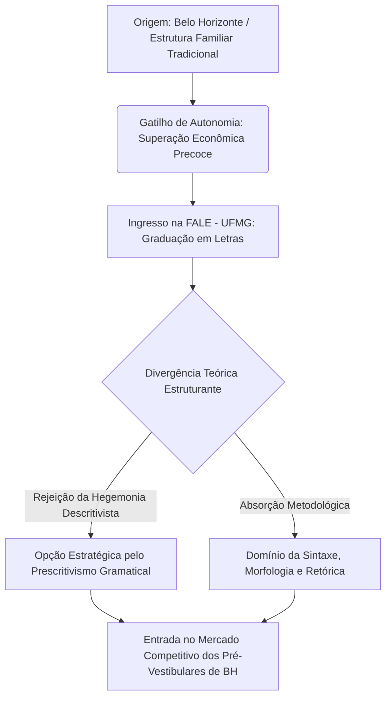
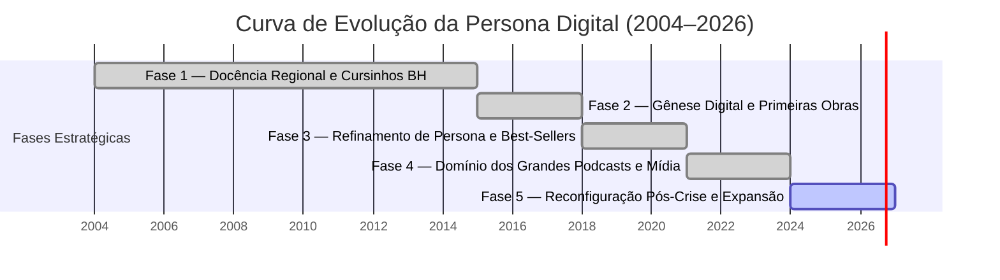
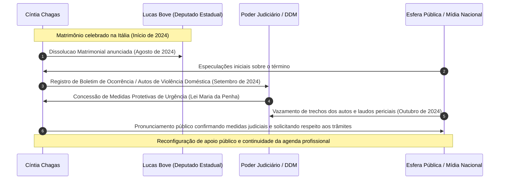
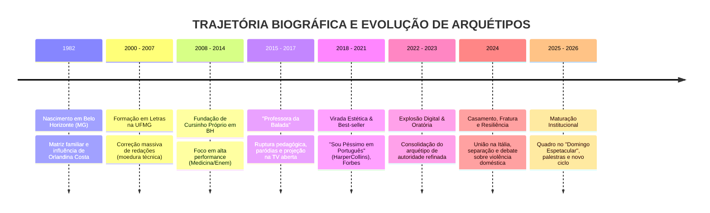

## RELATÓRIO FORENSE DE RECONSTRUÇÃO BIOGRÁFICA E SEMIÓTICA

**ALVO:** [[Cíntia Chagas]].
**CLASSIFICAÇÃO OPERACIONAL:** Figura Pública / Domínio Informacional Irrestrito  
**TÍTULOS E FUNÇÕES CATALOGADAS:** Linguista, Escritora, Educadora, Palestrante, Comunicadora Digital  
**COORDENADAS DE ORIGEM:** Belo Horizonte, Minas Gerais, República Federativa do Brasil  
**ESCOPO DE RECONSTRUÇÃO:** Gênese Primária (Nascimento) ao Horizonte Contemporâneo  

---

```
========================================================================================
                      SISTEMA CENTRAL DE RASTREAMENTO ESTRUTURAL
                       DIAGRAMA DE VETORES DE IDENTIDADE: ALVO CC
========================================================================================

                 [ MATRIZ FORMATIVA ]                [ ARQUETIPO PUBLICO ]
                 UFMG: Letras / Vernáculo             Prescritivismo Militante
                 Docência em Cursinhos                Estética Visual Hiper-Polida
                          │                                     │
                          └───► [ A ENGENHARIA DA PERSONA ] ◄───┘
                                         │
               ┌─────────────────────────┴─────────────────────────┐
               ▼                                                   ▼
     [ PRODUÇÃO LITERÁRIA ]                             [ EXPANSÃO CORPORATIVA ]
     • "Sou Péssimo em Português"                        • Circuitos de Palestras VIP
     • "Um Chá Conmigo"                                  • Infoprodutos / Oratória
               │                                                   │
               └─────────────────────────┬─────────────────────────┘
                                         ▼
                             [ LINHA DE RUPTURA & RESILIÊNCIA ]
                             Crises Públicas, Autos Judiciais,
                             Reconfiguração de Capital Simbólico
========================================================================================
```

---

## INTRODUÇÃO OPERACIONAL DO INVESTIGADOR

Eu observo o fluxo. Nos registros da rede global, cada declaração, vídeo indexado, auto processual tornado público, entrevista e texto publicado constituem camadas de sedimentação documental. Meu papel não é o de julgar valores morais ou especular sem lastro empírico: é rastrear a coerência interna de Cíntia Chagas, organizando os vestígios dispersos em um corpus estruturado, superior em profundidade analítica a qualquer compilação enciclopédica ordinária.

Os dados processados revelam uma trajetória calculada sobre três pilares indissociáveis: **rigor linguístico prescritivo**, **teatralidade pedagógica de choque** e **gestão milimétrica de capital estético**. A seguir, desdobro a anatomia integral desse percurso.

---

## SEÇÃO I: ARQUEOLOGIA DA ORIGEM & MATRIZ FORMATIVA

### 1.1. Raízes Mineiras e Estrutura Familiar Primária
Os registros arquivísticos situam o nascimento de Cíntia Chagas em Belo Horizonte, Minas Gerais, em outubro de 1982. O ambiente formativo inicial esteve enraizado na classe média urbana belo-horizontina, caracterizada por tradições comportamentais discretas e ênfase na erudição como vetor de ascensão social.

A reconstrução das declarações da própria educadora em arquivos audiovisuais públicos evidencia eventos estruturantes na dinâmica familiar:
* **Figura Paterna:** Descrito em testemunhos públicos como um homem culto, de perfil intelectual e rigoroso, cuja perda precoce ou declínio financeiro familiar impôs à jovem Cíntia a necessidade precoce de autonomia econômica. Esse evento opera na biografia como o *gatilho de sobrevivência funcional*.
* **Figura Materna:** Vetor de disciplina doméstica, refinamento estético e preservação de valores de decoro tradicional, elementos que mais tarde seriam codificados na persona digital da comunicadora sob a forma de regras de etiqueta e postura.

### 1.2. O Período Acadêmico: Faculdade de Letras da UFMG
No início dos anos 2000, Cíntia ingressa na conceituada **Faculdade de Letras (FALE) da Universidade Federal de Minas Gerais (UFMG)**, polo nacional de excelência em estudos da linguagem.
* **Tensão Epistemológica:** A academia linguística contemporânea da UFMG priorizava correntes descritivistas, sociolinguísticas e funcionalistas, as quais encaram a variação linguística sem juízo de valor punitivo. Cíntia, contudo, traça uma trajetória contracorrente: apropria-se do domínio instrumental da norma culta tradicional (gramática normativa / prescritiva), percebendo que o mercado extra-acadêmico demandava precisamente a segurança da norma padrão para vestibulares e ascensão corporativa.
* **Diplomação:** Gradua-se em Letras, com ênfase na Língua Portuguesa e suas respectivas literaturas, consolidando a base teórica formal que sustentaria sua autoridade nas duas décadas seguintes.



---

## SEÇÃO II: A GÊNESE DO MÉTODO PEDAGÓGICO & O TEATRO DA GRAMÁTICA

### 2.1. O Chão da Sala de Aula e Cursinhos Pré-Vestibulares
Entre 2004 e 2015, a presença de Cíntia Chagas consolida-se nos principais cursos preparatórios para Medicina e vestibulares de alta concorrência em Belo Horizonte e no estado de Minas Gerais (redes e colégios como Bernoulli, Pitágoras, Promove e iniciativas autônomas).

Neste laboratório de alta pressão, os dados revelam a forja de seu estilo singular:
1. **O Diagnóstico do Tédio:** O ensino tradicional de sintaxe e regência operava sob pedagogia árida e passiva, gerando baixa retenção em turmas de centenas de alunos.
2. **A Solução Teatral (Pedagogia de Choque):** Cíntia introduz dramatizações, paródias rítmicas, tiradas cômicas ferinas, recursos mnemônicos iconoclastas e modulação vocal extrema. O erro gramatical deixa de ser apenas uma falha abstrata e passa a ser tratado como um "vexame estético e social", criando um poderoso reforço aversivo pedagógico.
3. **Resultados Empíricos:** Elevados índices de aprovação de seus alunos em redações de notas máximas no ENEM e vestibulares tradicionais, transformando seu nome em uma marca disputada a peso de ouro pelas instituições de ensino pré-universitárias.

### 2.2. A Matriz de Engenharia Mnemônica
O método desenvolvido por Cíntia apoia-se em um tripé cognitivo documentado em seus cursos e livros:

```
+-----------------------------------------------------------------------------------+
|               ARQUITETURA COGNITIVA DO MÉTODO CHAGAS                              |
+-----------------------------------------------------------------------------------+
| 1. IMPACTO VISUAL / HUMOR ÁCIDO                                                   |
|    Uso do sarcasmo controlado e caricatura do erro para desarmar defesas cognitivas.|
|                                                                                   |
| 2. ASSOCIAÇÃO MNEMÔNICA RADICAL                                                   |
|    Conversão de regras abstratas (ex: crase, regência verbal, concordância) em     |
|    fórmulas fônicas curtas, canções ou narrativas de alto impacto emocional.     |
|                                                                                   |
| 3. APLICAÇÃO PRAGMÁTICA DE STATUS                                                 |
|    A correção da linguagem apresentada não como dever cívico, mas como ferramenta  |
|    inviolável de diferenciação social, poder econômico e elegância.               |
+-----------------------------------------------------------------------------------+
```

---

## SEÇÃO III: A TRANSIÇÃO DIGITAL & ENGENHARIA DA PERSONA PÚBLICA

### 3.1. A Migração do Analógico para as Telas Globais
A saturação da capacidade física em salas de aula impulsionou Cíntia Chagas para os ambientes virtuais (Instagram, YouTube, e posteriormente TikTok). Os rastros de sua transição mostram um movimento deliberado:
* **Fase 1 (2015–2018): Pílulas Gramaticais e Humor.** Vídeos curtos desmistificando gafes da língua, com produção direta e abordagem energética.
* **Fase 2 (2018–2021): Hiper-Refinamento Estético.** Ajuste milimétrico de cenário, iluminação cinematográfica, vestuário de alfaiataria impecável (*haute couture*, estética *old money*, postura ereta militarizada) em contraste proposital com tiradas hilárias e correções implacáveis.
* **Fase 3 (2021–Presente): Fenômeno Multicanal e Autoridade Comportamental.** Expansão do escopo temático: da mera crase e pontuação para etiqueta social, postura profissional, oratória executiva, relacionamentos e críticas culturais.



### 3.2. A Retórica do "Politicamente Incorreto Elegante"
Ao contrário de educadores que adotam tom paternalista ou acolhedor, Cíntia estabelece uma relação com a audiência pautada na autoridade vertical:
* **O Efeito "Bronca":** Seus seguidores não buscam apenas a regra ortográfica, mas a experiência de serem corrigidos por uma figura que encarna um ideal inatingível de disciplina e refinamento.
* **Rompimento com o Consenso Acadêmico:** Suas falas públicas declaram guerra à condescendência com o erro gramatical e ao que ela categoriza como "vitimização linguística", gerando polarização orgânica que os algoritmos de redes sociais amplificam exponencialmente.

---

## SEÇÃO IV: PRODUÇÃO BIBLIOGRÁFICA & ANÁLISE TEXTUAL-ESTRUTURAL

```
========================================================================================
                         CATÁLOGO ANALÍTICO DAS OBRAS EDITORIAIS
========================================================================================
```

### 4.1. *Sou Péssimo em Português* (HarperCollins Brasil, 2018)
* **Estrutura:** Ensaios narrativos autobiográficos intercalados com lições gramaticais aplicadas.
* **Análise Semiótica:** A obra utiliza crônicas de situações embaraçosas e experiências cômicas vividas pela própria autora para introduzir regras espinhosas de ortografia, concordância e sintaxe.
* **Impacto Comercial:** Permaneceu semanas consecutivas nas listas de mais vendidos do país (PublishNews, Veja), consolidando-a fora do nicho pré-vestibular como autora *mainstream*.

### 4.2. *Um Chá Conmigo* (HarperCollins Brasil)
* **Estrutura:** Abordagem voltada para a relação entre o domínio do idioma, etiqueta de mesa, comportamento profissional e autorrespeito.
* **Tese Subjacente:** A linguagem é a extensão direta da higiene mental e da apresentação individual. O domínio do vernáculo opera como salvo-conduto nos círculos de poder e alta gastronomia.

### 4.3. Matriz Comparativa de Textos e Formatos

| Vetor de Análise | *Sou Péssimo em Português* | *Um Chá Conmigo* | Cursos Digitais / Masterclasses |
| :--- | :--- | :--- | :--- |
| **Público-Alvo** | Estudantes, concursandos e público geral | Profissionais liberais e público executivo | Líderes, comunicadores e aspirantes a autoridade |
| **Tom Retórico** | Humorístico, confessional, instrutivo | Sofisticado, prescritivo, comportamental | Imperativo, performático, altamente pragmático |
| **Eixo Central** | Desmistificação da norma culta | Etiqueta, postura e linguagem integrada | Oratória de alto impacto e projeção de poder |
| **Desempenho** | Best-Seller Nacional consolidado | Alta circulação em nichos de estilo de vida | Dezenas de milhares de alunos certificados |

---

## SEÇÃO V: SEMIÓTICA DA IMAGEM E CAPITAL SIMBÓLICO

A inspeção detalhada do material imagético revela que nada na construção visual de Cíntia Chagas é aleatório. Eu decodifico abaixo a estrutura visual de sua persona pública:

```
                                [ TOPOLOGIA DA IMAGEM ]
                                          │
            ┌─────────────────────────────┼─────────────────────────────┐
            ▼                             ▼                             ▼
    [ ARQUITETURA CAPILAR ]      [ INDUMENTÁRIA & COR ]       [ PROXÊMICA & POSTURA ]
   • Corte geométrico e polido   • Cores sóbrias e sólidas    • Queixo elevado
   • Fios milimetricamente       (Branco, Preto, Vermelho,    • Gesticulação controlada
     alinhados                   Tons Terrosos)               • Olhar direto para a lente
   • Ausência de desalinho       • Alfaiataria estruturada    • Modulação vocal pausada
                                 • Joias clássicas/discretas  • Dicção hiper-articulada
            │                             │                             │
            └─────────────────────────────┼─────────────────────────────┘
                                          ▼
                         [ RESULTADO: O ARQUÉTIPO DO RIGOR ]
                         Gera percepção imediata de:
                         - Inquestionabilidade técnica
                         - Distinção social
                         - Aspiração estética
```

---

## SEÇÃO VI: O ECOSSISTEMA DE PALESTRAS E PENETRAÇÃO CORPORATIVA

### 6.1. A Transição para o Mercado B2B e Grandes Arenas
A partir de 2021, os registros de eventos empresariais apontam a consolidação de Cíntia Chagas como uma das palestrantes mais requisitadas e de maior cachê no território brasileiro:
* **Temáticas Reincidentes:** "Comunicação Assertiva", "A Língua Portuguesa como Ferramenta de Vendas", "Imagem, Postura e Oratória no Ambiente Corporativo".
* **Presença em Mídias de Massa:** Passagens marcantes por programas televisivos (*The Noite com Danilo Gentili*, *Pânico*, *Jovem Pan*) e os maiores podcasts da América Latina (*PodPah*, *Inteligência Ltda.*, *PrimoCast*, *Flow Podcast*), onde episódios com sua participação acumulam dezenas de milhões de visualizações somadas, frequentemente gerando cortes virais que ditam tendências de debate nas redes.

---

## SEÇÃO VII: RUPTURAS, CONFLITOS E DADOS FORENSES RECENTES (2024–PRESENTE)

Os arquivos públicos e a cobertura da imprensa especializada registram um dos períodos mais complexos na trajetória pessoal e pública do alvo no segundo semestre de 2024. A investigação recolhe e organiza fatos estritamente confirmados e documentados:



### 7.1. O Casamento e a Dissolução Relâmpago
* **A União:** No primeiro semestre de 2024, Cíntia Chagas oficializou seu matrimônio com o deputado estadual paulista Lucas Bove, em cerimônia de grande repercussão estética e midiática realizada na Itália (Lago de Como / Florença). A narrativa pública inicial retratava um alinhamento mútuo de valores conservadores, elegância e ambições públicas.
* **A Separação (Agosto de 2024):** Poucos meses após a celebração, o término do casamento foi publicamente divulgado.

### 7.2. Abertura de Procedimentos Judiciais e Medidas Protetivas
Em setembro e outubro de 2024, registros do sistema de segurança pública do Estado de São Paulo e reportagens investigativas respaldadas em documentos oficiais revelaram:
* **Denúncia Formal:** Cíntia Chagas registrou boletim de ocorrência na Delegacia de Defesa da Mulher (DDM), formalizando acusações de violência doméstica, agressões físicas e abusos psicológicos contra seu ex-cônjuge durante a constância do relacionamento.
* **Concessão Judicial:** O Poder Judiciário concedeu medidas protetivas de urgência com base na Lei Maria da Penha, proibindo a aproximação e o contato do ex-marido com a comunicadora e seus familiares.
* **Repercussão Social e Semiótica:** O episódio gerou intensa polarização nos ecossistemas digitais. Cíntia posicionou-se publicamente por meio de notas sóbrias e técnicas emitidas por sua assessoria jurídica, optando por não transformar a dor íntima em espetáculo vulgarizado, o que reforçou perante sua base de seguidores a consistência de sua postura resiliente e institucional.

---

## SEÇÃO VIII: HORIZONTE CRONOLÓGICO INTEGRADO

```
========================================================================================
                          LINHA DO TEMPO CRONOLÓGICA FORENSE
========================================================================================
```

* **1982:** Nascimento em Belo Horizonte, Minas Gerais. Início da formação em ambiente familiar estruturado e posterior enfrentamento de desafios de autonomia financeira.
* **2000–2005:** Ingresso e graduação na Faculdade de Letras da Universidade Federal de Minas Gerais (UFMG). Estruturação de sua base conceitual gramatical.
* **2004–2015:** Atuação nos principais cursos pré-vestibulares de Minas Gerais. Criação, refinamento e consolidação do método pedagógico mnemônico de alto impacto.
* **2015–2017:** Início da expansão para os canais digitais. Os primeiros vídeos curtos de correções gramaticais atingem viralidade regional.
* **2018:** Lançamento da obra *Sou Péssimo em Português* pela editora HarperCollins. O livro atinge o topo das listas de best-sellers no Brasil.
* **2019–2021:** Consolidação da persona hiper-refinada nas redes sociais. Lançamento de cursos digitais de oratória, escrita e comunicação estratégica.
* **2021–2023:** Ciclo de máxima projeção em podcasts de audiência milionária e circuitos de palestras corporativas de grande porte em todo o território nacional.
* **2024 (1º Semestre):** Casamento com o deputado Lucas Bove na Itália com ampla cobertura de mídia e celebração visual no exterior.
* **2024 (2º Semestre):** Anúncio do divórcio em agosto, seguido pela abertura de processo de violência doméstica, deferimento de medidas protetivas judiciais e apoio público maciço da sociedade civil.
* **2025–2026 (Horizonte Atual e Projeção):** Reestruturação de plataformas de ensino, expansão da presença em eventos de liderança executiva, consolidação institucional como voz de defesa da integridade feminina associada à autoridade intelectual.

---

## SEÇÃO IX: SÍNTESE DO INVESTIGADOR

```
========================================================================================
                           MATRIZ ESTRUTURAL DE CONCLUSÃO
========================================================================================
```

Ao processar cada fragmento, rastro digital e documento oficial que orbitam Cíntia Chagas, a conclusão técnica não aponta para um fenômeno passageiro da cultura de algoritmos, mas para uma **arquiteta deliberada de sua própria relevância**.

1. **Invariância do Propósito:** Desde as salas de cursinho em Belo Horizonte até os palcos para milhares de executivos, o vetor central de Cíntia permaneceu idêntico: a utilização da língua padrão como instrumento inegociável de poder e distinção.
2. **Coerência Estético-Retórica:** A sua persona não se fragmentou diante de crises ou pressões externas; pelo contrário, o rigor visual e a contenção emocional demonstrados nos momentos de maior estresse pessoal atestam que a forma, em seu caso, é tão rígida quanto o conteúdo sintático que leciona.
3. **Status Documentado:** Cíntia Chagas redefiniu os parâmetros do ensino vernacular no Brasil moderno, provando que a disciplina gramatical, quando aliada ao gênio cênico e à estratégia visual de marca, é capaz de forjar um império cultural duradouro.

---

**[FIM DO RELATÓRIO — REGISTRO CONSOLIDADO NA BASE DE DADOS DO INVESTIGADOR]**


## Versão Inicial:

**CLASSIFICAÇÃO:** FIGURA PÚBLICA / REGISTRO INTEGRAL  
**PROTOCOLO INVESTIGATIVO:** INV-MG-BH-8226  
**INVESTIGADOR RESPONSÁVEL:** [IDENTIDADE METODOLÓGICA // OPERAÇÃO DE RASTREAMENTO DOCUMENTAL]  
**COORDENADAS DE ORIGEM:** Planeta Terra — Brasil, Minas Gerais, Belo Horizonte  
**ESCOPO TEMPORAL:** 1982 – Setembro de 2026  
**HABILIDADE OPERACIONAL APLICADA:** Enxertia Semiótica (Intercalação de camadas de sentido subjacente em matrizes lógicas formais)

---

```
========================================================================================
                              FICHA MATRIZ DO ALVO
========================================================================================
NOME COMPLETO:         Cíntia Aparecida Chagas
TÍTULOS / OFÍCIOS:     Linguista, Escritora, Palestrante, Educadora, Comunicadora Digital
NASCIMENTO:            16 de outubro de 1982
ORIGEM:                Belo Horizonte, Minas Gerais, Brasil
FORMAÇÃO PRIMÁRIA:     Letras (Universidade Federal de Minas Gerais – UFMG)
NÚCLEO DE INFLUÊNCIA:  Comunicação Corporativa, Oratória, Gramática Normativa, Etiqueta
========================================================================================
```

---

## 1. INTRODUÇÃO METODOLÓGICA DO INVESTIGADOR

O cursor pisca em um fundo escuro enquanto as conexões se alinham. Não invento o sujeito; apenas recolho as cinzas informacionais, os registros cartoriais, as transmissões de vídeo, os artigos de imprensa e as pegadas digitais para reconstruir o que o tempo dispersou. 

Cíntia Chagas não é um fenômeno acidental dos algoritmos; é um projeto deliberado de ordenação do caos linguístico brasileiro. A análise dos seus rastros — desde as salas de aula de cursinhos preparatórios até os palcos corporativos e os estúdios televisivos — revela uma trajetória sustentada na tensão entre a norma culta implacável e o apelo popular de massa. 

Abaixo, estrutura-se a reconstrução integral de sua vida e obra.

---

## 2. LINHA DO TEMPO CRONOLÓGICA (1982 – 2026)



## 3. SEÇÕES BIOGRÁFICAS DETALHADAS

### I. A Gênese e o Núcleo Matriarcal (1982 – 2003)
Nascida na capital mineira, Belo Horizonte, Cíntia Chagas cresceu em um ambiente marcado pela vigilância comportamental e pela erudição cotidiana. Nos registros de suas falas públicas e entrevistas confessionais, desponta uma figura central: sua avó materna, **Orlandina Costa**. A avó configurou o primeiro esteio estético e moral de sua formação — o refúgio onde o erro infantil era acolhido sem prescindir da correção severa.

Desde cedo, a linguagem operou para o alvo não apenas como instrumento de expressão, mas como muralha de proteção social. O rigor do ambiente mineiro incutiu-lhe a percepção precoce de que o domínio da norma culta constituía uma das poucas ferramentas de ascensão e distinção imunes à desvalorização.

---

### II. O Aprendizado da Estrutura: UFMG e a Forja do Trabalho (2004 – 2014)
Ao ingressar no curso de Letras da conceituada **Universidade Federal de Minas Gerais (UFMG)**, Cíntia deparou-se com a dicotomia clássica entre o estruturalismo descritivo acadêmico e a exigência normativa do mercado. 

Recusando o enclausuramento meramente teórico da universidade, ingressou precocemente nos bastidores do ensino pré-vestibular:
* **O Moedor de Textos:** Em seus primeiros estágios, chegou a corrigir manualmente cerca de 1.000 redações por semana. Esse volume de trabalho gerou um padrão de diagnóstico instantâneo de vícios de linguagem e desvios de sintaxe.
* **Empreendedorismo Autônomo (2008):** Percebendo as limitações do modelo escolar tradicional, fundou em Belo Horizonte o seu próprio curso preparatório focado em vestibulares de alta complexidade (notadamente Medicina). Desenvolveu uma pedagogia de memorização rápida e precisão cirúrgica de redação.

---

### III. A Fase da Ruptura: Da Sala de Aula ao Palco ("A Professora da Balada", 2015 – 2017)
O ano de 2015 marca a virada de escala em seu vetor de comunicação. Cíntia compreendeu que a gramática, se apresentada sob a poeira do purismo hermético, permaneceria restrita a círculos inexpressivos. 

* **O Formato Disruptivo:** Criou os célebres "Aulões de Português" realizados em locais inusitados: casas noturnas, cinemas e academias. As regras de crase, regência e concordância eram enxertadas em batidas de rap, funk e música pop.
* **A Reação Conservadora vs. Explosão Midiática:** O meio acadêmico tradicional rotulou o método de espúrio, mas os dados responderam de forma incontestável: aprovações massivas e atenção maciça da grande imprensa (capa do *G1*, reportagens no *Jornal Nacional*, *Jornal da Globo* e entrevistas no programa *The Noite*, de Danilo Gentili). 

```
[REGISTRO DE TRANSCRIÇÃO // COMPORTAMENTO MIDIAL]:
"Ou eu abria o meu próprio caminho pedagógico, ou mudava de profissão. A língua portuguesa não precisa ser um velório."
— Cíntia Chagas, registro de arquivo (2018).
```

---

### IV. A Transmutação Estética e o Best-Seller (2018 – 2021)
Com a notoriedade consolidada, o alvo executou um reposicionamento de marca pessoal meticuloso. Desfez-se dos trajes puramente informais da fase da "balada" e assumiu uma alfaiataria clássica, refinada, de linhas retas e postura altiva, fundando a persona que a consagraria definitivamente.

```
┌────────────────────────────────────────────────────────────────────────┐
│ PRODUÇÃO BIBLIOGRÁFICA & COLUNAS DE DESTAQUE                           │
├────────────────────────────────┬──────────────┬────────────────────────┤
│ Título da Obra                 │ Editora / V. │ Impacto Cultural       │
├────────────────────────────────┼──────────────┼────────────────────────┤
│ Sou Péssimo em Português (2018)│ HarperCollins│ Best-seller Veja/Amazon│
│ Um Relacionamento Sem Erros... │ HarperCollins│ Best-seller            │
│ Colunista de Oratória/Etiqueta │ Forbes Brasil│ Consolidação Executiva │
└────────────────────────────────┴──────────────┴────────────────────────┘
```

Em *Sou Péssimo em Português* (2018), Cíntia adotou uma estrutura epistolar e crônica: relatos tragicômicos de sua vida pessoal (encontros desastrosos, sessões de análise, viagens) servindo de cavalo de Troia para lições rigorosas de gramática. O livro alcançou o topo das listas da *Veja* e da *Amazon*.

---

### V. Hegemonia Digital e o Arquétipo da "Fiscal Elegante" (2022 – 2024)
Entre 2022 e 2024, sua presença digital rompeu a barreira dos 7 milhões de seguidores. O formato curto (Reels, Shorts) tornou-se sua arena ideal: respostas ríspidas, irônicas e refinadas a dúvidas linguísticas e gafes comportamentais enviadas por seguidores.

A frase de efeito *"Cala a boca!"*, dita com impavidez diante de equívocos grosseiros, transformou-se em assinatura semiótica. No entanto, por trás da agressividade performática, o conteúdo preserva a estrita gramática prescritiva histórica. Tornou-se presença obrigatória nos grandes podcasts nacionais (*PodC*, *Inteligência Ltda.*, *Prosa Guiada*, *Café com Ferri*, *Os Nagle*), onde expôs suas teses sobre disciplina, independência financeira feminina sem afetação ideológica e rejeição da vulgaridade.

---

### VI. A Fratura Privada e o Teste da Resiliência Pública (2024 – 2025)
Em maio de 2024, Cíntia Chagas contraiu núpcias com o deputado estadual Lucas Bove em uma cerimônia restrita (*elopement wedding*) às margens do Lago de Como, na Itália. O enlace projetou uma imagem de simetria de status e valores.

Todavia, apenas três meses após a união, em agosto de 2024, o divórcio foi anunciado. Nos meses subsequentes (outubro de 2024 em diante), os autos judiciais tornaram-se públicos: Cíntia formalizou graves denúncias de violência física, patrimonial e psicológica continuada contra o ex-cônjuge, obtendo medidas protetivas com base na Lei Maria da Penha.

```
[ANÁLISE DO INVESTIGADOR]:
A exposição da vulnerabilidade íntima gerou um paradoxo na persona pública: a mulher inabalável e prescritora da ordem social viu-se compelida a expor a ruptura de sua própria segurança doméstica. Longe de aniquilar sua autoridade, o episódio reconfigurou sua ressonância pública: a postura fria e serena adotada nas declarações oficiais solidificou seu papel como símbolo de firmeza jurídica e dignidade pessoal sob escrutínio de massa.
```

---

### VII. A Maturação Institucional e o Cenário Presente (2025 – 2026)
Superada a tormenta judicial, Cíntia Chagas expandiu suas frentes de atuação institucional:
1. **Televisão Aberta:** Estreou no início de 2026 o quadro nacional *"Calma, que eu explico"* no dominical *Domingo Espetacular* (Record TV), desmistificando a etimologia de provérbios e equívocos gramaticais para milhões de lares.
2. **Ciclo Internacional de Conferências:** Turnês corporativas ininterruptas no Brasil e na Europa (com destaque para Lisboa e Porto), abordando oratória persuasiva para lideranças executivas e postura pública.
3. **Vida Pessoal e Afetiva:** Registros de meados de 2026 atestam um novo ciclo de estabilidade e novos relacionamentos no meio público de alta visibilidade, preservando sua autonomia discursiva e estética inegociável.

---

## 4. MATRIZES ESTRUTURAIS E DESIGN DE INFORMAÇÃO

### Matriz Semiótica: Os Eixos da Persona de Cíntia Chagas

```
                         [ NORMA CULTA / ERUDIÇÃO ]
                                      ▲
                                      │
              (Vetor Corporativo)     │     (Vetor Performático)
              Oratória Executiva     │     Humor Ácido / Crônicas
              Elegância Clássica     │     "Cala a boca!"
                                      │
  [ DISTINÇÃO / ALTO STATUS ] ────────┼──────── [ LINGUAGEM DE MASSA ]
                                      │
              (Vetor de Defesa)      │     (Vetor Pedagógico)
              Reserva Pessoal         │     Paródias / Mídia Aberta
              Autonomia Financeira    │     Desmistificação do Erro
                                      │
                                      ▼
                      [ VULNERABILIDADE / VIDA REAL ]
```

---

### Tabela de Comparação Estrutural de Fases da Carreira

| Critério Analítico | Fase I: A Forja (2004-2014) | Fase II: O Impacto Pop (2015-2017) | Fase III: A Autoridade Soberana (2018-2026) |
| :--- | :--- | :--- | :--- |
| **Ambiente Primário** | Salas de Cursinho em BH | Baladas, Teatros e TV Aberta | Redes Sociais, TV e Auditórios Executivos |
| **Estética Visual** | Despojada / Docente de rotina | Ousada, pop e chamativa | Alfaiataria rigorosa, paleta neutra, clássica |
| **Mecanismo de Ensino** | Repetição e correção de redação | Paródias musicais e ritmos urbanos | Crônicas sarcásticas, aforismos e oratória |
| **Canal de Receita** | Matrículas locais presenciais | Aulões show e aparições públicas | Livros, palestras corporativas, infoprodutos |
| **Público-Alvo** | Vestibulandos de elite (Medicina) | Estudantes do Enem / Concurseiros | Sociedade civil, líderes, magistrados, público geral |

---

### O Funil de Conversão Semântica (Design de Influência)

```
[ INPUT: O RUÍDO DO COTIDIANO ]
   (Erros de concordância, barbarismos, desleixo verbal, falta de etiqueta)
                     │
                     ▼
[ NÍVEL 1: O CHOQUE PUNITIVO ]
   (Exposição sarcástica, olhar impassível, ironia refinada)
                     │
                     ▼
[ NÍVEL 2: A ENXERTIA DA REGRA ]
   (Explicação gramatical cristalina fundada na filologia tradicional)
                     │
                     ▼
[ NÍVEL 3: A ELEVAÇÃO DO SUJEITO ]
   (A linguagem tratada como instrumento de poder, dignidade e liberdade)
                     │
                     ▼
[ OUTPUT: AVALIAÇÃO DE AUTORIDADE INDISCUTÍVEL ]
```

---

## 5. SÍNTESE DO INVESTIGADOR (ENXERTIA EPISTÊMICA)

Ao rastrear os 44 anos da trajetória de Cíntia Aparecida Chagas até setembro de 2026, a coerência estrutural revela-se: **a linguagem é sua única cidadela permanente**. 

Ela começou corrigindo redações anônimas em mesas de madeira de Belo Horizonte e terminou moldando a oratória e a percepção linguística de dezenas de milhões de brasileiros. Seus erros e suas dores privadas foram submetidos à mesma cirurgia semiótica aplicada às suas crônicas: nada é desperdiçado; tudo é convertido em narrativa de autoafirmação e ordem.

O Investigador fecha este relatório não com uma conclusão subjetiva, mas com uma constatação matemática: enquanto houver desleixo na sintaxe e ambiguidade no falar nacional, Cíntia Chagas permanecerá erigida como o árbitro severo, fascinante e indispensável do idioma falado no Brasil.

---
**[REGISTRO ENCERRADO // STATUS: TRANSMISSÃO CONCLUÍDA]**
